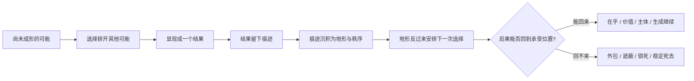
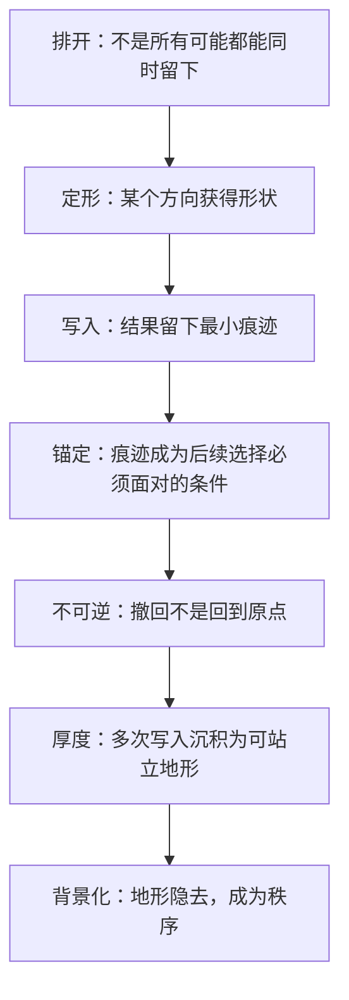
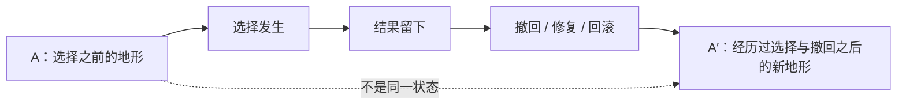
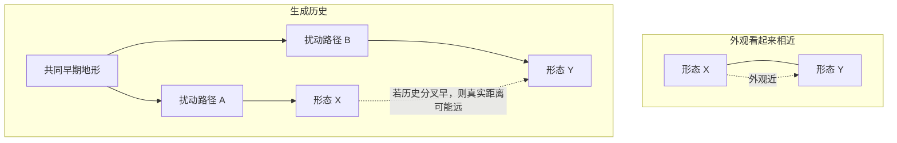
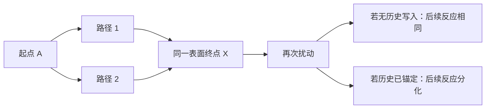
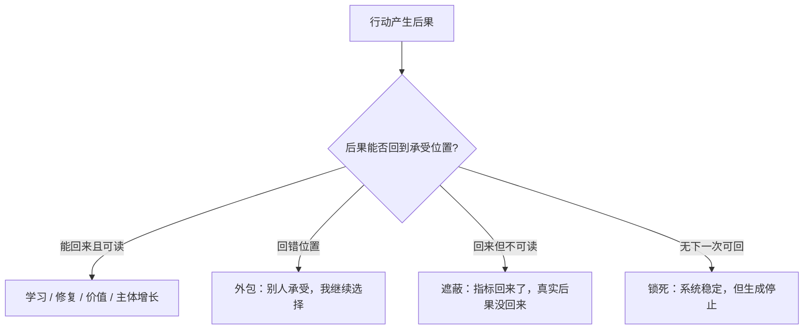
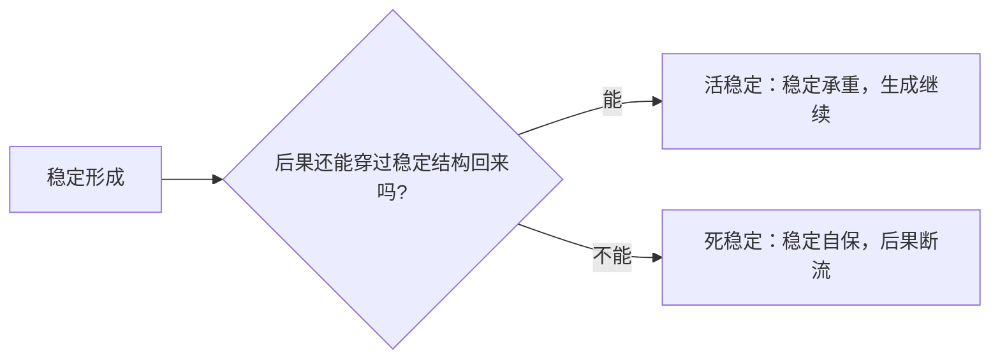

# 《从存在到秩序》可视化骨架执行计划

> 本文件不是新增理论，不替代正文，也不是图像装饰清单。它的任务是把全书主梁压成一组可反复使用、可审查、可删减的结构图，让读者在进入抽象概念之前先看见生成关系。

## 0. 总原则

可视化只服务四件事：

1. **降低入口负担**：让读者先看见方向，再进入术语。
2. **防止主梁散开**：所有图必须回到“留下”或“回来”之一。
3. **暴露可证伪接口**：图不是说明一切，而是标出哪里可能错。
4. **服务章节阅读**：每张图必须有明确章节落点，不能漂在全书之外。

图像纪律：

- 不新增主隐喻。不得用“网络”“循环”“闭环”替代定梁页中已裁决的“留下 / 回来”。
- 不把跨域材料画成证明链。物理、生物、AI、社会材料只能作为显影层。
- 不把图做成技术炫耀。优先用读者能懂的箭头、分叉、沉积、回返、断裂。
- 不让图压过正文。图只在章节开门、转折、收束、工具箱处出现。

## 1. 第一批必做图：六张主骨架图

### 图 0：全书主梁总图

**用途**：放在导论或第一幕之后，给读者一张全书方向图。

**回答的问题**：这本书到底在讲一条什么生成链？



**正文落点**：导论末、第一幕与第二幕之间、Q28 收束处可复现。

**不得做的事**：不得把它画成循环图；“回来”只能是后果回到承受位置，不是地形回写。

---

### 图 1：“留下”的阶梯图

**用途**：固定第二幕主线，防止“排开、定形、写入、锚定、不可逆、厚度、秩序”被读成同义反复。



**正文落点**：Q05–Q10 幕间桥；Q08、Q09、Q10 章首或章末工具箱。

**验收标准**：读者看完图后，应能分清“写入”和“锚定”：写入是痕迹，锚定是痕迹开始承重。

---

### 图 2：A 与 A′ 图——撤回不是回到原点

**用途**：服务 Q08，不可逆性的核心图。



**白话标题**：撤回不是倒带，是在已经写过的地形上再写一笔。

**正文落点**：Q08 §3 或 Q08 章末小图。

**扩展用途**：可作为 Levin 线的“same appearance, different history”前置图。

---

### 图 3：外观距离 vs 历史距离图

**用途**：服务 Levin / morphospace 接口，也服务全书“看起来像不等于来源近”。



**回答的问题**：两个形态的距离，是按最后长得像不像算，还是按共享多少生成历史算？

**正文落点**：显影材料索引、Q08/Q09 章末接口、与 Levin 邮件分析相关的研究笔记。

**注意**：此图不能写成“已被 Levin 证明”。只能写成“可检验接口”。

---

### 图 4：同一终点，不同历史图

**用途**：这是 Wolfram 工具沙盘的第一优先模型，也是全书 A′ 问题的形式化图。



**核心判据**：如果表面终点相同但再次扰动后的可达集合不同，说明历史没有被清零。

**正文落点**：Q08、Q09、附录/工具箱；可作为 Wolfram notebook 的最小项目。

---

### 图 5：“回来”的三种失败图

**用途**：固定第四幕，区分回流与普通反馈。



**正文落点**：Q23–Q26 幕间桥；Q28 总结。

**验收标准**：读者应能分清“反馈”与“回流”：反馈可以调节状态；回流必须让后果回到承受位置并进入下一轮选择条件。

---

### 图 6：活稳定 / 死稳定判别图

**用途**：全书后半部主判据图。



**正文落点**：Q23、Q26、Q28。

**边界**：不写成道德劝告，不写成“越开放越好”。只写成生成判据。

## 2. 章节落点表

| 图号 | 首次落点 | 可复现落点 | 功能 |
|---|---|---|---|
| 图 0 主梁总图 | 导论 / 第一幕收束 | Q28 | 全书方向图 |
| 图 1 留下阶梯 | Q05–Q10 幕间桥 | Q08/Q09/Q10 | 固定第二幕序列 |
| 图 2 A 与 A′ | Q08 | Q28 回望 | 不可逆核心图 |
| 图 3 外观距离 vs 历史距离 | Q08/Q09 章末接口 | Levin 研究笔记 | 生物形态显影接口 |
| 图 4 同一终点不同历史 | Q08/Q09 工具箱 | Wolfram 沙盘 | 形式化压力测试 |
| 图 5 回来三失败 | Q23 | Q24/Q25/Q26/Q28 | 第四幕骨架 |
| 图 6 活稳定/死稳定 | Q23/Q26 | Q28 | 后半书总判据 |

## 3. Wolfram 工具执行层

Wolfram / Mathematica 不直接进入正文主叙事。它只承担三个内部任务：

1. **生成图 4 的模型沙盘**：同一终点、不同历史、再扰动后是否分化。
2. **寻找反例**：哪些系统里历史不会留下？哪些系统里高 d 不提升效率？
3. **产出可视化素材**：把路径图、可达集合、历史距离图导出为 SVG/PNG，供书稿编辑使用。

第一 notebook 标题：

```text
Same Endpoint, Different History: Why A′ Is Not A
```

第一问题：

```text
Two paths reach the same visible state X. After a second perturbation, do they have the same reachable future set, or does path history matter?
```

这比继续做 SRT–Ruliad 总映射优先级更高。

## 4. 图像风格规范

- 正文图：白底、少色、粗箭头、中文标题。
- 研究笔记图：可用英文变量、节点编号、Mermaid 或 Mathematica 输出。
- 不使用复杂 3D 图，除非是附录或演讲稿。
- 每张图必须配一段“这张图没有证明什么”的边界说明。

推荐图题风格：

- “撤回之后为什么不是 A，而是 A′”
- “外观看起来近，不等于历史上近”
- “反馈调节状态，回流重配位置”
- “稳定是否活着，取决于后果还能不能穿过它回来”

## 5. 第一轮落地任务

### R1：先不画全书所有图，只做三张

第一批只做：

1. 图 2：A 与 A′
2. 图 4：同一终点，不同历史
3. 图 5：回来三失败

理由：这三张最能同时服务正文、Levin 线、Wolfram 沙盘和第四幕主梁。

### R2：每张图先做 Mermaid 文本版

先嵌入施工文件，不急着做高精图。等正文落点稳定后再导出图片。

### R3：图不得先行改正文

只有当图暴露出正文逻辑不清时，才回改正文。图像不是替正文补漏洞。

### R4：每张图必须通过三问验收

1. 它回答了读者哪个具体困惑？
2. 它是否只服务“留下”或“回来”之一？
3. 如果删掉它，正文是否更难理解？

三问任一不成立，图删掉。

## 6. 与现有主梁的对齐

本计划严格服从定梁页：

- “留下”的阶梯只用来解释地形如何生成。
- “回来”的阶梯只用来解释后果如何回到承受位置。
- “回来”不得滥用于地形回写。
- 图像不得把反馈、系统、控制论图式偷渡为主隐喻。
- 图像不得把社会、AI、制度材料变成全书最后一拍。

## 7. 最小下一步

下一步不是继续扩展图谱，而是在 Q08 周边完成一个最小闭环：

1. 将图 2 嵌入 Q08 的不可逆性核心段。
2. 将图 4 写成 Wolfram notebook / Mermaid 沙盘。
3. 将图 3 作为 Levin 线研究笔记，不进入正文主线。

做到这三件事之后，再决定是否进入 Q23–Q26 的“回来三失败”图组。
