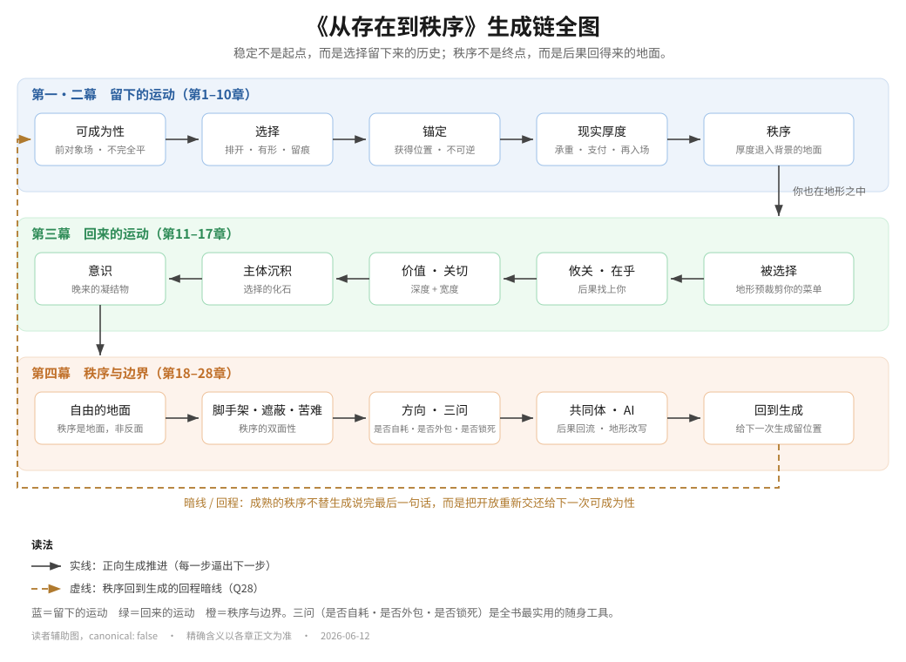

# 读者辅助件：生成链全图

> 这是一张可反复翻回的地图。本书每一章都建立在前一章之上——读到第三、四幕时，如果记不清自己走到链条哪一步，翻回这里。
>
> 精确含义以各章正文为准；本图只标方向，不下定义。

---

## 文字版（无障碍 / 纯文本环境）

**主梁一句话**：稳定不是起点，而是选择留下来的历史；秩序不是终点，而是后果回得来的地面。

**第一·二幕　留下的运动（第1–10章）**
可成为性（前对象场·不完全平）
→ 选择（排开·有形·留痕）
→ 锚定（获得位置·不可逆）
→ 现实厚度（承重·支付·再入场）
→ 秩序（厚度退入背景的地面）

↓ *你也在这个地形之中*

**第三幕　回来的运动（第11–17章）**
被选择（地形预裁剪你的菜单）
→ 攸关·在乎（后果找上你）
→ 价值·关切（深度 + 宽度）
→ 主体沉积（选择的化石）
→ 意识（晚来的凝结物）

↓

**第四幕　秩序与边界（第18–28章）**
自由的地面（秩序是地面，不是反面）
→ 脚手架·遮蔽·苦难（秩序的双面性）
→ 方向·三问（是否自耗·是否外包·是否锁死）
→ 共同体·AI（后果回流·地形改写）
→ 回到生成（给下一次生成留下位置）

⤺ *暗线 / 回程*：成熟的秩序不替生成说完最后一句话，而是把开放重新交还给下一次可成为性。

---

## 读法

- **实线方向**：正向生成推进，每一步逼出下一步的问题。
- **虚线回程**：第二十八章的收口——秩序回到生成，不是闭环，而是给下一次生成留位置。
- **三色**：蓝＝留下的运动，绿＝回来的运动，橙＝秩序与边界。
- **三问（是否自耗·是否外包·是否锁死）** 是全书最实用的随身工具，出现在第二十二章。

*图与文字版均为读者辅助，`canonical: false`。*
