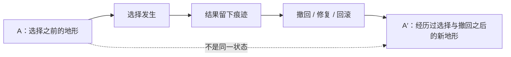

# 图 2：A 与 A′——撤回不是回到原点

> **图题建议**：撤回之后为什么不是 A，而是 A′  
> **白话题注**：撤回不是倒带，是在已经写过的地形上再写一笔。

## 1. 图的任务

本图服务 Q08“不可逆性问题：撤回为什么不是回到原点？”。它只回答一个读者困惑：

> 如果结果已经撤回、关系已经修复、系统已经回滚，为什么 SRT 仍说没有回到原点？

图的答案是：

> 因为撤回恢复的通常是表面结果；但经历过选择、写入、撤回之后，后续选择面对的地形已经多了一段历史。这个状态不是 A，而是 A′。

## 2. Mermaid 正文版

## 3. 读者版图注

一次选择发生之后，它不只是产生一个结果，也会改变后续选择面对的地形。撤回、修复或回滚可以真实地恢复某些表面结果，但它们通常不能把“经历过这件事”从历史中清零。因此，撤回之后的状态不是原来的 A，而是 A′：它可以很像 A，甚至在功能上几乎等价，但它已经带着一段不可清零的历史。

## 4. 图内文字短版

- A：选择之前
- 选择发生
- 结果留下
- 撤回 / 修复 / 回滚
- A′：经历过之后
- A ≠ A′：不是失败，而是多了一段历史

## 5. 图没有证明什么

本图**不证明**所有后果都会长期显著，也不证明修复无效，更不证明任何系统都无法恢复功能状态。它只表达 Q08 的最小主张：

> 一旦某个显现承重并再入场，撤回就只能在已经改变的地形上进行，不能把历史变成从未发生。

## 6. 插入建议

**首选落点**：Q08 §3“选择写回地形：撤回之后为什么是 A′”之后。

**插入方式**：正文段落之后放图，不放在章首。因为读者需要先从“说错话 / 撤回 / 修复”的生活场景进入，再用图收束结构。

**建议引入句**：

> 可以把这个差别画成一条很短的路径：

**建议承接句**：

> 图里真正重要的不是 A′ 比 A 更坏，而是 A′ 已经不是“从未发生”的 A。修复、学习、原谅、回滚，都发生在 A′ 的地形上。

## 7. 与后续图的关系

- 连接图 4：“同一终点，不同历史”。图 2 说明 A′ 不是 A；图 4 进一步问：如果两个路径到达同一表面终点 X，历史是否仍会影响下一次扰动？
- 连接 Levin 线：外观相似不等于历史相同。若再切割 / 再扰动反应不同，说明历史没有被清零。
- 连接 Q09：A′ 的历史差异若反复承重，就会沉积为厚度。

## 8. 验收三问

1. **它回答了读者哪个具体困惑？**  
   回答“为什么撤回之后不是回到原点”。

2. **它是否只服务‘留下’或‘回来’之一？**  
   只服务“留下”：选择写入地形，撤回不能清零写入史。这里不使用“回来”作为后果回流术语。

3. **如果删掉它，正文是否更难理解？**  
   是。Q08 的 A / A′ 区分是不可逆性的核心抽象，图能把抽象命题压成一条可见路径。
