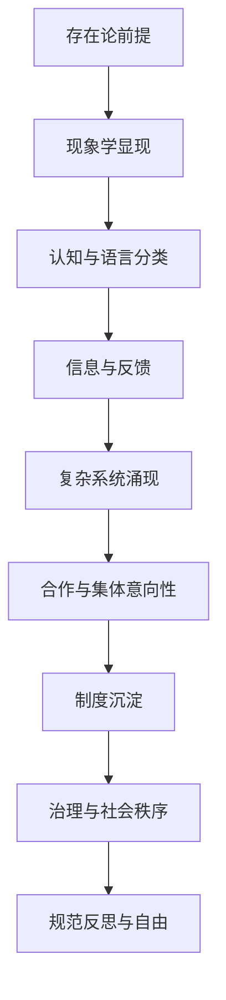
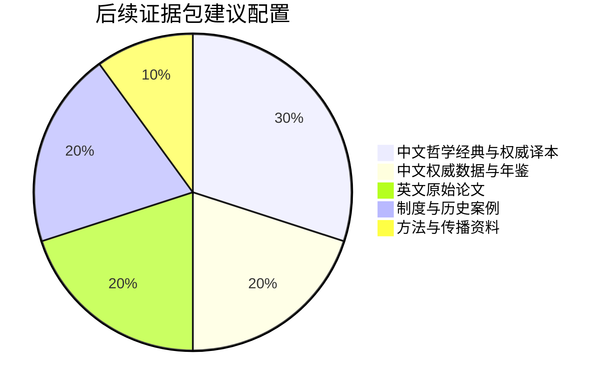

# 《从存在到秩序》深度研究报告提纲与定制材料清单

## 工作边界

由于你尚未上传目录、样章、注释、参考文献与目标出版信息，以下内容全部以**“基于未指定原文的假设”**为前提：我暂时把《从存在到秩序》理解为一部试图把“存在”的本体论问题，推进到“秩序”的生成、稳定、危机与治理问题的跨学科中文思想书。这个方向天然横跨形而上学、现象学、存在主义、社会本体论、复杂系统、信息哲学、合作演化与制度研究，因此后续完整版报告最需要优先检查的，不是单一学术点是否“对”，而是各层级之间有没有被稳固地桥接。现象学关注经验结构与第一人称显现，社会本体论与集体意向性解释社会事实和制度如何成立，信息哲学与香农信息论要求区分信号、信息与意义，复杂系统研究则强调多层反馈、涌现与非线性。SEP 作为经专家编写、持续修订的学术参考工具，适合用来搭建这类初步跨学科框架。citeturn0search1turn0search3turn4search3turn4search6turn1search0turn1search2turn8search19turn4search20

## 执行摘要

初步判断，这本书最值得“拔高”的方向，不是把“存在”写得更抽象，而是把“存在如何通向秩序”重写成一条**可分层、可证明、可被案例支撑**的链条：**存在论前提 → 现象学显现 → 认知与语言中的分类/命名 → 信息与反馈机制 → 复杂系统中的涌现与失稳 → 合作与集体意向性 → 制度化与治理秩序**。这样改写有三重收益：其一，避免从形而上学直接跳到政治或制度结论的论证断裂；其二，把“秩序”从静态稳定改成“可生成、可演化、可崩解、可修复”的动态结构；其三，使全书能够同时对话哲学史、复杂性科学、制度研究与现实治理问题。若后续原文确有类似宏大主张，那么完整版报告会优先围绕“中介机制不足”“概念层级混用”“规范判断偷渡”“科学借用过度简化”这四类常见漏洞展开逐章诊断。citeturn0search4turn0search1turn0search3turn1search0turn1search2turn7search0turn1search15

## 详细提纲

基于未指定原文的假设，完整版研究报告建议按下表展开。这个结构已经对齐你要求的五类目标：找缺口、找问题、补证据、挖深论证、做战略拔高。citeturn0search4turn0search1turn0search3turn1search0turn7search0turn1search15

| 模块 | 核心任务 | 重点检查 | 输出形式 | 优先级 | 可行性 |
|---|---|---|---|---|---|
| 概念与术语校准 | 建立“存在、存在者、秩序、结构、制度、信息、意义、自由、治理”术语表 | 是否混用本体论、认识论、政治哲学语言 | 术语表 + 核心命题图 | 极高 | 高 |
| 未讲主题清单 | 找出“可以讲但未讲”的高价值主题 | 时间性、历史性、集体意向性、制度沉淀、失序机制、语言中介 | 表格 | 极高 | 高 |
| 问题与改写建议 | 识别常见论证断裂与表达失衡 | 从存在直跳秩序、从科学直跳规范、从经验直跳制度 | 表格 | 极高 | 高 |
| 补充证据与案例 | 为核心论点配置证据等级与案例池 | 哲学经典、原始论文、官方统计、制度案例、反例 | 表格 | 高 | 高 |
| 可深入论证的研究路线 | 设计后续可扩展成章节或论文的深挖路径 | 概念谱系、比较研究、案例验证、数据补证 | 列表 | 高 | 中高 |
| 拔高策略 | 提升全书的结构、学理密度与传播势能 | 章节重构、双层读者策略、外部传播路径 | 战略建议 | 高 | 高 |

基于未指定原文的假设，以下主题是**高概率需要补入**的“缺口主题”候选。它们之所以重要，是因为它们分别补足了从第一人称经验到社会秩序的中介层。citeturn0search1turn4search1turn4search6turn8search0turn8search2turn1search0turn7search0turn1search15

| 主题 | 重要性 | 可纳入位置 | 优先级 | 可行性 |
|---|---|---|---|---|
| 时间性与历史性 | 使“存在”不落为静态实体论 | 导论或第一章 | 极高 | 高 |
| 现象学“显现”层 | 给“存在→秩序”加上经验中介 | 哲学基础章 | 极高 | 高 |
| 身体性与具身认知 | 防止只用抽象理性解释秩序 | 认知与语言章 | 高 | 中高 |
| 语言、命名与分类 | 解释秩序如何被稳定表达 | 认知与语言章 | 高 | 高 |
| 信息与意义的区分 | 防止把香农信息当价值与意义 | 科学桥接章 | 极高 | 高 |
| 涌现与边界条件 | 防止把“自组织”写成目的论 | 科学桥接章 | 极高 | 中高 |
| 合作与集体意向性 | 解释秩序为何能超出个体 | 社会秩序章 | 极高 | 高 |
| 制度沉淀与规范内化 | 解释秩序如何持久化 | 社会政治章 | 极高 | 高 |
| 失序、脆弱性与崩解 | 让“秩序”不是单向赞歌 | 危机与治理章 | 高 | 高 |
| 中国思想参照系 | 提升中文作品独特高度 | 结尾或独立章节 | 高 | 中高 |

基于未指定原文的假设，后续完整版报告中“问题与改写建议”部分建议优先检查如下高频论证。这里的“原论点”是**占位式假设**，用来模拟常见写法。相关风险主要来自范畴混淆、机制缺位与规范偷渡。citeturn0search3turn1search2turn1search0turn7search0turn1search15

| 原论点 | 问题类型 | 改写或补强方案 | 优先级 |
|---|---|---|---|
| “存在决定秩序。” | 过度总括、机制缺失 | 改为“秩序是存在在经验、信息、协作与制度层面的多级稳定化结果” | 极高 |
| “秩序优于混乱。” | 价值预设未申明 | 补出“描述性秩序”与“规范性正当秩序”的区分 | 极高 |
| “复杂系统会自发走向秩序。” | 科学借用简化、隐含目的论 | 改写为“在特定边界条件与反馈结构下可能出现局部有序” | 极高 |
| “信息越多，秩序越高。” | 把统计信息混同语义与制度意义 | 区分香农信息、语义信息、规范信息 | 极高 |
| “语言建构世界。” | 过度语言中心主义 | 补入身体性、物质条件与制度约束 | 高 |
| “自由与秩序对立。” | 二元化过强 | 改写为“自由既可能解构秩序，也可能通过自律与协作生成秩序” | 高 |
| “制度只是外在约束。” | 忽视内化与集体行动 | 加入规范内化、角色结构、合法性来源 | 高 |
| “宏大哲学命题可直接指导治理。” | 从本体论直跳政策结论 | 增设中层理论：合作、规范、制度、案例比较 | 极高 |

基于未指定原文的假设，证据部分不应只补“更多名言”，而应建立**证据阶梯**：经典原典用于定义边界，原始科学论文用于机制论证，官方统计与制度案例用于现实印证，反例用于防自说自话。中国语境下，国家统计局持续提供《中国统计年鉴》，CNKI 中国经济社会大数据研究平台整合统计年鉴、统计公报、普查与分析报告，适合支撑制度、治理与社会秩序部分的中文证据池。citeturn5search1turn5search3turn5search9turn5search15

| 证据类型 | 来源优先级 | 如何引用 | 优先级 |
|---|---|---|---|
| 哲学经典原文与权威中译本 | 中文权威译本 > 原文对照 | 用于术语界定与概念谱系 | 极高 |
| 英文原始论文 | 经典论文 > 权威综述 | 用于复杂性、信息、合作机制 | 高 |
| 中文核心期刊与学术综述 | CSSCI/CNKI核心优先 | 用于接入中文学界讨论 | 高 |
| 官方统计与年鉴 | 国家统计局、权威数据库优先 | 用于治理、制度、社会秩序案例 | 高 |
| 历史制度案例 | 经典案例 + 反例并举 | 用于论证制度生成与崩解 | 高 |
| 当代公共治理案例 | 可核验官方材料优先 | 用于提升现实针对性 | 中高 |

基于未指定原文的假设，完整版报告中“可深入论证的研究路线”建议优先走以下五条，每条都能独立扩成一章，或改写成后续论文、讲座与传播文章：
1. **存在—显现—秩序的谱系路线**：方法为概念史与文本细读；资料以亚里士多德、胡塞尔、海德格尔及社会本体论为主；预期结论是“秩序不是从存在直接推出，而是经由显现与可共同化经验逐级生成”。citeturn0search4turn0search1turn0search5turn0search12turn0search3
2. **信息—意义—制度的区分路线**：方法为概念区分 + 跨学科文献比对；资料以香农信息论、信息哲学、语言/意义理论为主；预期结论是“只有把统计信息、语义信息与规范信息分开，‘秩序’才不会变成含混的大词”。citeturn1search2turn8search3turn4search4turn4search10
3. **复杂性—涌现—失稳的机制路线**：方法为机制解释与反例比较；资料以复杂系统科学与“More is Different”为主；预期结论是“秩序并非自然赞歌，而是局部稳定、脆弱反馈与层级相互作用的结果”。citeturn1search0turn1search5turn1search9
4. **合作—集体意向性—制度生成路线**：方法为合作理论 + 制度理论 + 案例比较；资料以Nowak、Ostrom、社会制度理论为主；预期结论是“秩序生成的关键不是抽象统一，而是可持续合作、规则可执行性与制度正当性”。citeturn7search0turn1search15turn1search7turn8search0turn8search2
5. **写作传播路线**：方法为双层受众重写；资料以学术出版社提案与写作规范为参照；预期结论是“这本书可以同时面向学术读者与高质量公共读者，但前提是摘要、目录、样章和读者定位足够清晰”。citeturn3search1turn3search2turn3search8turn3search21turn3search26turn3search27

## 可视化草图

下图是一个适合本书的**概念桥接图**。它把最容易缺失的“中介层”全部显式化，能直接对应后续章节重构。citeturn0search1turn4search1turn4search6turn1search0turn8search2turn8search0

下图是后续完整版报告建议采用的**证据配置比例**。这不是事实分布，而是面向中文思想书写作的一种最优先资源配置建议：先用中文经典与权威数据稳住地基，再用英文原始论文补机制，再用案例拉高可读性与说服力。国家统计局与 CNKI 确实提供了适合作为中文证据底座的官方与准官方资料池。citeturn5search1turn5search3turn5search9turn5search15

## 关键原始材料

学术出版社对书稿开发通常会优先看五类东西：**项目说明、详细目录、样章、目标读者/竞品、文献与注释质量**。Cambridge、MIT Press、Princeton、Chicago、Harvard 与 Illinois 的作者指南都把这些视为提案与评估的核心，因此如果你要我后续做“逐章精准定制”，最关键的也正是这五项。citeturn3search1turn3search2turn3search8turn3search14turn3search21turn3search27

| 需提供的原始材料 | 为什么最关键 | 推荐格式 | 优先级 |
|---|---|---|---|
| 当前目录 + 每章 100–300 字摘要 | 决定我能否判断“未讲主题”和结构断裂 | Word/Markdown/大纲均可 | 极高 |
| 导论全文 + 一章最核心理论章节 | 决定我能否判断你的总论点、论证风格与薄弱点 | 可直接贴文本 | 极高 |
| 核心概念定义表 | 解决“存在/秩序/结构/制度/信息/自由”等术语漂移 | 两列表格即可 | 极高 |
| 参考文献与注释草单 | 决定补证据时是“续建”还是“重建”资料系统 | Zotero/Word/截图均可 | 高 |
| 目标读者定位 + 对标书单 + 不可删改观点清单 | 决定我如何在学术深度、可读性与传播上做取舍 | 一页说明即可 | 高 |

如果你只能先提供一组材料，**最优先组合**是：**目录摘要、导论全文、核心概念表**。这三项一到位，下一版深度定制报告就可以从“提纲级推断”进入“逐章级诊断”。