# IRP 成熟度状态机 T0–T7

> PRD §5.4 的可视化伴随文件。**门槛定义以 PRD 为准**；本文件是团队对齐与对外讲解用的渲染版。
>
> 一句话：**宽进**发生在 T0 入口（几乎不拒输入）；**严出**是从 g3 开始、贯穿 g3–g7 的逐级门槛。升级是"挣来的"，由门触发，不由时间或点赞触发（DP8/DP10）。

## 状态图

```mermaid
stateDiagram-v2
    direction LR
    [*] --> T0
    T0: T0 Impulse（理论冲动）
    T1: T1 Structured（已结构化）
    T2: T2 Author-confirmed（作者确认）
    T3: T3 Criticizable（可被批评）
    T4: T4 Community-reviewed（已社区评审）
    T5: T5 Revised（批评后修订）
    T6: T6 Expert-readable（专家可读）
    T7: T7 Public-ready（可公开/受限应用）

    T0 --> T1: g1 字段1–7,15 已生成
    T1 --> T2: g2 张力命中 HIT + 核心字段确认 ★命门
    T2 --> T3: g3 命题+失败条件+风险限形 ★严出起点
    T3 --> T4: g4 ≥2 份结构化评审（张力层+对象层）
    T4 --> T5: g5 评审触发实质性版本变更
    T5 --> T6: g6 学院简报 + 通过冷读者测试
    T6 --> T7: g7 大众简报 + 风险限形已强制
    T4 --> T3: 降级（评审推翻→reviewer_challenged，不静默）
```

## 门槛表（权威见 PRD §5.4）

| 门 | 从→到 | 进入条件 | 性质 |
|---|---|---|---|
| g1 | T0→T1 | 字段 1–7、15 已生成（AI 可，未确认可） | 宽进后结构化 |
| g2 | T1→T2 | **张力层"被看穿"命中** + 核心字段 author_confirmed | ★ 情绪命门（DP4） |
| g3 | T2→T3 | 清晰命题 + 失败条件 + 风险已解析到合规输出形态 | ★ 严出起点（DP8） |
| g4 | T3→T4 | ≥2 份结构化评审（张力层 ≥1 + 对象层 ≥1） | 人类承认（DP6） |
| g5 | T4→T5 | 评审触发**实质性**版本变更（非措辞修饰） | 修订 |
| g6 | T5→T6 | 学院简报生成 + 通过冷读者测试（DP5） | 对外可信 |
| g7 | T6→T7 | 大众简报 + 高风险限形已强制 | 可公开/受限应用 |

降级：评审推翻已确认结论时，相关字段转 `reviewer_challenged`，packet 可被降级并**通知作者，不静默**（PRD FR-MAT-04）。

## 两条轴

- **宽进（T0 入口）**：理论、假说、模型、哲学框架、LLM 辅助作品、跨学科长文、个人研究计划、未成熟但真实的问题意识——都接（BP §6.1）。不因无 affiliation / 非博士 / 用 LLM / 非英语母语 / 非传统路径而拒。
- **严出（g3→g7）**：不把所有输入都输出为成熟理论；高风险域（医疗/心理/儿教/金融/法律/政治/神经）只允许 hypothesis / reflection framework / research proposal / observation protocol / non-clinical educational，**禁** diagnosis / treatment / intervention / advice / protocol for others（BP §6.3）。

## 样例落位

| Packet | 当前 T 级 | 说明 |
|---|---|---|
| [SRT（dogfood）](Theory_Packets/THEORY_PACKET_SAMPLE_SRT.md) | T3 | solo 阶段真实；T4+ 待真实社区评审 |
| [Joy = suspension of optimization](Theory_Packets/THEORY_PACKET_SAMPLE_joy-suspension-of-optimization.md) | T3 | 演示宽进→张力→严出（g3）全过程，含心理域限形 |
