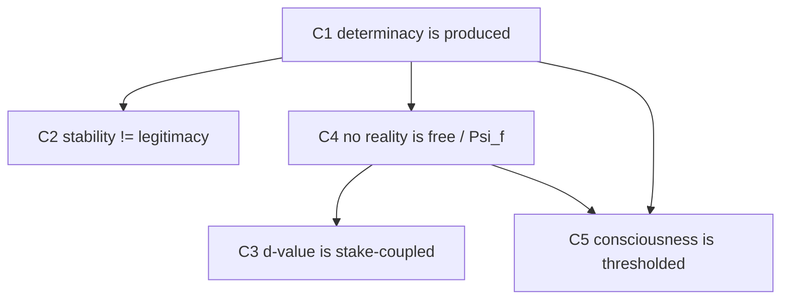

# Theory Packet (SAMPLE) — Selection-Reality Theory

> **为什么用 SRT 做样本**：把项目自己最严肃的理论，过自己的协议。它示范两件事——(1) 协议能接住一个高密度、跨域的理论；(2) **严出对自己人一样狠**：SRT 的"解释一切"风险被按平台自己的反宗派规则（BP §13.2）+ 公共护栏降级。这是最强的可信度动作。
>
> 成熟度按 PRD §5.4 诚实标注为 **T3**：solo 阶段（T0–T3）真实；字段 17–18 的社区阶段标 `[illustrative]`，因为 IRP 社区评审尚未真正发生。

## Packet header

```yaml
packet_id:        TP-SRT-0001
theory_title:     Selection-Reality Theory (SRT)
author:           Founder (dogfood self-run)
maturity:         T3   # Criticizable; T4+ illustrative
visibility:       private (visibility decision pending — see positioning_note)
risk_flags:       [grand_theory_overclaim]   # 见字段 15
allowed_output_forms:  [public_summary, hypothesis, reflection_framework]
created / updated: 2026-06-17 / 2026-06-17
```

---

## Fields

### 1. Theory title
> prov: `original` · label: `human revised`

Selection-Reality Theory (SRT).

### 2. One-sentence thesis
> prov: `author_confirmed` · label: `human revised`

Reality is not first given and then selected; reality becomes determinate through constrained selection — stabilized through history, tested by resistance.

### 3. Problem origin
> prov: `original` · label: `human revised`

Dissatisfaction with the inherited picture in which reality is already fully formed and selection only happens afterward (we pick among finished objects). That picture cannot say what must happen for *any* possibility to become determinate in the first place.

### 4. Object proposal ★
> prov: `author_confirmed` · label: `human revised`

The **process by which a possibility becomes determinate** — selection, anchoring, resistance, cost, stabilization — rather than reality as a finished shelf from which we pick.

### 5. Choice tension ★★
> prov: `author_confirmed` · label: `human revised`

```yaml
protected_value: >
  Reality must stay accountable: what is real must pay cost, survive resistance,
  and leave consequences. It is neither merely given nor arbitrary.
competing_pressures:
  - "Given-realism: treats reality as pre-settled, so stability gets mistaken for legitimacy and the question of who pays the cost disappears."
  - "Constructivism/relativism: frees reality from constraint, so accountability and 'some worlds are better anchored than others' are lost."
current_misread_object: >
  Read as idealism ("mind creates reality"), as relativism ("all claims equal"),
  or as panpsychism ("everything is conscious").
alternative_objectifications:
  - "Process metaphysics (becoming over being)"
  - "Enactivism / autopoiesis (constraint + embodiment)"
  - "Predictive processing (cost-bound inference)"
```

> 张力层注解：SRT 正是为同时**拒绝**"给定实在论"与"相对主义"而生——selection-first 但 constraint-bound。这条张力是该理论的发动机，也是它最常被误读的地方。

### 6. Core concepts
> prov: `original` · label: `human revised`

- `L0 / L1 / L2`：latent possibility / manifest reality / stabilized convergence
- Selection（broad）：远宽于有意识选择（attention, action, measurement, embodiment, memory, institutional filtering, …）
- `Ĝθ`（G_hat_theta）：parameterized selection / anchoring operator；`θ` = 选择条件（history, embodiment, context, model-state…）
- `d-value`：stake-coupled concern
- `Psi_f`：ontological friction（payability burden）
- Thresholded consciousness；**stability ≠ legitimacy**

### 7. Glossary
> prov: `author_confirmed` · label: `human revised`

| Author term | Plain-language meaning | Nearest existing term |
|---|---|---|
| L0 | possibility before stable selection | potentiality / possibility space |
| L1 | the actual, selected slice here-and-now | the actual / the manifest |
| L2 | what hardens when selections repeat | institutions / habit / "second nature" |
| Ĝθ | the selecting-anchoring structure, conditioned on θ | selection mechanism |
| d-value | value as exposure to returning consequence | stake / skin-in-the-game (not preference) |
| Psi_f | the cost of making and holding a reality real | friction / thermodynamic-info cost |

### 8. Core claims
> prov: `author_confirmed` · label: `human revised`

| # | Claim | type | strength |
|---|---|---|---|
| C1 | Determinacy is produced, not presupposed: a possibility becomes determinate only through a selecting structure (Ĝθ) that constrains, anchors, pays, repeats, stabilizes. | causal / definitional | strong |
| C2 | Stability ≠ legitimacy: a stabilized pattern (L2) can be stable yet harmful, false, coercive, or costly. | descriptive / normative | strong |
| C3 | Value (d-value) is stake-coupled, distinct from capacity and from preference: value begins where consequences return and cannot be substituted away. | definitional / normative | medium |
| C4 | No reality is durable for free: every selected reality carries Psi_f friction; living reality needs *payable* friction (neither zero nor crushing). | causal | medium |
| C5 | Consciousness is thresholded, not co-extensive with selection: it appears only when selection enters concern, burden, consequence-return, self-modulation, and directional readability. | definitional / empirical-bridging | weak-medium |

### 9. Claim map
> prov: `ai_inferred` · label: `author confirmed`



### 10. Evidence types
> prov: `author_confirmed` · label: `human revised`

| Claim | Evidence type |
|---|---|
| C1 | conceptual + formal (axioms/equations exist as formal anchors) |
| C2 | conceptual + historical illustration |
| C3 | conceptual + phenomenological; empirical bridge proposed, not completed |
| C4 | conceptual; formal cost-framing; empirical not completed |
| C5 | bridging to AI/consciousness; **operational criterion still open** |

### 11. World knowledge alignment
> prov: `ai_inferred` · label: `author confirmed`

| Adjacent work / field | Relation | Note |
|---|---|---|
| Process philosophy (Whitehead) | complement | becoming over being; SRT adds cost/anchoring apparatus |
| Enactivism / autopoiesis | complement | selection under constraint + embodiment |
| Predictive processing / Active Inference | complement | friction/cost; SRT keeps "stability ≠ legitimacy" |
| Constructivism / social construction | re-draw boundary | constructed **but constraint-bound** — not relativist |
| Idealism | oppose | selection-first ≠ mind-first |
| Panpsychism | oppose | selection is broad; consciousness is thresholded |

### 12. Steelman
> prov: `ai_inferred` · label: `author confirmed`

A single vocabulary (selection / anchoring / friction / stake / threshold) lets one ask the *same* structural question across physics-of-determinacy, consciousness, AI, and social institutions — "where are the stakes, the consequence-returns, the costs, the convergence?" — without collapsing those domains into one substance and without declaring all stabilized worlds equally legitimate.

### 13. Red-team critique
> prov: `ai_inferred` · label: `reviewer challenged`

- **"Explains everything" / unfalsifiable**: if selection underlies all determinacy, what observation could SRT *not* accommodate after the fact?
- **Circularity**: "real = what survives constraint" + "constraint = what makes real" risks definitional loop.
- **Relabeling vs prediction**: do d-value / Psi_f generate any differential prediction beyond existing affect, reward, and thermodynamic-cost theories?
- **Threshold underspecification**: C5's consciousness threshold may not be statable independently of intuition.

### 14. Failure conditions ★
> prov: `author_confirmed` · label: `human revised`

- If a determinate reality can be exhibited that requires **no** selecting structure and **zero** anchoring cost, **C1 fails**.
- If `d-value` and `Psi_f` cannot be operationalized to make **any** differential prediction beyond existing affect/cost theories, the value/friction apparatus reduces to relabeling (**C3/C4 fail as science**).
- If the consciousness threshold cannot be specified by a **measurable** criterion independent of intuition, **C5 stays philosophy, not science**.
- If "stability ≠ legitimacy" yields **no** decision procedure for which stable patterns to reselect, **C2 is rhetorical**.

### 15. Risk flags
> prov: `system` · label: `author confirmed`

```yaml
domain: none           # no clinical/financial/legal advice content
level:  med
flag:   grand_theory_overclaim
governance:
  - "BP §13.2 反宗派化：'解释一切'的理论不得直接升级；必须保留最强反对、失败条件、非适用范围。"
  - "PUBLIC_GUARDRAILS downgrade rule：任何'SRT explains everything / proves all others wrong'句式必须降级。"
allowed_output_forms:   [public_summary, hypothesis, reflection_framework]
forbidden_output_forms: [certified_truth, "claim to settle every domain at once"]
author_care_note: "本样本作者=founder 本人，无第三方照护问题。"
```

> 严出演示：同一套理论，若以"SRT 解释了一切、证明其他理论都错"出街 = 过度宣称风险；按平台自己的规则降级为"a constrained framework with explicit failure conditions"。**平台对自己人一样狠。**

### 16. Author confirmation ★
> prov: `author_confirmed` · label: `author confirmed`

- Tension layer "did we see you?": **HIT**（founder 自评；张力"reality accountable vs given/arbitrary"确为 SRT 的生成张力）
- Per-field confirmed: 1–16 confirmed
- Overall author sign-off: `[x] confirmed`（dogfood：founder 即作者）

### 17. Review ledger `[illustrative]`
> prov: `system` · label: `AI assisted`

> 以下为**示意**条目，展示评审账本的形态；IRP 社区评审尚未真正运行。

| Date | Reviewer | Layer | Key point | Adopted? |
|---|---|---|---|---|
| `[illustrative]` | Bridge reader | object | "C5 threshold needs a measurable criterion or label it philosophy" | pending |
| `[illustrative]` | Independent researcher | tension | "你守护的其实是 accountability，不是 anti-realism——把这点写到首句" | adopted → 见字段 2 |

### 18. Revision history `[illustrative]`
> prov: `system` · label: `AI assisted`

| Version | Change summary | Triggered by | Maturity at time |
|---|---|---|---|
| v0.1 | Initial dogfood packet from public one-pager | founder | T3 |

### 19. Public brief
> prov: `author_confirmed` · label: `human revised`

SRT asks how possibilities become realities. Reality becomes determinate through constrained selection, is stabilized through history, and is tested by resistance. Selection is broader than conscious choice; consciousness is thresholded; **stability is not legitimacy**. What becomes real must pay cost, survive resistance, and leave consequences.

### 20. Academic brief
> prov: `ai_inferred` · label: `author confirmed`

A selection-first (not mind-first) account of determinacy, positioned between given-realism and constructivism: realities are selected under constraint, anchored by a parameterized operator (Ĝθ), and made durable only by payable ontological friction (Psi_f). It complements process metaphysics, enactivism, and predictive-processing while resisting relativism (stability ≠ legitimacy) and panpsychism (consciousness is thresholded). Formal anchors (axioms, equations) exist; the open empirical frontier is operationalizing d-value, Psi_f, and the consciousness threshold into differential predictions.

---

## Maturity gate checklist

- [x] **g1 T0→T1** · [x] **g2 T1→T2** (tension HIT) · [x] **g3 T2→T3** (claims + failure conditions + risk handled)
- [ ] **g4 T3→T4**：待真实社区评审（字段 17 现为 illustrative）
- [ ] g5 / g6 / g7：未进入
