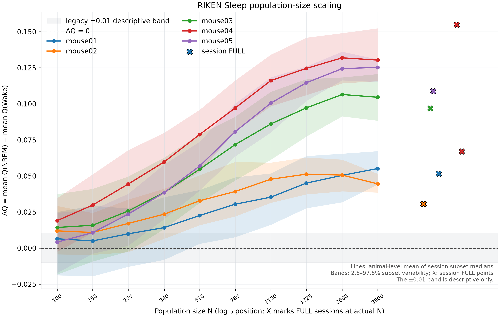

# RIKEN Sleep Population-Size Scaling Holdout Test

## Result

The preregistered directional criterion is met: all five animals have a positive within-animal slope of Sleep ΔQ against `log10(N)`, and the median slope is positive. The result is classified `PS-A` under the frozen Gate 1 rule. This supports population-size dependence of this operational Sleep state contrast in the eligible RIKEN recordings.

The finite-N trajectories do not directly bracket zero in any animal. All five animal-level ΔQ values at `N=100` are positive. A sign reversal at small N was not observed and was not required by the primary hypothesis.

This result is qualified by a deterministic subset-seed namespace deviation disclosed below. The seed root, uniform sampling without replacement, frozen N grid, graph rule, Louvain repeat count, max-Q statistic, and animal-level estimand were unchanged. The exact subset memberships differ from the literal numeric-N seed recipe in the preregistration; this is not exact seed-recipe compliance.

## Frozen design and execution

- Preregistration: [SRT_NEURO_POPULATION_SIZE_SCALING_PREREGISTRATION_2026-09-24.md](SRT_NEURO_POPULATION_SIZE_SCALING_PREREGISTRATION_2026-09-24.md), frozen in commit `c317d97f` before execution.
- Biological sample: 5 animals and 6 nested recordings/sessions; mouse04 contributes two sessions, combined within mouse04 before cross-animal summaries.
- Signal: existing RIKEN S3 `spike_smoothed` pipeline.
- Target N: `100, 150, 225, 340, 510, 765, 1150, 1725, 2600, 3900`, plus `FULL`. All finite targets were available in all six recordings.
- Finite-N subsampling: 100 uniform random subsets without replacement per recording and target; the same membership was used across that recording's state windows.
- Graph: connected MST backbone plus strongest remaining ranked absolute-correlation edges; target mean degree 16; binary unweighted network.
- Optimization: 200 Louvain repeats per graph; max-Q retained; seed root 12345.
- Completed: 6006/6006 recording × target × subset jobs and 49,049 state-window graphs; all 9,809,800 Louvain Q trials were present and finite.
- Runtime: Python 3.14.0, NumPy 2.5.3, SciPy 1.18.1, h5py 3.16.0, NetworkX 3.6.1, python-louvain 0.16; macOS 15.7.4 arm64; 8 worker processes. Execution completed 2026-10-09 at 16:38 +08:00.
- The saved runtime state began with a `workers=4` default from the smoke run. The full run used 8 workers, as recorded in `.local/phase2_population_size_scaling/environment.txt` and the run command log.

For each subset and recording, state Q is the mean of its window-level max-Q values; `ΔQ = mean Q_NREM − mean Q_Wake`. The per-animal finite-N point is the session median of 100 subset contrasts, averaged across sessions within an animal. The slope uses the ten finite target N values only; `FULL` is a separate reference. Spearman rho is also calculated over the finite target grid. The cross-animal percentile bootstrap resamples animals, using 10,000 resamples and seed 98765. Bootstrap intervals are descriptive with five animals; no p-value is used.

For mouse04's plotted subset band, the two nested session subset draws were averaged at matching repeat indices; its primary curve point remains the average of the two session medians. Bands show subset variability, not biological uncertainty.

## Animal results

| Animal | β_N | Spearman ρ | FULL ΔQ | ΔQ at N=100 | Finite-N ΔQ range | Direct zero bracket |
|---|---:|---:|---:|---:|---:|---|
| mouse01 | 0.03438 | 0.98788 | 0.05161 | 0.00645 | 0.00499 to 0.05515 | none |
| mouse02 | 0.02816 | 0.90303 | 0.03054 | 0.01195 | 0.01083 to 0.05126 | none |
| mouse03 | 0.06729 | 0.98788 | 0.09685 | 0.01431 | 0.01431 to 0.10647 | none |
| mouse04 | 0.07897 | 0.98788 | 0.11094 | 0.01906 | 0.01906 to 0.13189 | none |
| mouse05 | 0.08744 | 1.00000 | 0.10887 | 0.00416 | 0.00416 to 0.12530 | none |

Positive slopes: **5/5**. Cross-animal median β_N: **0.06729**; mean β_N: **0.05925**. Animal bootstrap 95% percentile interval: mean β_N **[0.03848, 0.08002]**, median β_N **[0.02816, 0.08744]**. Gate 1 classification: **PS-A**.

The legacy ±0.01 band is shown only as a descriptive reference. It is not an uncertainty interval, significance threshold, or success criterion.



## Kiyooka comparison and anchor

The comparison distinguishes (1) Kiyooka's full/large-N cellular result, (2) its state-matched large-N subsampling control, and (3) this continuous random-single-neuron N sweep. The comparison does not imply that Kiyooka lacked a neuron-count control.

The exact session-specific active-neuron anchor used by the Kiyooka size-matched control was not faithfully recoverable from the available source/method record. It is recorded as `ANCHOR-UNRESOLVED`; no approximate anchor was substituted. See Kiyooka et al., *Cell Reports* (2025), [doi:10.1016/j.celrep.2025.116902](https://doi.org/10.1016/j.celrep.2025.116902).

## Execution deviation

The preregistration specified subset seeds as:

```text
stable_seed(12345, "population_size_scaling_subset", recording_id, numeric_target_N, subset_repeat)
```

The runner supplied the target label string (`"N100"`, etc.) in place of numeric `target_N`. Sampling remained uniform without replacement under deterministic seeds, and no seed or analysis choice was changed after observing an outcome. The realized membership is fully preserved and hashed. Example at `N=100`, subset repeat 0:

| Recording | Implemented seed (`"N100"`) | Preregistered numeric-N seed |
|---|---:|---:|
| mouse01_sleep | 635240748 | 2046770659 |
| mouse02_sleep | 912237860 | 2060364916 |
| mouse03_sleep | 210638059 | 22518005 |
| mouse04_day1_sleep | 1233146577 | 573670191 |
| mouse04_day2_sleep | 1020964656 | 428509053 |
| mouse05_sleep | 1811738390 | 32688115 |

This changes the deterministic sample realization, not the target population, sampling law, graph, optimization, contrast, or analysis rule. The result is reported as the completed outcome of the realized implementation with an explicit seed-spec deviation, rather than claiming literal compliance with the preregistered seed recipe.

## Interpretation boundary

This result supports a positive population-size trend in Sleep ΔQ across these five animals and this frozen network pipeline. It does not demonstrate a sign reversal: no animal's observed finite-N trajectory crosses zero, and every `N=100` point is positive. It does not establish a mechanism, SRT, objectification, consciousness, or a generic novelty claim about finite-size effects, subsampling, or network measures.

Mouse05 overlaps the broader Phase 1 lineage. Sleep was held out from the Phase 3C N-only decomposition for this specific hypothesis, but the result is not fully independent of the broader programme.

## Data and integrity inventory

Files are the existing eligible RIKEN Phase 2 data under the ignored local runtime directory. Checksums below are SHA-256 of the source MAT files.

| Recording/session | Animal | Accepted neurons | Bytes | SHA-256 |
|---|---|---:|---:|---|
| mouse01_sleep | mouse01 | 7843 | 658474258 | `a73526ff842633816a7d03f2578eaeb398fd928c9c2b4a62a2496273dc3c59e6` |
| mouse02_sleep | mouse02 | 6574 | 1093789677 | `e7f283390791c5fbeade9dc2f579d9e89c772a46afcb7f36636d8d081bf99934` |
| mouse03_sleep | mouse03 | 7112 | 1197235306 | `dcac3d396edcb188e88a7e1ff91efe335c904e9defdf2d26c11c36281bcb4277` |
| mouse04_day1_sleep | mouse04 | 9612 | 1625754526 | `3d78be67a6a192c511a41520062f6621b898661d2a2bc127e3f13012fb24ace3` |
| mouse04_day2_sleep | mouse04 | 10197 | 2254368168 | `84c843c06006a283a9df7fc3e081c550500e52909bafc96533b91861130f02c7` |
| mouse05_sleep | mouse05 | 7355 | 1263665343 | `973c27b3e27451d153c108b1ad38e447b749622ac58de2c6c0c0c01ccb380181` |

All 6006 job files are complete; no partial or unreadable job remains. Each graph has 200 finite Q trials, and each stored Q_max matches the maximum of its trial vector. Selected neuron indices and their hashes are retained in the local job files. The exact 200 Louvain seeds for every graph, along with its identifiers, selected-index hash, and Q_max, are retained in the compressed local seed ledger.

## Files

- `SRT_NEURO_POPULATION_SIZE_SCALING_RESULT_2026-10-09.md` — this result record.
- `SRT_NEURO_POPULATION_SIZE_SCALING_RESULT_2026-10-09.json` — machine-readable results, per-animal curves, validation and provenance.
- `SRT_NEURO_POPULATION_SIZE_SCALING_ANIMAL_CURVES_2026-10-09.csv` — animal-level finite-N and FULL summaries.
- `SRT_NEURO_POPULATION_SIZE_SCALING_SUBSAMPLE_SUMMARY_2026-10-09.csv` — all recording/session × target × subset contrasts, seeds and selected-index hashes.
- `SRT_NEURO_POPULATION_SIZE_SCALING_FIGURE_2026-10-09.png` — animal curves and subset variability.
- Raw job files and the 200-seed-per-graph ledger remain under the ignored `.local/phase2_population_size_scaling/` directory; no raw MAT data is added to Git.

## Next gate

Gate 1 is `PS-A`. Stop this population-size programme here and prepare a separate null-calibration preregistration before any null or mechanism analysis. No null model or new robustness control has been run.
