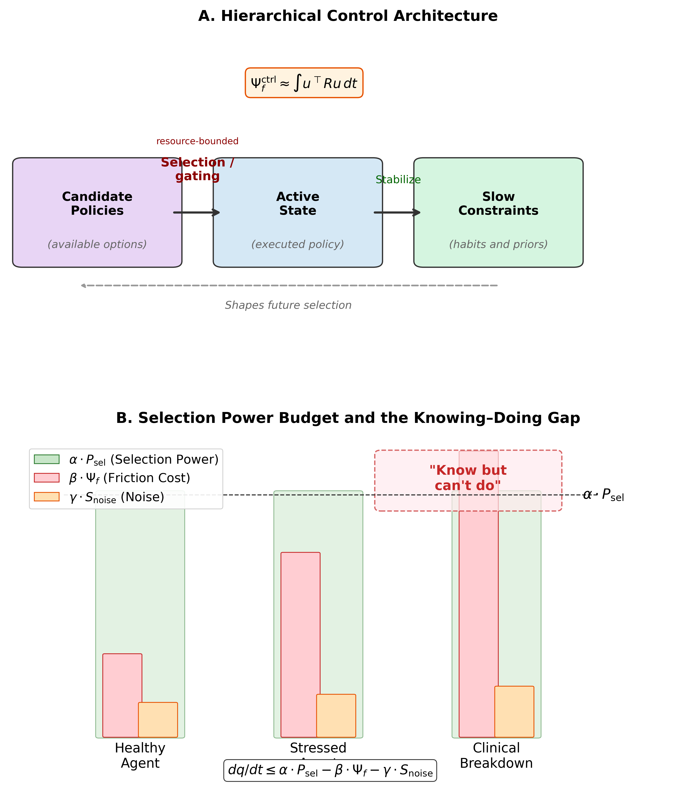
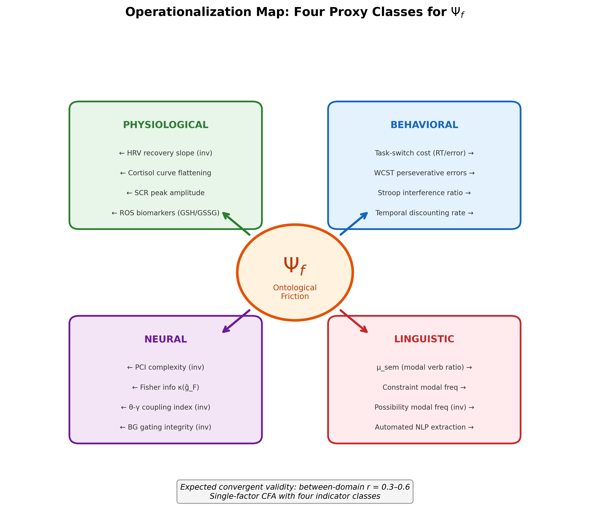
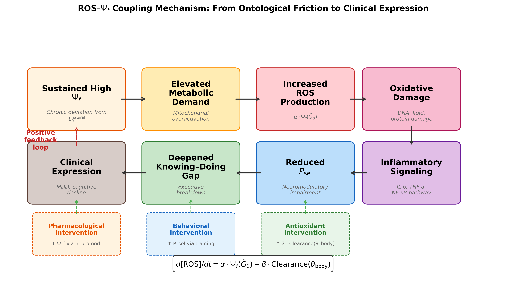
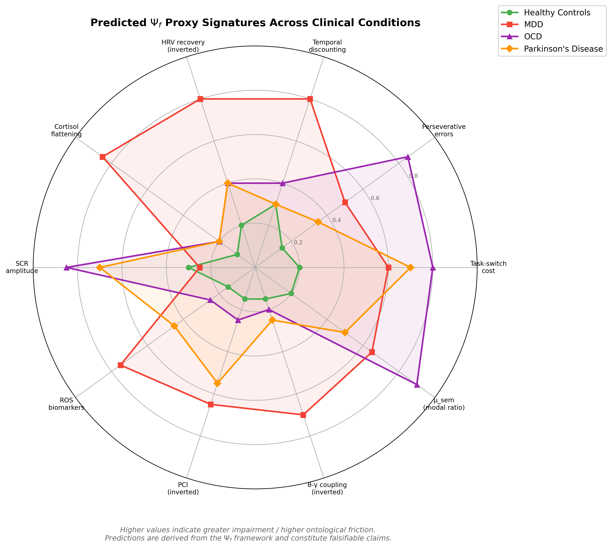
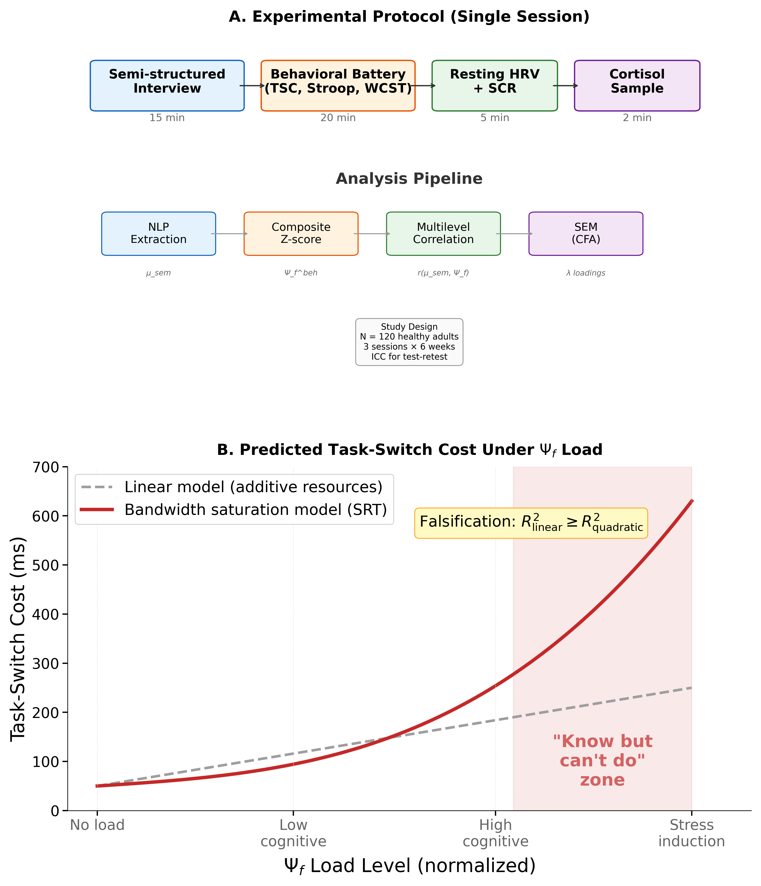

# 面向执行崩溃的转化型跨模态控制成本框架

**文章类型**：Hypothesis and Theory  
**目标期刊**：Frontiers in Neuroscience  
**建议专栏**：Translational Neuroscience  
**运行标题**：执行崩溃中的控制成本  
**说明**：本文为英文主稿的中文阅读版，用于讨论、修改与内部流转；正式投稿仍以英文稿为准。  

## 摘要

执行崩溃常表现为一种“知道但做不到”的解离：个体对适当行动具有相对完整的知识表征，却无法将其转化为实际执行。该现象广泛见于神经系统疾病与神经精神疾病之中，但迄今仍缺乏足够形式化的解释。本文提出一个潜在的跨模态控制成本因子，称为*本体摩擦*（ontological friction, $\Psi_f$），用于刻画这一缺口。这里的“本体”仅作为一个紧凑命名，用来指称横跨表征层与行动层的维持/切换成本，而非形而上学主张。本文从两个层面定义 $\Psi_f$：其一为经验层面的潜变量，其二为机制层面的控制成本模型族，包括基线漂移条件下的积分控制努力与信息几何偏离。本文将主观痛苦建模为“平滑摩擦变化率”与情境评估共同决定的风险函数族，并将执行崩溃表述为一种带宽饱和事件，即摩擦成本与噪声成本超过可用选择能力时系统发生失稳。本文的核心贡献是转化导向的：提出一条低成本验证链，将行为控制任务、经调整的情态语言指标以及自主神经生理指标（HRV/SCR）结合起来；神经与生化指标则被定位为可选的后续裁决层。重性抑郁障碍、强迫症和帕金森病在本文中被用作检验模型特异性预测的边界用例，而非替代既有疾病分类学。本文给出五个可预注册的假设、明确的证伪阈值，以及一个用于刻画“知道—做到”转折的临界负荷参数。本文不报告新数据，而是提供一个面向转化神经科学的“理论到实验”框架，以支持执行功能障碍与生物标志物研究中的直接经验检验。

## 1. 引言

### 1.1 “知道—做到”缺口

考虑三个临床场景。帕金森病患者能够准确描述从椅子上站起所需的动作序列，却依然坐在原地，无法启动该动作程序。强迫症患者明知反复洗手并不合理、也不成比例，却无法停止实施。重性抑郁障碍患者可以清楚说出哪些行为有助于改善现状，例如锻炼、社交接触或规律服药，却仍长期躺卧、难以将知识转化为行动。

这三个场景共享一个显著的结构特征：个体关于世界与适当行动的表征模型大体仍然完好，但将该知识付诸实施的能力发生了损伤。我们将这种“知道”与“做到”之间的解离称为*知道—做到缺口*（knowing-doing gap）。这一现象在临床上极具重要性，但在理论上仍然定义不足。尽管执行功能研究已经系统描述了其行为表现（Miyake et al., 2000; Diamond, 2013），神经影像研究也识别了相关神经基础（Stuss and Alexander, 2007; Miller and Cohen, 2001），现有框架仍缺乏一个统一的定量解释：它既要说明为何知识与行动可以解耦，又要预测何时发生这种解耦，并能跨行为、生理、神经和语言层面予以测量。

### 1.2 现有框架的局限

若干理论框架涉及“知道—做到”缺口的部分侧面，但都只覆盖了其中一部分。

**认知负荷理论**（Sweller, 1988; Sweller et al., 2019）量化了学习与任务执行中的工作记忆负担。该理论在教育心理学中影响深远，但本质上仍是一个行为层面的构念，缺乏生理与神经层锚定，也无法处理“在竞争性默认状态下长期维持某个被选状态”的成本问题。

**自由能原理**（FEP；Friston, 2010）提供了优雅的变分框架，将有机体描述为最小化预测误差的系统。变分自由能中的复杂度项 $D_{KL}[Q \| P]$ 捕捉了部分与“摩擦”相近的内容，即维持一个偏离先验的模型所需付出的成本。然而，FEP 将该成本视为应当被最小化的对象，难以自然容纳某些需要持续高偏离成本的适应性状态，例如创造性洞见、抵抗默认启发式的伦理抉择，或者系统在偏离成本压倒其能力时的失败模式。

**整合信息理论**（IIT；Tononi et al., 2016）给出一个意识的标量指标 $\Phi$，强调因果结构的不可还原性。它能够描述整合程度，却不处理维持整合状态的动态成本，也不处理状态间转移成本，因此更像是快照指标，而非控制成本函数。

**异稳态负荷**（allostatic load；McEwen, 1998; McEwen and Stellar, 1993）刻画了慢性应激适应的累积生理代价，但其时间粒度过粗，难以解释瞬时层面的执行崩溃，也缺乏与信息论量的明确形式连接。

**经典自我损耗模型**将自我控制理解为有限资源（Baumeister et al., 1998），但其“葡萄糖底物”式解释遭遇了显著的方法学批评、薄弱的元分析支持与复制危机（Hagger et al., 2016; Vadillo et al., 2016）。因此，本文更倾向于把代谢读出视为待检验的相关量，而不是预设为固定机制。

这些框架都不能与本文的提议互相替代。$\Psi_f$ 框架提出三个必须同时成立的强预测：第一，存在非线性的临界负荷转折（$\rho_c$）；第二，情境敏感的情态语言变化（$\mu_{\text{sem}}$）；第三，行为—语言—生理指标可收敛到同一个潜在因子。

关键缺口在于：目前没有任何一个框架给出一个单一、形式上明确的量，它既能同时满足以下条件：（a）在信息论与热力学直觉上可锚定；（b）同时生成行为、生理、神经与语言层面的可测预测；（c）将“知道—做到”缺口解释为一个特定的失败模式；（d）产生具有临床差异化能力的预测。

### 1.3 贡献与范围

本文被定位为一篇关于“资源受限行动选择下的执行崩溃”的转化神经科学假说论文。我们提出*本体摩擦*（$\Psi_f$）这一潜在的跨模态控制成本因子，并将其作为连接计算理论、可及性较高的生物标志物以及疾病差异化预测的候选桥梁。核心验证链被有意设计为低成本且可扩展：行为控制任务、经调整的情态语言分数，以及自主神经生理指标（HRV/SCR，可选皮质醇）。成本较高的神经与生化指标被明确定位为可选的裁决层，而非验证模型所必须的前提。重性抑郁障碍、强迫症和帕金森病在本文中被作为边界用例，用于应力测试参数漂移与解离模式，而不是为了替代各自既有的疾病病理机制。正文将直接使用标准的层级控制与预测加工语言；附录 A 仅提供一个可选的紧凑符号映射，并简单指向一篇 SRT 背景综述（Zhang, 2025）。

这是一项面向经验转化的理论与计算贡献。本文不报告任何新数据。按照 *Frontiers in Neuroscience* 的 Hypothesis and Theory 稿件定位，本文聚焦于一个明确研究领域——执行功能障碍中的“知道—做到”缺口——并围绕这一领域提出可检验模型、测量策略、证伪规则以及具备临床可操作性的未来研究协议。

---

## 2. 层级控制视角下的本体摩擦

### 2.0 本文使用的标准控制术语

为了降低理解门槛，正文尽量直接使用控制论、预测加工与主动推断中已经熟悉的语言：

- $\Psi_f$：可估计的控制/执行成本（潜在跨模态因子）。其中“本体”只是命名层面的简写，用来指称跨层维持/切换成本，并不要求读者接受额外形而上学承诺。
- $P_{\text{sel}}$：可用控制预算，也可理解为选择能力的代理指标。
- 候选策略空间：个体在某一时刻可供选择的任务相关策略集合。
- 当前活动状态：此刻真正被实施的知觉—行动或任务控制状态。
- 慢变量约束：习惯、先验、超先验以及类特质参数，它们会塑造未来选择。
- 资源受限的选择/门控机制：在有限神经与身体资源条件下，将候选策略映射到实际执行的控制过程。

若读者偏好紧凑符号，可参见附录 A；但正文论证并不依赖那套记号。

### 2.1 最小层级控制脚手架

本文的模型完全可以在标准层级控制语言中理解。这里的三部分分解只是一个务实的建模选择，而不是新的本体论宣言。换言之，读者不必接受任何额外哲学体系才能评估 $\Psi_f$；同样的方程可以被理解为与工作记忆门控、资源受限控制以及主动推断/预测编码中的控制回路兼容。

**候选策略空间**：表示在某一时刻可供系统选择的候选状态或策略集合。

**当前活动状态**：表示系统此刻真正处于其中并正在实施的状态。

**慢变量约束**：表示塑造未来选择的较慢约束，包括习惯、模型先验、超先验等。在本文中，它们与参数漂移、切换黏滞性以及类特质式控制极限相联系。

这些层次通过资源受限的选择机制相连：

$$x_{\text{act}}(t) = \operatorname{Select}_{\theta}\!\left[\Pi(t)\right] \tag{1}$$

其中 $\Pi(t)$ 表示候选策略空间，$x_{\text{act}}(t)$ 表示当前活动状态，$\theta$ 表示具身化参数，例如网络权重、神经调质状态与代谢约束。下标 $\theta$ 用来强调选择过程是资源受限的。

慢变量则通过稳定化更新：

$$z(t+1) = \operatorname{Stabilize}\!\left(z(t),\; x_{\text{act}}(t+1)\right) \tag{2}$$

本文的核心主张是：相对于某条基线策略轨迹，维持或切换当前活动状态都会产生一个可测的控制成本，这一成本就是本体摩擦 $\Psi_f$，而它会对执行功能形成约束。

### 2.2 本体摩擦：形式定义

我们采用双层定义，以便同时支持直接估计与机制比较。

**定义 1A（经验层潜变量）**：在测量层面，$\Psi_f$ 是一个由行为、语言和生理指标共同载荷的潜变量；神经与生化指标则被用作扩展层：

$$y_k = \lambda_k \Psi_f + \varepsilon_k,\quad k=1,\dots,K \qquad \text{(3a)}$$

其中 $y_k$ 为标准化观测指标，$\lambda_k$ 为因子载荷，$\varepsilon_k$ 为残差。这个量是 SEM/CFA 中直接估计的对象。

**定义 1B（机制层控制成本）**：在机制层面，状态动力学写为

$$
\begin{aligned}
\dot{x}(t)&=f_\theta(x,t)+B_\theta(x,t)\,u(t)+\xi(t),\\
\dot{x}_0(t)&=f_\theta(x,t)+\xi(t)\quad \text{when }u(t)=0
\end{aligned}
\qquad \text{(3b)}
$$

其中 $u(t)$ 为控制输入，$\dot{x}_0$ 为无控制输入时的基线漂移轨迹。本体摩擦可写为积分控制努力：

$$\Psi_f^{\text{ctrl}}(T)=\int_0^T u(t)^\top R\,u(t)\,dt,\quad R\succ 0 \tag{3c}$$

也可以采用一个信息几何对照模型：

$$\Psi_f^{\text{info}}(T)=\int_0^T D_{KL}\!\left(q_t\parallel q_t^0\right)dt \qquad \text{(3d)}$$

其中 $q_t^0$ 表示基线策略分布。在一定正则条件下（例如轨迹局部平滑、KL 在指数族邻域内可作二阶展开），KL 形式可以用 Fisher 度量近似：

$$\Psi_f^{\text{KL-2nd}}(T)\approx \int_0^T \dot{\vartheta}(t)^\top g_F(\vartheta)\dot{\vartheta}(t)\,dt \qquad \text{(3d')}$$

（Amari, 2016）。在本文中，$\Psi_f$ 默认指经验层的潜在构念；式（3c）、（3d）与（3d'）被视为相互竞争或互补的机制模型，而不是普遍严格等价的恒等式。

**机制模型比较计划**：式（3c）更适合描述试次级的控制能量/努力，例如切换或抑制负荷；式（3d）/（3d'）更适合描述信念漂移或习惯覆盖条件下的分布偏离成本。经验上，未来研究应对同一组结果变量拟合同配的分层模型，并采用 LOO/WAIC（在条件允许时辅以 Bayes factor）进行比较。若 3c 家族胜出，则摩擦可操作化地概括为控制努力；若 3d/3d' 胜出，则更适合将摩擦理解为信息几何偏离；若没有单一家族明显占优，则保留式（3a）为主要估计目标，而把机制方程视为情境特定模块。

**定义 2（痛苦风险函数族）**：主观痛苦被建模为“平滑摩擦变化率”和情境评估共同决定的风险函数：

$$h_{\text{distress}}(t)=\sigma\!\left(a\,\frac{d\widetilde{\Psi}_f^{(\tau)}(t)}{dt}+c\,\text{Appraisal}(t)-b\right) \tag{4}$$

其中 $\widetilde{\Psi}_f^{(\tau)}$ 为平滑后的摩擦轨迹（窗口参数为 $\tau$），$\sigma(\cdot)$ 为单调链接函数（例如 logistic），Appraisal 表示个体对情境的威胁/挑战评估（Gaab et al., 2005）。在局部线性且评估近似恒定时，式（4）可退化为常见近似：$\text{distress}\propto d\Psi_f/dt$。这种写法保留了“摩擦快速上升具有失稳性”的核心直觉，同时避免把所有痛苦都简单归结为导数的过强断言。

在预注册层面，$\tau$ 被视为敏感性分析参数（默认取 10 秒、30 秒、60 秒或相应试次窗口），Appraisal 采用每个 block 结束后立即填写的 0–100 挑战/威胁量表，以减少回溯偏差。

**定义 3（选择预算不等式；热力学启发）**：宏观任务状态秩序 $q(x_{\text{act}})$ 的变化率受以下不等式约束：

$$\frac{dq}{dt} \leq \alpha \cdot P_{\text{sel}}(t) - \beta \cdot \Psi_f(x_{\text{act}};\theta) - \gamma \cdot S_{\text{noise}} \tag{5}$$

其中 $P_{\text{sel}}(t)$ 表示选择能力，$\Psi_f$ 表示摩擦成本，$S_{\text{noise}}$ 为环境噪声熵，$\alpha,\beta,\gamma > 0$ 为耦合系数。

该不等式是本文框架的主预算约束：系统在当前控制状态中维持或提升秩序的能力，受限于可用选择能力减去摩擦与噪声成本。当 $P_{\text{sel}} < \beta \cdot \Psi_f + \gamma \cdot S_{\text{noise}}$ 时，系统进入“秩序坍塌”（$dq/dt < 0$），其经验表现可为认知紊乱或执行失败。在早期实验中，$q(x_{\text{act}})$ 被视为边界变量，而非必须的一线终点；可选代理包括压缩率、熵率近似或任务状态稳定性指标。

**定义 4（参数动力学）**：具身参数 $\theta$ 的演化写为：

$$\frac{d\theta}{dt} = \underbrace{\eta \cdot A[\sigma, \text{Target}]}_{\text{Learning}} - \underbrace{\delta \cdot \frac{\partial \Phi(\theta)}{\partial \theta}}_{\text{Friction descent}} - \underbrace{\kappa \cdot (\text{Input}_{\text{act}} - \text{Baseline})}_{\text{Homeostatic recoil}} \tag{6}$$

其中 $\eta, \delta, \kappa > 0$，$A[\sigma, \text{Target}]$ 为学习信号，$\partial\Phi(\theta)/\partial\theta$ 为摩擦势梯度，第三项表示系统回归基线的稳态回缩压力。该式用于描述习惯形成、信念修正与治疗变化的慢变量动力学。

### 2.3 作为带宽饱和的“知道—做到”缺口

“知道—做到”缺口可以由选择预算不等式自然导出。设某个体的慢变量约束和已学习模型对适当行动给出了正确表征，例如患者知道应该锻炼，医生知道下一步手术动作应该是什么。也就是说，“知道”本身仍然存在。

在全文中，**选择能力**（$P_{\text{sel}}$）是主术语；“带宽”只作为对剩余选择能力的非正式同义表达。

但要把知识转化为行动，系统需要通过资源受限的选择/门控过程把它变成一个当前活动的行动状态。这个转换过程要消耗选择能力，并引入额外摩擦 $\Psi_f$。当系统已经处于高基线摩擦状态，例如长期应激、神经退行性改变或异常参数构型之下时，剩余的选择能力可能不足以支撑该行动的执行。

形式上，当下式成立时，系统进入“知道但做不到”区：

$$P_{\text{sel}}^{\text{residual}} = P_{\text{sel}} - \beta \cdot \Psi_f^{\text{baseline}} < \Psi_f^{\text{action}} \tag{7}$$

其中 $\Psi_f^{\text{baseline}}$ 是维持当前状态的基线摩擦成本，$\Psi_f^{\text{action}}$ 是启动目标行动所需的额外摩擦成本。此时个体的已学习模型仍完好（他“知道”），但选择/门控系统缺乏足够剩余容量（他“做不到”）。

这一表述产生一个明确预测：知道—做到缺口与基线摩擦负荷之间的关系应是**非线性**的。在低 $\Psi_f^{\text{baseline}}$ 条件下，增加任务要求会近似线性地增加切换成本；而当 $\Psi_f^{\text{baseline}}$ 逼近 $P_{\text{sel}}$ 时，微小的额外要求就会导致急剧性能崩溃。

为将其参数化为可拟合的临界现象，定义归一化控制负荷：

$$\rho(t)=\frac{\beta\cdot\Psi_f^{\text{baseline}}(t)}{P_{\text{sel}}(t)} \tag{7a}$$

并用分段变化点模型描述切换成本：

$$C_{\text{switch}}(\rho)=c_0+c_1\rho+c_2(\rho-\rho_c)_+^2,\quad (x)_+=\max(x,0) \tag{7b}$$

其中 $\rho_c$ 为估计得到的临界点。模型预测：当 $\rho<\rho_c$ 时，系统处于相对稳定的线性区；当 $\rho\ge\rho_c$ 时，成本会加速上升。经验上可采用分段回归、阈值混合模型或 Bayesian changepoint inference 来估计 $\rho_c$。

### 2.4 与预测加工/自由能最小化的关系

$\Psi_f$ 与变分自由能中的复杂度项具有形式关系。在 FEP 框架中，变分自由能 $F$ 可以分解为：

$$F = \underbrace{D_{KL}[Q(\theta) \| P(\theta)]}_{\text{Complexity}} - \underbrace{\mathbb{E}_{Q}[\ln P(\text{data} | \theta)]}_{\text{Accuracy}} \tag{8}$$

其中复杂度项 $D_{KL}[Q \| P]$ 惩罚后验对先验的偏离，这与本文式（3d）中的信息几何摩擦具有明确对应关系。从这个角度看，$\Psi_f$ 可以被理解为对复杂度成本的推广：第一，它是随时间累积的；第二，它作用于被执行的知觉—行动控制，而不只作用于信念；第三，它通过式（5）与能量预算相连接。

本文框架与标准 FEP 的关键区别在于规范性含义。FEP 倾向于认为系统“应该”最小化自由能，因而也倾向于最小化复杂度成本；本文框架则承认某些状态本来就需要持续较高的 $\Psi_f$，例如抵抗过早闭合的创造性洞见、抵抗默认启发式的伦理选择、维持与逝者联系的哀伤。在这些场景里，高 $\Psi_f$ 并不等同于病理，相反可能是有价值状态的构成部分。真正的问题不在于 $\Psi_f$ 高，而在于 $\Psi_f$ 是否**不可持续**，即它是否长期超过了个体的选择能力预算。

这一点具有直接临床意义：治疗的目标不是消除 $\Psi_f$（那将同时消除能动性），而是在减少不必要摩擦与扩大选择能力之间恢复平衡。

### 2.5 量纲化与可识别性（经验预算形式）

本文中的式（5）被用作一个**经验上可识别的统计预算模型**，而非具有固定 SI 单位的封闭物理定律。在 phase-1/2 推断中，所有量都在标准化空间中估计：

$$\frac{d\widetilde{q}}{dt} \leq w_0 + \alpha\,\widetilde{P}_{\text{sel}} - \beta\,\widetilde{\Psi}_f - \gamma\,\widetilde{S}_{\text{noise}} + \varepsilon_t \qquad \text{(5z)}$$

其中波浪号表示 z-score 标准化，$\alpha,\beta,\gamma$ 是回归权重而非普适物理常数。在此表述下，$\widetilde{q}$ 是无量纲的状态稳定性/秩序指标，所有预测量也都是无量纲的。最小代理锚定见表 1：$\widetilde{P}_{\text{sel}}$ 由 HRV/SCR 恢复指标给出，$\widetilde{\Psi}_f$ 通过行为—语言—生理指标的潜变量估计获得，$\widetilde{S}_{\text{noise}}$ 则由任务冲突/熵操控给出。

在确认性 phase-1 分析中，我们将 $q(x_{\text{act}})$ 具体化为一个最低配可观测指数：

$$q^*(t)=\frac{1}{2}z\!\left(-H_{\text{error},w}(t)\right)+\frac{1}{2}z\!\left(-CV_{\text{RT},w}(t)\right) \tag{5q}$$

其中 $H_{\text{error},w}$ 为窗口化错误熵，$CV_{\text{RT},w}$ 为窗口化反应时变异系数。$q^*$ 越高，表示局部任务状态越稳定。

从解释上看，$q^*$ 是一个最低配的“秩序/稳定性”代理：稳定控制状态理应伴随较低的错误不可预测性与较低的反应时离散度。为把这一指标与一般唤醒/疲劳效应区分开来，phase-1 模型中将纳入基线唤醒和 block 顺序等协变量；若 $q^*$ 的方差完全被这些非特异因素解释，而预算项不再提供符合方向性的信号，则式（5）的解释力会被削弱。也就是说，phase-1 对式（5）的确认性检验是统计性的，而不是把它当作字面热力学恒等式。

对于变化点检验，除保留式（7a）的理论比值外，我们还定义一个更稳健的 phase-1 近似：

$$\rho^{*}(t)=z\!\left(\Psi_f^{\text{baseline, latent}}(t)\right)-z\!\left(P_{\text{sel}}^{\text{proxy}}(t)\right) \tag{7c}$$

它避免了低分母区间中比值估计不稳定的问题。因此，我们的推断目标是统计临界点（$\rho_c$ 或 $\rho_c^*$），而不是某个普适的热力学常数。

**图 1.** *层级控制架构与选择能力预算。*（A）三部分控制脚手架：候选策略空间、当前活动状态与慢变量约束，它们由资源受限的选择/门控机制连接。虚线反馈箭头表示慢变量对未来选择的塑形作用。（B）预算示意图显示：当红条（$\beta \cdot \Psi_f$）与橙条（$\gamma \cdot S_{\text{noise}}$）之和超过绿条（$\alpha \cdot P_{\text{sel}}$）时，“知道但做不到”缺口将从健康状态演化到受压运行，再到临床崩溃。最终绘图应保留这些符号标签，以便与式（5）一一对应。

{ width=6.5in }

---
## 3. 操作化：$\Psi_f$ 的四类代理指标

一个理论构念只有在可测时才真正具有科学价值。本节推导四类 $\Psi_f$ 代理指标：它们分别根植于已有的测量范式，但在本文中被统一到同一个潜变量解释之下。核心主张是：$\Psi_f$ 并不等同于任何单一指标，而是表现为跨行为、生理、神经与语言指标的相关模式。

### 3.0 验证优先的分层策略

为了最大化经验可行性，本文采用分阶段验证策略。**核心验证链**优先使用低成本、可广泛复现的模态：行为控制成本任务、语言情态比率探针（$\mu_{\text{sem}}$），以及低成本生理指标（HRV 和 SCR，皮质醇为可选）。高成本指标（ROS 检测、PCI、Fisher 几何读出和 theta-gamma coupling）被视为后续阶段的**扩展层**，而不是第一轮证伪所必需的前提。扩展指标若不增加解释力，并不自动推翻核心模型。

为提高透明度，我们将模型项与可测代理明确对应：

**表 1. 核心层与扩展层的方程—代理映射。**

| 模型项 | 功能解释 | 核心测量映射 | 扩展测量映射 |
|---|---|---|---|
| $P_{\text{sel}}(t)$ in Eq. (5) | 可用控制预算 | HRV 恢复斜率、SCR 恢复曲线、日间皮质醇斜率 | PCI 与网络复杂度指标 |
| $\Psi_f$ in Eqs. (3a), (5), (7) | 潜在控制成本 | 任务切换成本、Stroop 干扰、固着性错误、$\mu_{\text{sem}}^{\text{adj}}$ | ROS 指标、Fisher 几何指标 |
| $S_{\text{noise}}$ in Eq. (5) | 环境/任务不确定性负荷 | 冲突水平操控、干扰项熵、提示变异控制 | 生态噪声范式 |
| $q(x_{\text{act}})$ in Eq. (5) | 任务状态秩序/稳定性 | 由错误熵与 RT 变异构成的 $q^*$（式 5q） | 压缩率或序列复杂度替代指标 |
| Appraisal$(t)$ in Eq. (4) | 对威胁/挑战的情境评估 | 每 trial 或 block 的 0–100 评估量表 | 多条目压力量表 |
| $u(t)$ in Eq. (3c) | 瞬时控制输入努力 | trial 级抑制/控制需求（例如 Stroop 不一致试次、切换试次、规则覆盖试次） | 来自 EEG/TMS 范式的神经控制能量替代指标 |
| $\rho$ and $\rho^*$ in Eqs. (7a, 7c) | 归一化摩擦负荷 | 主分析：$\rho^*$；敏感性：比值型 $\rho$ | 与神经/生化层的跨模态验证 |

### 3.1 行为代理

**任务切换成本**：当系统必须为新任务规则重构当前活动控制状态时，这种重构会产生与当前和目标控制配置距离成比例的摩擦。经典任务切换成本——即切换试次相对于重复试次的反应时和错误率增量（Monsell, 2003; Kiesel et al., 2010）——可直接作为这种重构摩擦的行为指标。已有计算模型还进一步把该成本拆分为重构成分与干扰控制成分（Yeung and Monsell, 2003; Brown et al., 2007），这支持在模型层面对行为摩擦进行估计。本文预测：无论在个体间还是个体内不同负荷条件下，任务切换成本都应随 $\Psi_f$ 升高而上升。

**固着性错误**：在威斯康星卡片分类测验（WCST；Berg, 1948）及类似任务中，固着性错误反映个体无法放弃一个高摩擦构型——旧规则已深度锚定，系统无法支付切换成本。固着性错误数量可作为参数空间“黏滞性” $\eta$ 的指标：$\eta \propto \partial\Psi_f / \partial\theta$。

**Stroop 干扰**：Stroop 效应（Stroop, 1935）测量的是抑制默认选择（读词）并转向非默认选择（命名颜色）的摩擦成本。Stroop 干扰比值（不一致 RT / 一致 RT）可以视作默认与非默认选择之间摩擦差的归一化行为指标。

**时间折扣**：较陡的时间折扣意味着个体偏好较小的即时奖励而非较大的延迟奖励，这可被理解为维持一个面向未来的非默认活动控制状态具有较高摩擦成本（Bickel et al., 2012）。双曲折扣模型中的参数 $k$（$V = A / (1 + kD)$）可被视为维持跨时间选择视野的摩擦代理。这一解释与将控制分配视为成本—收益权衡的努力决策框架相一致（Westbrook and Braver, 2015）。

**复合分数**：本文建议用以下标准化指标的平均值构成行为性 $\Psi_f$ 复合分数：（a）平均任务切换成本；（b）WCST 固着性错误比例；（c）Stroop 干扰比值；（d）时间折扣率。

### 3.2 生理代理（核心层与扩展层）

**心率变异性（HRV）恢复**：迷走神经介导的 HRV 反映自主神经系统调节唤醒的能力，可被视为选择能力 $P_{\text{sel}}$ 的一个生理底座。神经内脏整合模型（Thayer and Lane, 2009）表明，高静息 HRV 与灵活的自主调节相关，而低 HRV 则意味着僵化。本文预测，*HRV 恢复斜率*——即压力后 HRV 回归基线的速度——可作为系统消散 $\Psi_f$ 的指标。恢复越慢，意味着摩擦越持续；恢复越快，则意味着摩擦解决效率越高。

**皮质醇昼夜节律**：日间皮质醇曲线（包括觉醒反应和日斜率）反映 HPA 轴完整性。长期高 $\Psi_f$ 预计会压平该曲线，即降低晨峰并抬高晚间谷值，从而反映支撑选择能力的神经内分泌底座发生耗竭（Adam et al., 2017）。因此，本文提出用皮质醇觉醒反应幅度（CAR）与日斜率（DCS）作为互补的生理代理。

**皮肤电反应（SCR）**：决策过程中的相位性 SCR 峰值反映冲突与不确定性引起的瞬时自主唤醒，也即 $d\Psi_f/dt$ 的急性上升。高冲突决策任务中的 SCR 峰值（例如 Iowa Gambling Task；Bechara et al., 1994）可为式（4）中的风险函数提供实时生理索引。

**活性氧（ROS）作为生化签名：扩展层**：本文提出一个待检验联系：维持高摩擦状态所需的持续能量支出将提高线粒体活动，从而提高 ROS 生成。其形式化表达为：

$$\frac{d[\text{ROS}]}{dt} = \alpha \cdot \Psi_f(\text{control allocation}) - \beta \cdot \text{Clearance}(\theta_{\text{body}}) \tag{9}$$

其中 $\alpha$ 表示摩擦到氧化负荷的耦合系数，$\beta \cdot \text{Clearance}$ 表示抗氧化清除能力。可测 ROS 生物标志物包括 GSH/GSSG、MDA、8-OHdG 和 SOD 活性。本文有意将 ROS 放在 phase-3 扩展层，仅在核心低成本验证成功后再推进。

**ROS 耦合的证伪条件**：如果实验诱发的高 $\Psi_f$ 任务（例如时间压力下的持续任务切换）并未相对于低 $\Psi_f$ 对照任务产生更高 ROS，或抗氧化干预（提高 $\beta$）不能调节行为性 $\Psi_f$ 代理，则 ROS—摩擦耦合模型应被拒绝。

### 3.3 神经代理

神经代理提供更深的机制层信息，但并不是 phase-1 证伪所必需。本文将其视为扩展层模态，用于检验控制成本签名能否从低成本测量推广到电路层动力学。

**扰动复杂度指数（PCI）**：PCI 衡量皮层对 TMS 扰动的复杂响应，反映系统在分化与整合之间的加工能力（Casali et al., 2013）。本文将 PCI 解释为选择/门控系统残余控制能力的指标：PCI 高意味着剩余 $P_{\text{sel}}$ 高，PCI 低意味着能力耗竭。预测上，PCI 应在高 $\Psi_f$ 负荷下下降，并与行为性 $\Psi_f$ 代理呈负相关。

**Fisher 信息度量**：Fisher 信息矩阵 $g_F$ 描述神经状态空间流形的曲率，即参数变化时系统响应变化的敏感程度。本文提出将经验 Fisher 条件数 $\log \kappa(g_F)$、Fisher 体积项 $\log \det(g_F)$ 及最大特征值漂移 $\lambda_{\max}(g_F)$ 作为状态转移期间的神经性 $\Psi_f$ 代理（Amari, 2016）。具体而言，在认知状态切换过程中，Fisher 指标峰值应先于行为崩溃出现，构成一种“结构重构信号”。

**前额叶 theta-gamma coupling**：前额叶 theta 相位/ gamma 幅值耦合（TGC）被认为实现了一种限制工作记忆容量的复用机制，大约对应 5–7 个项目（Lisman and Idiart, 1995; Lundqvist et al., 2011）。本文将 TGC 完整性解释为选择能力指标：在高 $\Psi_f$ 条件下，TGC 降解应预示工作记忆失败与执行崩溃。具体预测是，随着行为性 $\Psi_f$ 复合分数升高，相位—幅值耦合调制指数（Tort et al., 2010）将下降。

**丘脑—基底节门控完整性**：丘脑—基底节回路可视为一个选择门，决定哪些候选行动轨迹被投射为实际执行。其完整性可通过概率反转学习任务中的强化学习参数（学习率、探索—利用平衡）来索引（Frank et al., 2004）。若该门控退化——如帕金森病——则会特异性提高行动启动摩擦，而未必同等损害认知性摩擦。

### 3.4 语言代理：情态机制探针

本文提出一种新的、非侵入性的 $\Psi_f$ 语言代理：自然语言中情态词分布。我们将其称为*情态机制探针*（modal mechanics probe，对应本文框架中的 H72 假设）。

**理论依据**：情态词编码说话者对必要性、义务、可能性与愿望的取向（Palmer, 2001; van der Auwera and Plungian, 1998）。本文假设，*约束导向*情态（must, should, have to, cannot）与*可能性导向*情态（can, might, could, want to）之间的平衡，反映了说话者所体验到的本体摩擦水平。高 $\Psi_f$ 往往伴随限制、义务与受约束感，因此会偏向产生约束类情态；低 $\Psi_f$ 更接近能动性、可能性与流动感，因此会偏向可能性类情态。

这一方向性与更广泛的证据相一致：临床相关的情感—控制状态会在语言中留下可测痕迹（Rude et al., 2004），而大规模临床 NLP 研究也已显示自然语言标记能够前瞻性预测抑郁风险（Eichstaedt et al., 2018）。因此，情态词使用可被看作一个有机制解释力的细分语言通道。

**神经生物学合理性**：我们并不把 $\mu_{\text{sem}}$ 视为纯粹的文体变量。在认知控制与具身语言框架下，冲突条件下的词汇选择依赖于前额叶介导的控制分配与策略约束（Miller and Cohen, 2001; Diamond, 2013）。据此，约束导向的情态输出可以被解释为高控制需求的语义溢出效应，即受限控制预算的下游语言痕迹，而非与神经控制脱钩的表面风格。

**操作定义**：语义情态比率 $\mu_{\text{sem}}$ 定义为：

$$\mu_{\text{sem}} = \frac{\sum_i w_i \cdot \text{Freq}(\text{constraint modal}_i)}{\sum_j w_j \cdot \text{Freq}(\text{possibility modal}_j)} \tag{10}$$

其中 $w_i, w_j$ 是领域特异权重（初始设为 1.0），Freq 表示每千词频次。约束情态包括：*must, have to, need to, should, ought to, cannot, must not*；可能性情态包括：*can, could, may, might, want to, would like to, choose to*。

**可复现评分协议与混杂控制**：为使 $\mu_{\text{sem}}$ 更接近量表而非轶事性指标，我们使用残差化分数：

$$
\begin{aligned}
\log\mu_{\text{sem}} ={}& b_0+b_1\text{Education}+b_2\text{PromptType}+b_3\text{Interviewer}\\
&+b_4\text{AffectLexiconRatio}+b_5\text{TokenCount}+b_6\text{TypeTokenRatio}+\varepsilon,\\
\mu_{\text{sem}}^{\text{adj}} ={}& \operatorname{Residual}\!\left(\log\mu_{\text{sem}}\right)
\end{aligned}
\qquad \text{(10a)}
$$

这使我们可以控制教育程度、访谈情境、提示词、访谈者风格、情感词总体比例与词汇多样性等重要的非理论方差来源。建议的信度检验包括：split-half、一致性标注者间一致性，以及重复访谈中的纵向 ICC。为减少 floor/ceiling 问题，分析时应排除总情态词少于 10 个的样本。

**跨语言映射协议（以普通话为例）**：跨语言适配的目标是保留*语义角色类别*（约束 vs 可能），而不是逐字对应。对普通话而言，可先构造如下词表：

- 约束导向情态：必须、得、要、应该、不能、不得
- 可能性导向情态：可以、能、可能、或许、想、愿意

每个语言版本都应报告：（1）词典构造规则；（2）分词/切词流程；（3）歧义消解规则（例如义务情态与认识情态的区分）；（4）合并跨语言样本前的测量不变性检验。最低预注册要求是先检验 configural，再检验 metric（scalar 可选）；若 metric 不成立，则确认性分析应保留语言内进行，合并估计只作探索性参考。

**方法学优势**：$\mu_{\text{sem}}$ 非侵入、低成本，可扩展到大语料，包括临床访谈档案和纵向录音，因此适合作为核心验证链中的 phase-1 指标。

### 3.5 聚合效度架构

本文的核心操作化主张是：四类代理并非测量四个互不相关的构念，而是共同收敛到同一个潜变量——$\Psi_f$。这一点可以通过结构方程模型（SEM）加以检验。

**建议模型**：一个单因子 CFA，包含四类指标：

- 行为复合指标 $\rightarrow \Psi_f$（预期载荷：$\lambda > 0.5$）
- 生理复合指标（HRV 恢复斜率，逆编码）$\rightarrow \Psi_f$（$\lambda > 0.4$）
- 神经复合指标（PCI，逆编码；Fisher 条件数）$\rightarrow \Psi_f$（$\lambda > 0.4$）
- 语言指标（$\mu_{\text{sem}}$）$\rightarrow \Psi_f$（$\lambda > 0.3$）

在分阶段验证中，我们使用嵌套模型策略。**核心模型（phase 1/2）**：行为 + 语言 + 低成本生理。**扩展模型（phase 3）**：加入神经与 ROS 区块，检验它们是否在核心模型之上进一步改善拟合与预测。

**预期相关结构**：同域内相关应为中等到较高（$r = 0.4$–$0.7$），跨域相关应为中等（$r = 0.3$–$0.6$）。若跨域相关普遍低于 $r = 0.15$，则单一潜变量解释应被放弃，转而支持相互独立的构念。

**单因子失败时的最低可存活模型**：该回退方案应当是预注册的，而不是事后补救。可选方案包括：（a）双因子模型，将控制表现（行为 + 生理）与语义约束（语言 + 可选神经/扩展指标）分离；（b）bifactor 模型，即一个总因子加若干模态特异因子。只有在总因子载荷稳定、且能对临界负荷结果提供超出模态因子的额外预测时，框架才被保留；否则，理论应被下调为一组模态索引摩擦（$\Psi_f^{(m)}$），而不再主张单一潜变量。

**区分效度**：$\Psi_f$ 应当能够与一般智力（IQ）、一般精神病理（$p$ 因子）以及特质性神经质区分开来。本文预测：在预测任务切换成本与临床执行功能障碍时，$\Psi_f$ 应具有超出这些构念的增量效度。

**图 2.** *本体摩擦（$\Psi_f$）的跨模态操作化地图。* 图中心为潜在构念，外部为四类代理。核心验证链包括行为、语言和低成本生理（HRV/SCR/皮质醇）；扩展链包括 ROS、生物化学与神经代理（PCI、Fisher 信息、theta-gamma coupling、基底节门控）。箭头表示预测关联方向，"(inv)" 表示逆编码。

{ width=6.5in }

---

## 4. 临床映射：不同疾病中的 $\Psi_f$

$\Psi_f$ 框架生成的并不是泛泛而谈的“执行功能受损”预测，而是更具体的**疾病特异摩擦签名**。在本文中，每种临床状况都被看作对 $\Psi_f$ 动力学的一种不同扰动方式。

### 4.1 重性抑郁障碍：持续高摩擦与氧化耦合

在 $\Psi_f$ 框架下，重性抑郁障碍（MDD）被建模为一种*慢性摩擦升高*状态：长时间内 $d\Psi_f/dt$ 保持正值，逐步耗尽选择能力，并伴随氧化应激累积。

**机制**：抑郁个体的已学习模型可能仍然准确，甚至具有某种“抑郁现实主义”（Alloy and Abramson, 1979）——也就是说，个体对哪些行动有益并不无知。问题在于，启动状态转移所需的行动摩擦 $\Psi_f^{\text{action}}$ 长期高于残余选择能力 $P_{\text{sel}}^{\text{residual}}$。个体于是落入一个稳定的低能量吸引子：不行动可以暂时最小化急性痛苦（$d\Psi_f/dt \approx 0$），但代价是长期摩擦不断累积。

ROS 耦合方程（式 9）进一步生成一个明确的病理生理链条：持续高 $\Psi_f$ $\rightarrow$ 更高代谢需求 $\rightarrow$ 更高线粒体 ROS 生成 $\rightarrow$ 氧化损伤 $\rightarrow$ 炎症信号增强 $\rightarrow$ 通过免疫介导的神经调质改变进一步压低 $P_{\text{sel}}$。该正反馈环与抑郁的炎症假说（Maes et al., 2011; Miller and Raison, 2016）是相容的，并为认知维度与免疫维度之间提供了一个机制桥梁。本文将这一链条定位为 phase-3 的机制裁决目标：横断面数据只能证明“相容”，不能证明因果方向。

**预测签名**：抑郁的核心链预测为：（a）行为性 $\Psi_f$ 复合分数升高，尤其体现在时间折扣与任务切换成本上；（b）HRV 恢复斜率降低，SCR/皮质醇模式异常；（c）$\mu_{\text{sem}}$ 升高，义务/约束类情态占比更高。扩展层预测则包括 PCI 降低、theta-gamma coupling 劣化，以及 ROS 指标升高（例如 GSH/GSSG 降低、MDA 升高）。

**图 3.** *ROS–$\Psi_f$ 耦合机制：从本体摩擦到临床表达。* 有向无环图展示如下链条：持续高 $\Psi_f$ $\rightarrow$ 更高代谢负荷 $\rightarrow$ ROS 生成增加 $\rightarrow$ 氧化损伤与炎症信号 $\rightarrow$ 选择能力 $P_{\text{sel}}$ 下降 $\rightarrow$ “知道—做到”缺口加深，并形成正反馈环（红色虚线箭头）。底部虚线框表示三类干预目标：药理学（$\downarrow \Psi_f$）、行为干预（$\uparrow P_{\text{sel}}$）与抗氧化（$\uparrow$ clearance）。

{ width=6.5in }

### 4.2 强迫症：切换黏滞性

强迫症（OCD）被建模为*切换黏滞性* $\eta$ 的病理性升高——参数空间对状态转移具有异常大的阻力。强迫行为占据摩擦地形中的局部极小值，且其势阱壁极陡，导致转向其他状态在能量上变得异常困难。

**机制**：本文用一个受网络结构调制的梯度流来描述 OCD 的切换黏滞性：

$$\frac{d\theta_i}{dt}= -\frac{\nabla_i \Phi(\theta)}{1+\lambda d_i} + \epsilon_i(t),\quad \lambda>0 \tag{11}$$

其中 $\Phi(\theta)$ 是摩擦势，$d_i$ 表示节点 $i$ 的网络度或加权中心性，$\epsilon_i(t)$ 为噪声。高中心性节点更新更慢，因为有效步长被 $(1+\lambda d_i)^{-1}$ 压缩。局部困陷强度可由曲率表征：

$$\Psi_f^{\text{switch}}(\theta_i)\propto \lambda_{\max}\!\left(\nabla^2_{\theta_i}\Phi(\theta)\right) \tag{11a}$$

因此，强迫状态对应于深且高曲率的局部势阱，这会显著提高状态转移成本。

**预测签名**：OCD 的特征包括：（a）对不确定性与污染相关刺激表现出显著升高的任务切换成本；（b）在强迫相关线索下出现较高 SCR（即急性 $d\Psi_f/dt$ 峰值）；（c）具有最高的 $\mu_{\text{sem}}$，其中 “must/have to” 类表达占主导。扩展层预测是 PCI 相对保留，即系统并非整体带宽耗竭，而是动态上被困住。它与抑郁的区分点在于：OCD 更突出的是*切换*摩擦升高，而维持能力相对保留。

### 4.3 帕金森病：选择门退化

帕金森病（PD）被建模为丘脑—基底节选择门的退化，也就是该回路把较慢控制变量中的运动计划转化为当前活动运动状态的能力下降。

**机制**：纹状体中的多巴胺信噪比可视作该门控的增益参数。随着黑质多巴胺神经元退化，门控区分候选行动的能力下降，行动启动摩擦升高（Frank et al., 2004; Redgrave et al., 2010）。本文引入一个无量纲的具身锚定指标：

$$\tilde{\kappa}_{\text{body}}(t)=\frac{\text{GripForce}(t)/F_0}{\Psi_f^{\text{initiation}}(t)/\Psi_0} \tag{12}$$

其中 $F_0$ 与 $\Psi_0$ 为个体基准归一化常数（例如基线握力与基线启动摩擦估计）。随着多巴胺可用性下降，$\tilde{\kappa}_{\text{body}} \rightarrow 0$：个体能形成运动计划，却无法把它稳定锚定到具身输出中。

**预测签名**：PD 的特征包括：（a）在早期阶段，运动任务的切换成本升高，而认知切换相对保留；（b）在动作启动尝试时 SCR 升高，但内分泌扁平化不如抑郁显著；（c）$\mu_{\text{sem}}$ 的升高更集中于运动动作相关表达。扩展层预测为运动皮层 PCI 降低，而前额叶相对保留。

对于经验性 PD 队列，最低调整集应包括：多巴胺药物状态（ON/OFF 与左旋多巴当量）、病程、运动严重度（例如 UPDRS）、睡眠状态以及主要精神共病。

### 4.4 差异化预测表

$\Psi_f$ 的临床价值取决于它能否生成*疾病特异*预测，而不是泛泛地说“执行功能有问题”。表 2 总结了不同条件下的摩擦签名。

**表 2. 不同临床条件下预测的 $\Psi_f$ 代理签名。**

| 代理指标 | 健康对照 | MDD | OCD | PD |
|---|---|---|---|---|
| 任务切换成本（RT） | 低 | 中高 | 高（领域特异） | 高（运动特异） |
| 固着性错误 | 低 | 中等 | 高 | 低到中等 |
| 时间折扣 | 中等 | 高 | 中等 | 低到中等 |
| HRV 恢复斜率 | 快 | 慢 | 中等 | 中等 |
| 皮质醇曲线 | 正常 | 扁平化 | 正常 | 正常 |
| 冲突期 SCR | 中等 | 低（钝化） | 高（线索特异） | 高（启动特异） |
| ROS 生物标志物 | 正常 | 升高 | 正常到轻度 | 中等 |
| PCI | 高 | 降低 | 保留 | 降低（运动皮层） |
| Theta-gamma coupling | 完整 | 劣化 | 完整 | 完整（认知） |
| $\mu_{\text{sem}}$ | 低 | 中高 | 最高 | 中等（运动动词） |

本文中的核心链推断主要基于行为 + 语言 + 低成本生理三行；ROS 与神经行被视为后续阶段的扩展裁决目标。

为提高可证伪性，本文给出两个定量判别模式。**模式 A（OCD 解离）**：OCD 的 $\mu_{\text{sem}}$ 应高于健康对照（$d \approx 0.8$–$1.2$），也高于 MDD（$d \approx 0.4$–$0.8$），而 PCI 保持在接近对照范围（$|d| < 0.3$）。**模式 B（PD 运动特异性）**：早期 PD 队列应表现出较大的运动切换损伤（$d > 0.8$）和较小的认知切换损伤（$d < 0.3$）。与之相对，单资源模型（包括标准单任务 EVC 拟合或泛化的全局缺损模型）通常预测更单调的跨域损伤，而较难产生这种双重解离。

这些预测是可被否证的。例如，如果 OCD 并未表现出最高的 $\mu_{\text{sem}}$，或者 PD 表现为广泛而非运动特异的切换成本升高，那么疾病特异的 $\Psi_f$ 模型就需要修订。

**图 4.** *不同临床条件下预测的 $\Psi_f$ 代理签名。* 雷达图展示健康对照（绿）、重性抑郁障碍（红）、强迫症（紫）和帕金森病（橙）在十项代理指标上的预测轮廓。数值越高表示损伤越重或本体摩擦越高。这些预测构成了 $\Psi_f$ 框架直接导出的可证伪主张。

{ width=6.5in }

### 4.5 竞争解释与 phase-2 决定性检验

为降低过度解释风险，本文将每一种疾病签名都对应到一个具体竞争解释，以及一个可在 phase-2 中实施的决定性对比：

- **MDD**：与一般症状严重度解释竞争。决定性检验是：高 $\Psi_f$ 轮廓是否会预测“高时间折扣 + 慢 HRV 恢复 + 高 $\mu_{\text{sem}}$”这一特定组合，而不是只表现为笼统的全局性功能下降。
- **OCD**：与广义焦虑/反刍解释竞争。决定性检验是：领域特异的切换黏滞性 + 最高 $\mu_{\text{sem}}$，且在扩展层中全局 PCI 保持在相对正常范围。
- **PD**：与全局精神运动迟缓解释竞争。决定性检验是：在早期队列中出现运动特异的切换受损，而认知切换相对保留，并伴随启动特异的自主神经尖峰。

若这些对比失败，则临床映射应被下调为跨诊断严重度效应，而不是疾病特异签名。

---
## 5. 可证伪假设与拟议实验协议

下面给出五个由 $\Psi_f$ 框架导出的、可直接预注册的假设。每个假设都明确了预测、证伪标准、所需样本量以及核心测量协议。我们的立场是：这些假设应当能被**逐条证伪**；其中任意一条失败，都不会自动推翻整个框架，但会迫使其范围被收缩或修订。

### 5.1 假设 H72：情态词模式反映本体摩擦

**预测**：被试内经调整的情态比率 $\mu_{\text{sem}}^{\text{adj}}$（式 10a）在**自我决策叙述**条件下应高于**中性事实复述**条件；两者差值 $\Delta\mu_{\text{sem}}^{\text{adj}}$ 应与行为性 $\Psi_f$ 复合分数（任务切换成本 + Stroop 干扰 + 固着性错误）正相关（$r > 0.30$），并与 HRV 恢复斜率负相关（$r < -0.30$）。我们还预测，在加入症状量表控制（PHQ-9、GAD-7 或同类指标）、情感词比例以及 block 级 Appraisal 后，$\mu_{\text{sem}}^{\text{adj}}$ 仍具有增量效度。

**协议**：$N = 120$ 名健康成人，在六周内完成三次测试。每次包括：（1）两个固定提示块（中性事实复述 + 自我决策叙述，总时长 15 分钟），录音并转写；（2）行为电池（任务切换、Stroop、WCST）；（3）HRV + SCR 记录（皮质醇对核心链而言为可选）。提示实施标准化：事实块使用固定、非评价性脚本（例如“按时间顺序描述昨天的日常流程”），决策块使用固定、自我选择脚本（例如“描述一个尚未解决的决定及其候选行动”），每块发言时间固定，顺序跨场次平衡。每个 block 结束后记录 0–100 的挑战/威胁评分，用于与式（4）相关的分析。$\mu_{\text{sem}}$ 通过预注册情态词典提取，并按式（10a）残差化。访谈者身份进入随机效应模型；情态词总数少于 10 的样本预先排除。

**统计分析**：采用含随机截距和随机斜率的多层模型进行被试内关联检验。主要固定效应包括：语境（决策 vs 事实）、$\Delta\mu_{\text{sem}}^{\text{adj}}$、block 级 Appraisal，以及这些变量与行为/HRV 的关系。增量效度通过加入 PHQ-9、GAD-7 及情感词比例前后的 $\Delta R^2$ 检验。若使用多语言队列，则在合并确认性推断前先进行 configural/metric invariance 检验。重测信度通过 raw $\mu_{\text{sem}}$ 与 adjusted $\mu_{\text{sem}}^{\text{adj}}$ 的 ICC 评估。

**证伪标准**：若（a）在 $\mu_{\text{sem}}^{\text{adj}}$ 上观察不到决策 vs 事实的语境效应，且（b）其在控制症状与情感词后没有增量解释力（$\Delta R^2 < 0.02$），则 H72 被拒绝，语言代理从核心模型中移除。

**功效分析**：在 $N = 120$、三次时间点、预期 ICC 为 0.50 的设计下，可在 $\alpha = 0.05$ 水平上以 90% 功效检测到 $r = 0.25$ 的被试内相关。

### 5.2 假设 H-NEURO-EXEC-01：高 $\Psi_f$ 下的非线性执行成本

**预测**：任务切换成本会随着同时负荷的升高而呈现非线性增加。确认性估计量为 $\rho^*$（式 7c），比值型 $\rho$（式 7a）作为敏感性分析。具体而言，变化点模型（式 7b）应较线性模型带来 $\Delta R^2 > 0.05$ 的改进，并得到一个可识别的临界点 $\rho_c^*$。

**协议**：$N = 80$ 名健康成人，采用被试内设计。通过四种水平操控 $\Psi_f$ 负荷：（1）单任务切换；（2）低并发负荷；（3）高并发负荷；（4）社会评价性应激。每种水平下测量任务切换成本，同时记录 HRV 与 SCR 以估计实时负荷。phase-1 中，基线摩擦由 $\mu_{\text{sem}}^{\text{adj}}$、静息 HRV（逆编码）与基线切换成本构成潜变量复合分数；$P_{\text{sel}}$ 通过归一化 HRV/SCR 恢复来代理。主分析使用 $\rho^*$，比值型 $\rho$ 仅作敏感性分析。

**证伪标准**：若在线性模型与变化点模型比较中，**主分析中的 $\rho^*$** 显示线性模型拟合相同或更好（$R^2_{\text{linear}} \geq R^2_{\text{changepoint}}$），或未能识别正的 $\rho_c^*$，则带宽饱和解释被拒绝，转而支持加性资源模型。

### 5.3 假设 H-MET-01：自由选择的代谢溢价

**预测**：需要覆盖默认或习惯性反应的决策——在训练后的刺激—反应兼容任务中表现为选择反习惯选项——会比执行习惯性反应带来更高的*自主控制成本*（主终点：SCR 幅度），且这一差异由个体的行为性 $\Psi_f$ 复合分数预测。血糖变化只作为次级探索性终点，因为“葡萄糖自我损耗机制”仍存在争议（Baumeister et al., 1998; Hagger et al., 2016; Vadillo et al., 2016）。

**协议**：$N = 60$ 名健康成人。第一阶段训练：完成 200 个 trial 的刺激—反应映射学习。第二阶段测试：50% 的 trial 被要求执行与训练相反的反应。SCR 为主要生理终点，持续记录；指尖血糖（第二阶段前后）作为次级探索性终点。行为性 $\Psi_f$ 复合分数在独立场次中测量。

**证伪标准**：若习惯性反应与反习惯反应之间的 SCR 幅度没有差异，或该差异不受 $\Psi_f$ 复合分数预测（$r < 0.15$），则主要“代谢溢价”假设被拒绝。若仅血糖效应为零，并不单独否证 H-MET-01，但会限制更底层底物解释的力度。

### 5.4 假设 H-CLIN-DEP-01：抑郁中的 ROS–$\Psi_f$ 耦合

**预测**：在 MDD 患者（$n = 40$）与匹配健康对照（$n = 40$）样本中，行为性 $\Psi_f$ 复合分数将以 $r > 0.30$ 预测 MDD 组的 ROS 生物标志物水平（例如 GSH/GSSG 比值）。HRV 中介在横断面数据中只被作为“相容性模型”检验，而不作因果方向解释。

**协议**：横断面对照设计。每位参与者完成完整行为任务电池（§3.1），提供唾液皮质醇和血样用于 ROS 测定，并进行 HRV 记录。MDD 诊断通过结构化临床访谈（SCID-5）确认。预先设定的排除/协变量包括：急性炎症性疾病、系统性激素或高剂量抗氧化剂使用、不稳定躯体疾病、物质依赖、抗抑郁药类别与剂量、病程、发作严重度、焦虑共病以及睡眠质量指标。

**证伪标准**：若 MDD 组中 $\Psi_f$ 复合分数与 GSH/GSSG 的相关低于 $r = 0.15$，或 HRV 中介不显著，则 ROS—摩擦耦合模型在抑郁中被拒绝。

### 5.5 假设 H-CLIN-OCD-01：OCD 中最高的 $\mu_{\text{sem}}$

**预测**：在三组比较（OCD，$n = 30$；MDD，$n = 30$；健康对照，$n = 30$）中，OCD 组的 $\mu_{\text{sem}}$ 将显著高于 MDD 和健康组（$\eta^2_p > 0.06$，中等效应量），且这一差异主要由约束类情态频率升高驱动。

**协议**：每位参与者完成一次 20 分钟的半结构化访谈（OCD 组配合 Y-BOCS，MDD 组配合 HAMD），并完成一个标准化自由叙述提示（“描述你的日常流程以及你面临的挑战”）。转写文本用于计算 $\mu_{\text{sem}}$。最低调整集包括：SSRI/抗精神病药增强治疗状态、苯二氮卓使用、病程、焦虑和睡眠共病指标，以及访谈者随机效应。

**证伪标准**：若 OCD 组的 $\mu_{\text{sem}}$ 未能显著高于健康对照（单侧检验 $p > 0.05$），则疾病特异的语言签名模型被拒绝。

### 5.6 拟议验证路线图

本文提出三阶段验证计划：

**Phase 1（核心低成本机制检验）**：执行 H72 与 H-NEURO-EXEC-01，使用行为任务、$\mu_{\text{sem}}^{\text{adj}}$、HRV 与 SCR。目标是判断在健康队列中是否存在稳定的潜在 $\Psi_f$ 因子，以及一个可测的临界点 $\rho_c^*$。总样本量约 $N_{\text{total}} \approx 200$，预计 12 个月完成。

**Phase 2（核心临床泛化）**：执行 H-CLIN-OCD-01 与 H-MET-01，在保持低成本核心链的前提下扩展到临床与类临床群体。总样本量约 $N_{\text{total}} \approx 150$，预计 18 个月完成。

**Phase 3（高成本可选裁决）**：执行 H-CLIN-DEP-01，加入 ROS 检测与神经扩展指标（例如 PCI、theta-gamma coupling、Fisher 几何）。目标是检验这些高成本模态是否在核心链之上带来额外解释力。总样本量约 $N_{\text{total}} \approx 200$，预计 24 个月完成。

预注册公开时，仓库将包含：多语言情态词典、预处理/分词脚本、核心与回退模型规格文件，以及用于证明决策阈值合理性的模拟脚本。

**表 3. 证伪标准总表。**

| 假设 | 层级 | 核心预测 | 证伪标准 | 所需 $N$ | 关键测量 |
|---|---|---|---|---|---|
| H72 | 核心 | 语境敏感的 $\mu_{\text{sem}}^{\text{adj}}$ + 增量效度 | 无语境效应且 $\Delta R^2 < 0.02$ | 120 | 调整后情态比率、RT、HRV/SCR、症状量表 |
| H-NEURO-EXEC-01 | 核心 | 存在可识别 $\rho_c^*$ 的非线性成本增长 | 线性拟合占优或无 $\rho_c^*$ | 80 | 任务切换 × 负荷、HRV/SCR、基线潜变量分数 |
| H-MET-01 | 核心—扩展桥梁 | 反习惯选择提高 SCR（葡萄糖探索性） | 无 SCR 差异或 SCR–$\Psi_f$ 关系 | 60 | SCR（主）、血糖（次）、兼容性任务 |
| H-CLIN-OCD-01 | 核心临床 | OCD 中最高的 $\mu_{\text{sem}}$ | OCD $\mu_{\text{sem}}$ = 对照 | 90（30×3） | 情态比率、临床访谈 |
| H-CLIN-DEP-01 | 扩展 | MDD 中 ROS 由 $\Psi_f$ 预测 | $r < 0.15$ | 80（40+40） | GSH/GSSG、任务电池、HRV |

主要终点决策规则：方向性主检验采用单侧检验（$\alpha=0.025$），次级检验采用 Benjamini-Hochberg FDR 控制（$q<0.05$）。预定义主终点分别为：H72（语境效应与 $\Delta R^2$）、H-NEURO-EXEC-01（$\rho_c^*$ 识别）、H-MET-01（SCR 对比）、H-CLIN-OCD-01（$\mu_{\text{sem}}$ 组间对比）、H-CLIN-DEP-01（$\Psi_f$–ROS 关联）。比值型 $\rho$ 推断明确仅作敏感性分析。

采用单侧检验的依据是：式（4）、（5）与（7）给出了预注册的单调方向性预测；与此同时，所有主要效应也将报告双侧敏感性分析。阈值（例如 $r>0.30$、$\Delta R^2>0.05$、剪枝规则 $r<0.15$）应理解为设计锚点，它们将由预期信度范围下的模拟功效分析进一步论证，而不是被当作普遍常数。

**图 5.** *核心链协议与临界负荷预测。*（A）面向 H72 与 H-NEURO-EXEC-01 的低成本协议，整合两类提示情境（中性事实复述 vs 自我决策叙述）、行为任务、HRV/SCR 记录、Appraisal 评分以及 NLP 提取，用于潜变量估计。基线负荷在主分析中估计为 $\rho^*=z(\Psi_f^{\text{baseline, latent}})-z(P_{\text{sel}}^{\text{proxy}})$（式 7c）；比值型 $\rho$ 仅作敏感性分析。（B）任务切换成本随归一化负荷 $\rho$ 的预测曲线：饱和模型（红实线）包含临界点 $\rho_c$ 和进入“知道但做不到”区后的非线性上升；加性模型（灰虚线）则预测近似线性增加。

{ width=6.5in }

---

## 6. 讨论

### 6.1 理论含义

$\Psi_f$ 框架试图填补认知神经科学中的一个长期空白：我们缺少一个跨模态的成本量，能够在形式上把行为、生理、神经和语言层面的执行崩溃统一到同一选择预算约束之下。通过把“知道—做到”缺口推导为一种带宽饱和现象（式 7），而非仅仅把它看作某一具体认知域中的失败，该框架生成了现有模型——例如认知负荷理论、FEP、IIT 或异稳态负荷——都无法单独给出的预测组合。

该框架最关键的理论推进，在于把“知识”与“能力”明确区分开来。在传统解释中，执行失败往往被归因于表征受损（个体不知道）、注意受损（个体无法专注）或动机受损（个体不想做）；$\Psi_f$ 框架增加了第四种可能：个体知道、能集中、也有意愿，但将知识转化为行动的成本超过了可用资源。这一带宽饱和解释能更直接说明临床上常见的主观体验——“我明明知道该做什么，但就是做不到”。

### 6.2 与现有框架的比较

表 4 从七个维度比较 $\Psi_f$ 与五种现有框架。

**表 4. 框架比较。**

| 特征 | 认知负荷理论 | 异稳态负荷 | 自由能原理 | EVC | IIT ($\Phi$) | 本文框架 ($\Psi_f$) |
|---|---|---|---|---|---|---|
| 跨模态操作化 | 否（仅行为） | 部分（生理） | 部分（神经 + 计算） | 部分（行为 + 计算） | 否（仅神经） | 是（4 类代理） |
| 形式方程 | 较少 | 否 | 是 | 是 | 是 | 是 |
| 动态成本函数 | 否（静态） | 是（累积） | 是（瞬时） | 是（成本—收益分配） | 否（快照） | 是（累积 + 导数） |
| 临床疾病特异性 | 否 | 部分 | 部分 | 部分（任务层，而非疾病层） | 否 | 是（表 2） |
| 语言探针 | 否 | 否 | 否 | 否 | 否 | 是（$\mu_{\text{sem}}$） |
| 带宽饱和模型 | 否 | 否 | 隐含 | 不明确 | 否 | 是（式 7） |
| 解释“知道—做到”缺口 | 部分 | 否 | 部分 | 部分 | 否 | 是 |

这一比较并不是为了声称 $\Psi_f$ 可以取代既有框架。更准确地说，$\Psi_f$ 可以被理解为一种跨模态的控制成本扩展：它吸收了认知负荷的行为面向、异稳态负荷的生理面向，以及变分复杂度的信息论面向，同时增加了显式的潜变量建模与疾病解离预测。

与控制期望值（Expected Value of Control, EVC）框架相比（Shenhav et al., 2013; Shenhav et al., 2017），$\Psi_f$ 最接近于一种跨模态的控制成本扩展：两者都把控制视为成本受限的过程，但 $\Psi_f$ 明确预测疾病特异的跨域解离，例如 OCD 中“高 $\mu_{\text{sem}}$ + 近正常 PCI”这样的组合，而这并不是单任务 EVC 拟合天然给出的结果。这种定位与计算精神病学试图建立“有机制基础且可临床检验”的桥梁目标相一致（Huys et al., 2016）。

### 6.3 局限与边界条件

本文仍有若干重要局限。

第一，$\Psi_f$ 是一个**潜在构念**，需要由多项指标共同推断。没有任何单一测量足以代表它；四类代理是否真的能收敛为单因子，是一个必须由数据检验的经验主张。如果 §3.5 中的 SEM 不支持单因子解，则框架需要被根本性修订。

第二，情态词探针（$\mu_{\text{sem}}$）可能具有**语言特异性**。不同语言的情态系统及其语义极性划分并不完全一致（Palmer, 2001），约束/可能性区分在所有语言中也未必都同样清晰。因此，普通话、德语、阿拉伯语等系统中的跨语言验证是必要后续工作。

第三，本文并不假设痛苦或疼痛**只**由控制成本生成。式（4）是一个条件风险模型；伤害性感受输入、社会威胁、情绪失调和 Appraisal 偏移都可能在 $d\Psi_f/dt$ 较低时仍然提高痛苦。这就是为什么我们使用带平滑与评估项的风险函数族，而不是简单的一对一导数恒等式。

第四，ROS 耦合假设（式 9）需要**纵向数据**才能确认时间先后顺序。横断面上 $\Psi_f$ 与 ROS 的相关虽然与模型相容，但不能证明方向性。要更进一步，必须使用前瞻性设计与干预设计。

第五，本文方程（3a–6）使用了若干简化功能形式。特别是式（3c）的二次控制成本、式（3d）的 KL 成本以及式（3d'）的局部 Fisher 近似，都只是建模选择，而非 identifiability guarantee。真正的数据可能支持二次、分段、指数或 sigmoid 等不同成本形状。

第六，本文**不处理意识“硬问题”**（Chalmers, 1995）。$\Psi_f$ 提供的是维持有意识状态之成本的可测相关物，而非解释为什么主观体验会伴随高摩擦加工。我们把这一点视为适当的范围限制。

第七，本文**不报告新数据**。虽然我们已尽可能给出可预注册、可复现的实验协议，但整个框架在 phase-1/2/3 验证计划真正执行之前，都仍停留在理论提议阶段。

### 6.4 替代模型与决定性检验

本文的设计目标不是“全有或全无”，而是允许框架被部分拒绝。关键裁决规则包括：

- 如果线性模型持续优于变化点模型，则拒绝饱和成分（式 7b），但保留加性控制成本表述。
- 如果跨模态收敛失败（跨域相关普遍低于 0.15），则拒绝单潜变量主张，转向模态特异模块。
- 如果 $\mu_{\text{sem}}$ 缺乏语境敏感性或增量效度，则将语言探针移出核心链，只保留行为—生理建模。
- 如果可选扩展指标（ROS/PCI/Fisher）不增加预测力，则保留核心链，并将扩展层降为探索性指标。

这些结果定义了明确的剪枝路径，从而避免事后保护理论。

**表 5. 替代模型裁决矩阵（预注册决策规则）。**

| 竞争解释 | 核心竞争预测 | $\Psi_f$ 预测 | 决定性检验 | 预定义决策规则 |
|---|---|---|---|---|
| 加性资源模型 | 切换成本随负荷近似线性上升 | 在 $\rho_c^*$ 附近出现变化点/非线性加速 | 在 H-NEURO-EXEC-01 中比较线性 vs 变化点模型 | 若主分析 $\rho^*$ 下线性拟合 $\ge$ 变化点拟合，则拒绝饱和成分 |
| 一般症状严重度模型 | 临床组差异主要来自整体严重度 | 存在疾病特异解离（表 2） | §4.5 中的 phase-2 对比 | 若解离对比失败，则降级为跨诊断严重度解释 |
| 语言风格/特质模型 | $\mu_{\text{sem}}$ 主要是稳定文体方差 | 存在语境敏感变化 + 增量效度 | H72 语境对比 + 对 PHQ/GAD/情感词控制后的 $\Delta R^2$ | 若无语境效应且 $\Delta R^2<0.02$，则移除语言探针 |
| 全局缺损模型 | 扩展指标在症状之外价值有限 | 扩展指标可能提供机制精度 | 比较 phase-3 中核心模型 vs 扩展模型 | 若无增量效度，则保留核心链并降级扩展指标 |

### 6.5 转化潜力

如果未来经验验证成功，$\Psi_f$ 框架具有若干转化用途。

**跨诊断生物标志物**：摩擦签名轮廓（表 2）可能支持一种以生物学为基础的执行功能障碍跨诊断分类框架，超越传统类别诊断。

**被动式语言监测**：$\mu_{\text{sem}}$ 可从临床访谈转写、治疗会谈录音，甚至在充分知情同意和伦理监督下从自然文本中提取，从而实现对 $\Psi_f$ 的低负担纵向追踪。

**治疗反应预测**：治疗干预可以被建模为两类：一类降低 $\Psi_f$（例如针对摩擦成本的药理干预），另一类提高 $P_{\text{sel}}$（例如增强选择能力的行为训练）。治疗期间的 $\Psi_f$ 轨迹有可能成为比单纯症状跟踪更早期的疗效指标。

**干预设计**：区分“降低 $\Psi_f$”与“提高 $P_{\text{sel}}$”提示组合治疗可能产生协同作用，其量化形式可写为：

$$\Delta S_{\text{sync}} = \Delta d \cdot (-\Delta\Psi_f) > 0 \tag{13}$$

当该协同指标为正时，表示系统出现了真实的跨域恢复，而不是单纯补偿。

### 6.6 结论

本文提出了本体摩擦（$\Psi_f$）这一形式上明确、跨模态可操作化的构念，试图把维持或切换当前活动状态相对于基线默认所需的控制成本，转化为一个可检验的认知与临床动力学框架。该构念由四组核心方程支撑，分别对应摩擦累积、主观痛苦风险函数、选择预算不等式以及参数演化动力学。本文又通过四类代理——行为、生理、神经和语言——将其操作化，并说明了“知道—做到”缺口如何作为带宽饱和现象出现。

将该框架映射到重性抑郁障碍、强迫症和帕金森病时，本文导出了疾病特异且可证伪的预测（表 2），从而使 $\Psi_f$ 解释不同于一般性的执行功能缺损描述。五个可预注册假设、明确的证伪标准与三阶段验证路线图，共同构成了可系统检验这一框架的实验架构。

“知道—做到”缺口并非只是临床上的一个现象学奇观，它也揭示了能动性的控制成本结构。无论是抑制冲动、克服偏见，还是启动一个运动序列，每一次意志行为都伴随某种本体摩擦。理解这种成本、测量它并学习如何调节它，对于认知神经科学、临床科学以及生物标志物导向的转化研究，都可能具有重要意义。

---

## 附录 A. 可选符号映射与背景引用

本文核心模型完全可以用标准控制论/预测加工语言来理解。若读者希望使用更紧凑的符号，可采用以下映射：

- $\Pi$ -> 候选状态/策略空间
- $x_{\text{act}}$ -> 当前执行的活动状态
- $z$ -> 慢变量约束（习惯、先验、超先验）
- $\operatorname{Select}_{\theta}$ -> 资源受限的选择/门控映射
- $\Psi_f$ -> 潜在控制成本
- $P_{\text{sel}}$ -> 可用控制预算
- $S_{\text{noise}}$ -> 外生/环境不确定性负荷

理解本文的方程、假设与证伪逻辑，并不要求接受任何 SRT 特定承诺。若读者希望了解与术语相关的更广泛哲学背景，可参考一条单独的背景文献：Zhang, Y. (2025). *Selective Reality Theory (SRT): A Synthetic Framework Connecting Ontology, Cosmology, and Consciousness*. PhilArchive manuscript. Available at: https://philpapers.org/rec/YUXSRT-3

---

## 利益冲突声明

作者声明，本研究在不存在任何可能构成潜在利益冲突的商业或财务关系的情况下完成。

## 作者贡献

作者提出理论框架、发展形式模型、设计拟议实验方案、制作图表并撰写全文。

## 经费支持

本工作未获得外部经费支持。

## 致谢

作者感谢同事和审阅者所提供的讨论与手稿反馈。作者在手稿语言优化与结构整理过程中使用了多种生成式 AI 系统（包括 Anthropic Claude 与 OpenAI GPT-5 via Codex）。所有 AI 协助内容均经作者批判性审阅、修改与核验，最终责任由作者本人承担。

## 生成式 AI 使用声明

作者声明，生成式 AI 仅用于手稿撰写过程中的语言与结构优化（包括 Anthropic Claude 与 OpenAI GPT-5 via Codex），未用于数据生成、统计分析或未经核验的引文插入。全文事实准确性、引文完整性与科学主张均由作者最终核查。

## 数据可得性声明

本文为理论稿，未生成或分析任何经验数据集。所有方程、假设与分析计划均已在正文中完整报告。待未来开展经验研究时，作者将公开 $\mu_{\text{sem}}$ 词典规范、分析代码与预注册脚本，以支持可复现性。

## 伦理声明

本理论工作未涉及人类或动物受试者，因此无需伦理审批与知情同意。

## 缩略语

FEP，Free Energy Principle；IIT，Integrated Information Theory；MDD，major depressive disorder；OCD，obsessive-compulsive disorder；PD，Parkinson's disease；HRV，heart rate variability；SCR，skin conductance response；ROS，reactive oxygen species；PCI，perturbational complexity index；WCST，Wisconsin Card Sorting Test；SEM，structural equation modeling；CFA，confirmatory factor analysis。

---

## 参考文献

中文阅读版不另行翻译参考文献条目；参考文献列表与英文主稿保持一致，请以英文稿为准。