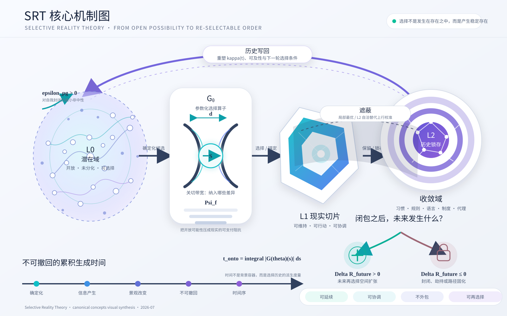

# SRT 核心机制图

这不是术语清单，而是一张机制图：它以空间关系表达 SRT 中“开放可能性如何被选择、锚定、锁存并反馈”的完整循环。

## 图形语法

- **左侧开放场**：`L0` 潜在域，不是虚无，也不是较弱的存在。
- **中央孔径**：`Gθ` 选择算子。孔径宽度对应 `d-value` 的赌注化关切带宽；阻力栅格对应 `Psi_f` 的可支付现实化阻抗。
- **中右多边形**：`L1` 现实切片，表示开放可能性被压成可维持、可行动、可协调的现实。
- **右侧同心结构**：`L2` 历史锁存，表示习惯、规则、语言、制度与代理结构。
- **顶部反馈弧**：历史写回，改变 `kappa(t)`、可及性与下一轮选择条件。
- **遮蔽阴影**：有限位置和 L2 自洽可能截断上行校准，使局部最优伪装成更大方向。
- **右下未来分叉**：以 `Delta R_future` 区分扩张未来再选择空间与封闭/固化。
- **底部时间轴**：不可撤回选择的累积生成时间序与 `t_onto`。

## 文件

- `SRT_Core_Concept_Map.svg`：主视觉，可直接嵌入 GitHub、网页、论文草稿或矢量编辑软件。
- `SRT_Core_Concept_Map.html`：网页查看器，可切换历史反馈、遮蔽、未来分叉和本体时间图层。
- PNG 版本可由 SVG 导出，适合微信、公众号、PPT 和社交媒体。

## 分享建议

1. **GitHub / Markdown**：直接引用 SVG。
2. **网页**：使用 HTML 版本，或将 SVG 以内联方式嵌入页面。
3. **微信 / 公众号 / PPT**：导出为 2× 或 3× PNG，避免平台不支持 SVG。
4. **论文**：优先使用 SVG/PDF 矢量版本，并根据版面裁切。

## 层级提醒

图中的 `L0 / L1 / L2` 指本体结构（潜在域 / 显现域 / 收敛域），不要与仓库治理中的理论深度 `L0 / L1 / L2` 混同。
