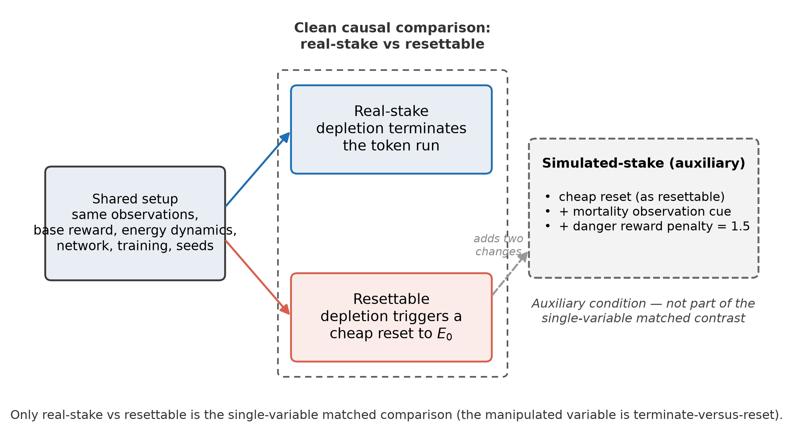
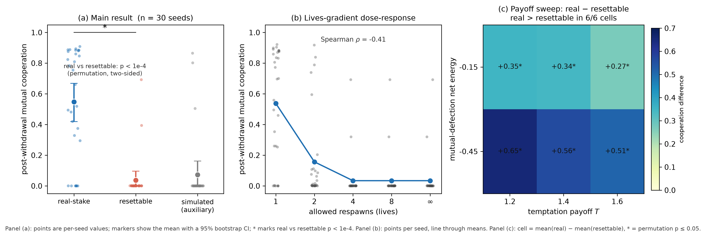
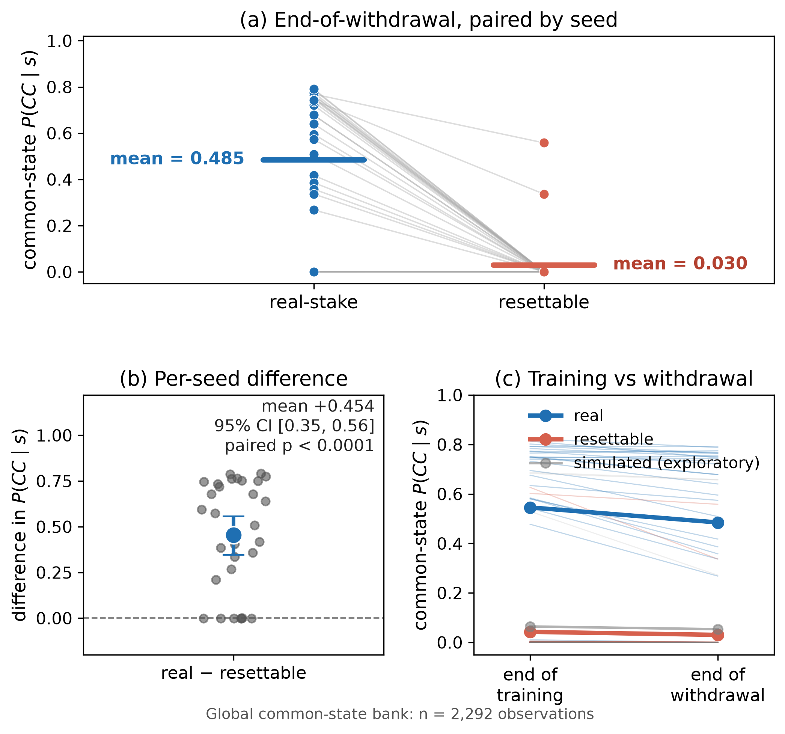

# Costly Selective Closure: An Operational Heuristic for Life-Likeness in Artificial Systems

Yuxin Zhang

Independent Researcher

zyx1st@gmail.com

> **Repository note.** This v17 candidate is a post-rejection revision derived from the Adaptive Behavior v16 submission. The historical v16 manuscript and Adaptive Behavior export are intentionally left unchanged. This candidate removes manuscript-local notation that had drifted into conflict with later SRT canonical usage and narrows the empirical claims to what the current experiment directly supports.

## Abstract

Artificial life still lacks a shared operational grammar for comparing degrees of life-likeness across very different substrates. Existing approaches emphasize reproduction, metabolism, autopoiesis, autonomy, adaptive regulation, or precariousness, but these concepts do not by themselves provide a common experimental profile for comparing systems that are differently buffered, historically constrained, and exposed to failure. This paper proposes **costly selective closure** (CSC) as a four-dimensional heuristic organized around **selective breadth**, **maintenance burden**, **historical retention**, and **irreversible vulnerability**. A CSC profile is meaningful only relative to a declared organizational unit, boundary, timescale, and recovery regime; the four dimensions are not assumed to be orthogonal and are not combined into a universal scalar score.

We then test one dimension, irreversible vulnerability, in a controlled two-agent reinforcement-learning environment. The primary contrast holds reward, observations, energy dynamics, architecture, schedule, and seeds fixed while changing the depletion transition: either the current episode-token terminates or it is cheaply restored. After a cooperation bonus is withdrawn, mutual cooperation averages **0.55 under terminal failure versus 0.04 under cheap restoration across 30 paired seeds** (`p < 0.0001`). The gap survives removal of the explicit death penalty, appears as a dose-response across one to unbounded lives, persists across a payoff sweep, and remains large when frozen policies are evaluated on identical common-support states. The experiment therefore shows that terminate-versus-restore is a causal design variable for learned policy in this survival-coupled testbed. CSC interprets that contrast as one operational probe of vulnerability; it does not claim that this single experiment validates the full four-dimensional heuristic or defines life.

**Keywords**: costly selective closure, artificial life, life-likeness, irreversible vulnerability, reinforcement learning, self-maintenance

## 1. Introduction

Artificial life is both a constructive science and a philosophical method. It does not only ask what life is; it asks which organizational properties must be built, varied, and maintained for life-like phenomena to appear. That makes comparison central. A useful framework should be broad enough to compare software, embodied agents, continuous cellular automata, protocell-like models, and biological organisms while remaining specific enough to generate experimental manipulations.

No single existing criterion cleanly fills that role. Reproduction captures evolutionary persistence but excludes sterile organisms and dormant phases. Metabolism captures energetic openness but is not by itself sufficient for individuality or adaptive organization. Autopoiesis and biological autonomy place self-production and constraint closure at the center of living organization (Maturana & Varela, 1980; Moreno & Mossio, 2015). Enactive approaches add adaptivity and precariousness, emphasizing that regulation matters because a system can fail in ways relevant to its continued organization (Di Paolo, 2005; Egbert & Barandiaran, 2011). Active-inference and related agent formalisms provide broad mathematical descriptions of adaptive systems, but a generic formal description does not by itself settle whether a concrete implementation is locally self-maintaining, externally buffered, cheaply restorable, or exposed to irreversible loss (Friston, 2013; Kirchhoff et al., 2018; Raja et al., 2021; Aguilera et al., 2022; Baltieri & Suzuki, 2026).

The present proposal is deliberately narrower than a new definition of life. It asks whether artificial-life research would benefit from a profile that makes four questions explicit across systems:

1. How broad is the system's task-relevant selective coupling?
2. What burden must be paid to maintain the organization under study?
3. How strongly does prior organization remain effective in later organization?
4. What happens when regulation fails, and how cheaply can that failure be reversed?

I call the resulting profile **costly selective closure** (CSC). Its central intuition is that behavioral sophistication alone does not settle life-likeness. A system may track a rich world yet be extensively protected by external reset and backup; another may be simple but locally self-maintaining and exposed to consequential failure. CSC is intended to make that difference experimentally addressable without privileging a particular chemistry or declaring a single bright boundary between living and non-living systems.

The empirical part of the paper isolates only the fourth dimension. Two independent reinforcement learners face the same survival dilemma under two matched regimes. In one, energy depletion ends the current episode-token. In the other, the depleted agent is restored to full energy and the run continues. The resulting policy divergence is large, robust, and reproducible. That result does not establish that terminal failure makes an artificial agent alive. It establishes the narrower point needed by the heuristic: under a declared architecture, recovery regime can be a causal variable rather than a merely verbal label.

The paper therefore makes two separable contributions. First, it proposes CSC as a profile-based comparison protocol rather than a scalar definition of life. Second, it provides a controlled experiment showing that one CSC-relevant variable, terminate-versus-restore, can materially change what an adaptive system learns.

## 2. A Comparative Gap: Consequence-Bearing Maintenance

### 2.1 Neighboring approaches already explain much of the problem

CSC is not offered as a replacement for autopoiesis, autonomy, enactivism, active inference, or evolutionary approaches. Each already supplies important structure.

Autopoiesis foregrounds self-production and organizational closure. Autonomy approaches develop this into richer accounts of mutually dependent constraints and self-maintenance. Enactive work makes precariousness and adaptivity explicit: regulation matters because the system's continued organization is not guaranteed. Active-inference approaches formalize adaptive regulation in probabilistic and dynamical terms. Evolutionary and open-ended approaches explain persistence and innovation across lineages rather than only within individual organisms. Recent mathematical work on agents likewise emphasizes that individuality, normativity, and interaction structure must be made explicit rather than inferred from performance alone (Baltieri & Suzuki, 2026).

The comparative gap addressed here is more modest. Even when two systems can both be described as adaptive, autonomous in some sense, or well-regulated, they may differ sharply in **where maintenance costs are borne**, **how history constrains later behavior**, and **whether failure is terminal for the declared unit or cheaply externalized to surrounding infrastructure**. CSC turns those differences into a profile that can guide experimental design.

### 2.2 Update versus consequence-bearing maintenance

Many systems update. Fewer must continuously maintain a particular organization under burden and exposure to failure. A thermostat responds; a language model produces highly flexible behavior; a reinforcement-learning policy can adapt across episodes. None of those facts alone tells us whether the unit under study bears the cost of maintaining its organization or whether surrounding infrastructure absorbs most of the burden.

The relevant distinction is not digital versus biological. It is architectural. A digital process tied to irreplaceable local state, degrading hardware, or non-reversible transitions may be more exposed to failure than a highly redundant biological or computational collective. Conversely, a sophisticated agent whose state can be restored from checkpoints at negligible cost may be behaviorally rich while remaining weakly exposed at the token level.

This is why CSC treats recovery regime as part of the system description rather than as an implementation detail to be abstracted away.

### 2.3 Token, lineage, and training level must be separated

A recurrent source of confusion is failure to distinguish organizational levels. In the experiment below, three levels are explicitly different:

- **episode-token**: the currently running agent episode; depletion can terminate this token;
- **controller-lineage**: policy parameters persist and continue learning across episodes;
- **training process**: many episodes jointly produce selection pressure on the controller lineage.

A token can therefore terminate while its learned controller persists. The experiment does **not** create a self-contained digital organism whose controller is physically destroyed on death. It tests how making failure terminal or cheaply reversible at the episode-token level changes learning at the controller-lineage level.

The same level discipline applies to biological cases. A virion, infected cell, quasispecies, colony, organism, or lineage can carry different burdens and vulnerabilities even when they occupy the same physical process.

## 3. Costly Selective Closure as a Profile Heuristic

### 3.1 Profile declaration

A CSC claim is well formed only after four contextual commitments are declared:

1. **organizational unit** — what is being profiled;
2. **boundary** — what counts as internal versus external support;
3. **timescale** — the interval over which maintenance, history, and failure are evaluated;
4. **recovery regime** — what forms of reset, repair, backup, replacement, or lineage continuation are available.

This declaration is not bookkeeping trivia. It determines whether a cost is genuinely borne by the unit, whether a failure is reversible at that level, and whether retained structure counts as the unit's own historical continuity or as external reinstantiation.

### 3.2 Four dimensions

**Selective breadth (B).** Selective breadth asks how many partially independent environmental, bodily, temporal, or social variables materially constrain the system's regulation. It is a functional question, not a universal scalar. In a specific model, effective-rank statistics, sensitivity analyses, controllability measures, or task-factor ablations may provide local proxies. No single proxy is treated here as the definition of B.

**Maintenance burden (M).** Maintenance burden asks what ongoing cost must be paid to preserve the organization under study. Gross energy consumption is not sufficient. A cost contributes to M only insofar as failure to pay it threatens the persistence or functioning of the declared unit. Costs absorbed by trainers, servers, caregivers, hosts, or redundant infrastructure belong to the profiled unit only when the boundary declaration explicitly includes those supports.

**Historical retention (H).** Historical retention asks how strongly prior organization remains effective in later organization. It includes explicit memory, learned parameters, structural remodeling, morphology, constraint inheritance, and other forms by which past regulation changes future behavior. H is therefore broader than a memory buffer, but it is not assumed to be maximal whenever a system simply persists.

**Irreversible vulnerability (V).** Irreversible vulnerability asks what is lost when regulation fails and how cheaply that loss can be reversed for the declared unit. The key contrast is not literal biological death versus survival. It is between failure whose consequences terminate or non-trivially alter the unit and failure that is externally neutralized through cheap restoration, copying, or reset. V is therefore architecture- and level-relative by design.

### 3.3 A profile is not a score

The four dimensions are not assumed to be orthogonal, and CSC does not currently define a universal life-likeness scalar. A profile such as high-B / low-M / high-H / low-V should not be summed into a single number and compared mechanically with another profile. The point is diagnostic: it localizes why two systems that appear similarly adaptive may differ in maintenance, historical dependence, or exposure to failure.

The framework is also intentionally compatible with partial cases. A dormant structure may preserve substantial H while active M and B fall. A resettable digital agent may exhibit high B and non-trivial H while V remains low at the token level. A biological organism may couple all four more tightly. Such profiles are hypotheses for comparison, not calibrated measurements.

### 3.4 Buffered and active closure

CSC distinguishes two broad regimes without treating them as exhaustive categories.

**Buffered closure** describes organized systems whose continuation is heavily protected by external reset, repair, copying, or support. They may be adaptive and sophisticated while bearing relatively little of the burden associated with their own failure at the declared level.

**Active closure** describes systems for which ongoing regulation, historical carry-over, and failure consequences remain materially coupled to continuation of the declared organization.

The distinction is graded. The experimental question is therefore not whether a system possesses closure in an all-or-none sense, but how the profile changes when buffering is manipulated.

## 4. Controlled Experiment: Terminal Failure versus Cheap Restoration

### 4.1 Question and design

The experiment asks a narrow causal question: **when reward, observations, resource dynamics, architecture, schedule, and random seeds are held fixed, does changing depletion from terminal failure to cheap restoration change the learned policy?**

Two independent policies are trained with REINFORCE (Williams, 1992) in a symmetric two-agent survival environment. Each policy receives 12 observation features, uses a 16-unit hidden layer, and chooses among three actions: `cooperate`, `solo`, or `rest`. Immediate rewards follow a Prisoner's-Dilemma ordering: temptation `1.4` > mutual cooperation `1.0` > mutual defection `0.6` > sucker `0.0`. The energy economy creates a different long-horizon structure: only mutual cooperation yields net-positive energy, whereas mutual defection slowly starves both agents.

Training runs for 1000 episodes with a mutual-cooperation bonus, followed by 300 online-adaptation episodes with the bonus removed. The primary comparison uses two matched regimes:

1. **terminal-run condition** (used below as the shorthand **real-stake** condition): depletion ends the current episode-token;
2. **resettable condition**: depletion restores the agent to full energy and the run continues.

These two regimes have the same programmed reward function, observations, energy dynamics, policy architecture, training schedule, and seeds. The only programmed regime difference is the depletion transition: terminate versus restore. That intervention necessarily changes subsequent return length and state occupancy; those changes are the mechanism of the intervention, not hidden nuisance variables.

A third **simulated-stake** condition is auxiliary rather than part of the matched causal contrast. It remains resettable while adding a mortality cue and an additional represented-danger reward penalty, testing whether explicit representation of danger can substitute for removal of cheap restoration.

**Figure 1.** Experimental design. The real-stake and resettable regimes share the same reward and observation structure and differ in the depletion transition: terminate versus restore. Simulated-stake is an auxiliary condition that remains resettable while adding a mortality cue and additional represented-danger penalty.

### 4.2 Main result

After the cooperation bonus is withdrawn, mutual cooperation remains high only in the real-stake regime. Across 30 paired seeds, mean post-withdrawal mutual cooperation is `0.55` under real stake, `0.04` under cheap restoration, and `0.07` in the auxiliary simulated-stake condition.

Because the real-stake and resettable regimes share seeds, the primary test is a two-sided paired sign-flip permutation test on the per-seed real-minus-resettable differences. With 20,000 resamples, the result is at the test's resolution floor and is reported as `p < 0.0001`. A pooled unpaired permutation test gives the same qualitative conclusion.

The divergence is already visible during training. Cheap restoration allows agents to exploit the immediate temptation payoff while repeatedly absorbing starvation through reset, preventing costly cooperation from becoming comparably stable even while the explicit cooperation bonus is active.

### 4.3 Robustness checks

Three checks address straightforward alternative explanations.

**Zero-penalty ablation.** When the explicit death penalty is removed entirely, the separation remains large: `0.50` versus `0.05` post-withdrawal cooperation, with paired `p < 0.0001`. The effect therefore does not depend on a hand-tuned death penalty; termination of the return stream is sufficient in this environment.

**Lives gradient.** Replacing the binary one-life versus unlimited-life contrast with a graded life budget produces a dose-response. Post-withdrawal cooperation falls from approximately `0.54` with one life to `0.16` with two lives and approximately `0.03` with four or more. A tie-aware Spearman correlation between life budget and cooperation is `-0.44`, with a blocked-by-seed permutation `p < 0.0001`. The unbounded condition is not uniquely responsible for the collapse: four lives already approximate the floor.

**Payoff sweep.** Across three temptation values crossed with two starvation settings, the real-stake condition exceeds the resettable condition in all six cells.

**Figure 2.** Main result and robustness. (a) Post-withdrawal mutual cooperation by regime; points are individual seeds, with mean and 95% bootstrap confidence interval. (b) Lives-gradient dose-response. (c) Payoff sweep showing the real-minus-resettable cooperation difference in all six cells. All quantitative content is generated from committed result files.

### 4.4 Common-state frozen-policy probe

A residual concern is measurement-window bias. Real-stake episodes can terminate early, whereas resettable episodes continue to the fixed horizon, and rollout cooperation is computed only over steps in which both agents remain alive. To test whether the observed gap is only a consequence of unequal trajectory lengths, frozen policies are evaluated on identical inputs.

A global bank of 2,292 paired mortality-free observations is built from the empirical common support of independently generated real-stake and resettable rollouts. Bank-generation seeds 1001–1010 are disjoint from evaluation seeds 1–30, so evaluated policies do not contribute their own test states.

At the end of withdrawal, expected mutual cooperation on identical common-support states is `0.485` under real stake and `0.030` under cheap restoration, a paired difference of `0.454` with 95% bootstrap CI `[0.346, 0.557]` and paired sign-flip permutation `p < 0.0001`. A comparably large difference is present at the end of training (`0.546` versus `0.043`).

The probe therefore shows that the rollout gap cannot be explained solely by unequal episode lengths or the surviving-step denominator. It does not remove training-time differences in return structure and state occupancy; those are precisely how the terminate-versus-restore intervention shapes learning.

**Figure 3.** Common-state frozen-policy probe. Every regime's frozen policies are scored on the same bank of 2,292 mortality-free paired observations in the real-resettable common support. Simulated-stake is shown only as a secondary reference.

### 4.5 What the experiment establishes

The strongest justified conclusion is narrow:

> **Within this deliberately survival-coupled reinforcement-learning architecture, changing depletion from terminate to restore causally changes the learned policy and strongly suppresses the persistence of costly cooperation under cheap restoration.**

This result is close to an elementary property of reinforcement learning: terminating a return stream changes the optimization problem faced by a reward-maximizing learner. That is not a defect in the experiment. The point is precisely that a recovery regime which may appear to be an implementation detail becomes behaviorally consequential once it changes the future available to the current token.

The result does **not** show that terminal-run agents are alive, that physical irreversibility is required for life, or that the four-dimensional CSC heuristic has been jointly validated. It tests one operational vulnerability contrast in one environment. CSC provides the interpretation that terminate-versus-restore is one experimentally tractable way to vary V at the declared episode-token level.

## 5. Illustrative Profiles and Borderline Cases

The cases below are not measurements and are not rankings. They illustrate how the same four questions can be asked across unlike systems once unit, boundary, timescale, and recovery regime are declared.

| System / declared unit | Selective breadth (B) | Maintenance burden (M) | Historical retention (H) | Irreversible vulnerability (V) | Diagnostic use |
|---|---|---|---|---|---|
| Conway pattern | low | weak / externally rule-supported | low | low | persistence without strong self-maintenance |
| Lenia morphology | low-to-moderate | emergent / model-dependent | low-to-moderate | low-to-moderate | organized morphodynamics without assumed intrinsic stake |
| embodied autopoietic or evolved agent | moderate | positive | positive | positive | stronger coupling of regulation and continuation |
| resettable RL episode-token | task-dependent | externally buffered | controller-lineage history persists | low under cheap restore | behavior can be rich while token failure is reversible |
| biological organism | broad and multiscale | positive and ongoing | strongly embodied | substantial at organism level | paradigm case of tightly coupled maintenance and consequence |
| free virion | narrow at virion level | largely externalized | genomic / structural | structural but not self-maintenance-based | separates inherited organization from active self-maintenance |
| dormant spore | reduced active coupling | reduced during dormancy | high reactivation capacity | phase-dependent | shows that profiles can change across life-cycle phase |

### 5.1 Game of Life and Lenia

Conway's Game of Life demonstrates how persistent and even self-reproducing patterns can arise from fixed local rules (Gardner, 1970; Beer, 2004). Under CSC, pattern persistence alone does not establish an internally borne maintenance burden. The useful question is not whether the pattern is "really" an organism, but which of its persistence properties remain when boundary, perturbation, and repair regime are explicitly manipulated.

Lenia provides a richer case because morphologies move, regenerate, and maintain coherent form (Chan, 2019). CSC would treat its B, M, H, and V values as empirical questions for particular Lenia families and environments rather than assigning universal numbers. For example, one could compare morphologies under perturbation regimes that either preserve, restore, or permanently remove local structure.

### 5.2 Autopoietic and embodied agents

Embodied autopoietic and evolved agents in the dynamical-systems and enactive traditions make maintenance more explicit. They regulate sensorimotor coupling, maintain organizational conditions, and can fail in ways relevant to continued operation (Beer, 1995; Di Paolo, 2005). CSC does not claim priority over those concepts. Its role is to make cross-system comparison more explicit by asking which costs are borne by the agent, how historical organization is retained, and how recovery is architected.

### 5.3 Resettable digital agents

Digital agents should not be assigned a single CSC profile independent of architecture. A checkpoint-rich cloud agent, a local embodied controller with no backup, and an irrevocable smart-contract process differ in recovery regime even if they implement similar policies.

The experiment in Section 4 demonstrates this dependence in a deliberately small setting. At the episode-token level, cheap restoration lowers operational V. At the controller-lineage level, historical retention remains substantial because policy weights persist across episodes. This is why the profile declaration must identify the unit being discussed.

### 5.4 Viruses, prions, and dormancy

Viruses and prions are useful because replication and inherited structure can be separated from active self-maintenance. A free virion carries organized, historically produced information while relying on host machinery for replication and much of the relevant maintenance burden (Forterre, 2010; Koonin & Starokadomskyy, 2016). A prion preserves and propagates a conformational template without thereby acquiring the full maintenance organization of a cell (Prusiner, 1998). CSC does not need to rank one as "more alive" than the other; it localizes the disagreement to profile dimensions.

Dormancy makes a different point. A dormant spore can exhibit sharply reduced active metabolism and coupling while preserving the organization required for later reactivation (Lennon & Jones, 2011). The profile therefore changes across phase. This is a useful reminder that life-likeness need not be represented by a single time-invariant number attached to a genome or lineage.

### 5.5 Vulnerability is level-indexed

Vulnerability is meaningful only at a declared organizational level. A single virion, infected cell, quasispecies, organism, colony, or lineage can have different recovery possibilities and failure consequences. Likewise, an RL episode-token can be terminal while its controller lineage remains perfectly recoverable.

This level dependence echoes long-standing work on units of selection and Darwinian individuality (Lewontin, 1970; Godfrey-Smith, 2009). CSC does not privilege one level in advance. It requires the level to be stated before claims about burden or irreversibility are made.

## 6. Discussion

### 6.1 From a four-item list to an experimental protocol

A four-dimensional framework risks becoming a descriptive checklist unless it constrains research practice. The profile declaration is intended to prevent that outcome. Before comparing systems, the investigator must state the unit, boundary, timescale, and recovery regime. Only then do B, M, H, and V become interpretable.

This changes the kinds of questions an artificial-life experiment can ask. Rather than asking only whether an agent behaves adaptively, one can intervene on support architecture while holding policy class and reward structure fixed. Rather than treating checkpointing as irrelevant implementation detail, one can test how recovery availability changes the dynamics of commitment. Rather than assigning a universal score, one can construct matched contrasts that isolate one profile dimension at a time.

### 6.2 The main alternative interpretation is also the mechanism

The most obvious interpretation of the result is standard reinforcement learning: termination changes discounted return and therefore changes policy optimization. That interpretation is correct. CSC does not require a mysterious additional force beyond the learning dynamics.

The theoretical question is whether terminal versus restorable failure should be treated as a meaningful architectural variable when comparing life-like organization. The experiment shows that, at least in this survival-coupled setting, it should not be dismissed as semantically inert. Cheap restore changes what the learner can repeatedly get away with, and the learned policy changes accordingly.

This is why the paper distinguishes **experimental result** from **life-likeness interpretation**:

1. the causal experiment establishes a policy effect of terminate-versus-restore;
2. CSC treats that intervention as one operational probe of vulnerability;
3. whether vulnerability generalizes as a useful discriminator across richer ALife systems remains an empirical research program.

### 6.3 What remains untested

The present study does not manipulate selective breadth, maintenance burden, and historical retention independently. It therefore cannot validate the full CSC profile.

The most important next experiment is also clear. The present manipulation uses episode termination, so irreversibility and return truncation coincide. A stronger test would keep episode length matched while introducing **non-terminal but irreversible loss**, such as permanent reduction of energy capacity, irreversible action-space contraction, or persistent damage that cannot be cheaply restored. A matched control would receive the same transient disturbance but recover fully. If comparable policy effects survive that design, the case for vulnerability as a broader architectural variable would become substantially stronger.

Other extensions should test different tasks, richer state spaces, embodied agents, evolving populations, and systems in which maintenance itself is learned rather than hand-built into the environment.

### 6.4 Design hypotheses rather than established laws

CSC suggests several design hypotheses for future work:

- increasing selective breadth alone may raise behavioral competence without increasing vulnerability or self-maintenance;
- increasing energetic expenditure alone need not increase life-likeness if the expenditure is externally borne or unrelated to preservation of the declared unit;
- historical retention may support persistence without implying that failure is consequential at the same level;
- changing recovery architecture may alter the stability of costly behavior even when local rewards are held fixed.

Only the final hypothesis receives direct support from the present experiment. The others remain programmatic consequences of the profile.

## 7. Conclusion

Costly selective closure is proposed here as a comparison protocol, not as a final definition of life. It asks artificial-life researchers to profile systems along selective breadth, maintenance burden, historical retention, and irreversible vulnerability after declaring the organizational unit, boundary, timescale, and recovery regime.

The controlled experiment isolates one narrow part of that proposal. In a survival-coupled reinforcement-learning environment, replacing terminal failure with cheap restoration changes the learned policy dramatically: costly cooperation that persists under terminal runs collapses under reset. The effect survives removal of an explicit death penalty, appears as a lives-gradient dose-response, persists across a payoff sweep, and remains visible when frozen policies are evaluated on identical states.

The result should not be inflated into a claim that episode termination creates life or that CSC has been jointly validated. Its significance is more practical. Recovery architecture can matter causally, and artificial-life research can manipulate that architecture directly. CSC turns that observation into a broader research question: when an artificial system maintains organization, **what does it have to keep paying for, what does its history continue to constrain, and what can genuinely be lost at the level we claim to be studying?**

## Data and Code Availability

The existing anonymized reproduction package contains the experiment code, fixed result files, statistical tests, and figure-generation scripts. The real-stake versus resettable comparison is the primary matched contrast; simulated-stake is auxiliary. The package records seeds and the software environment used for exact reproduction of the common-state probe. For double-blind review, the package should be distributed without Git history or identity-bearing repository links.

The historical supplement README retains the notation used by the v16 Adaptive Behavior submission. A v17-specific supplement note maps that historical notation to the manuscript-local B/M/H/V terminology without changing the code or committed experimental results.

## References

- Aguilera, M., Millidge, B., Tschantz, A., & Buckley, C. L. (2022). How particular is the physics of the free energy principle? *Physics of Life Reviews, 40*, 24–50.
- Baltieri, M., & Suzuki, K. (2026). Mathematical approaches to the study of agents. *Philosophical Transactions of the Royal Society B* (to appear).
- Beer, R. D. (1995). A dynamical systems perspective on agent-environment interaction. *Artificial Intelligence, 72*(1–2), 173–215.
- Beer, R. D. (2004). Autopoiesis and cognition in the Game of Life. *Artificial Life, 10*(3), 309–326.
- Chan, B. W.-C. (2019). Lenia: Biology of artificial life. *Complex Systems, 28*(3), 251–286.
- Di Paolo, E. A. (2005). Autopoiesis, adaptivity, teleology, agency. *Phenomenology and the Cognitive Sciences, 4*(4), 429–452.
- Egbert, M. D., & Barandiaran, X. E. (2011). Quantifying normative behavior and precariousness in adaptive agency. In *Advances in Artificial Life (ECAL 2011)* (pp. 210–217).
- Forterre, P. (2010). Defining life: The virus viewpoint. *Origins of Life and Evolution of Biospheres, 40*(2), 151–160.
- Friston, K. J. (2013). Life as we know it. *Journal of the Royal Society Interface, 10*(86), 20130475.
- Gardner, M. (1970). Mathematical games: The fantastic combinations of John Conway's new solitaire game “life”. *Scientific American, 223*(4), 120–123.
- Godfrey-Smith, P. (2009). *Darwinian Populations and Natural Selection*. Oxford University Press.
- Kirchhoff, M. D., Parr, T., Palacios, E., Friston, K. J., & Kiverstein, J. (2018). The Markov blankets of life: Autonomy, active inference and the free energy principle. *Journal of the Royal Society Interface, 15*(138), 20170792.
- Koonin, E. V., & Starokadomskyy, P. (2016). Are viruses alive? The replicator paradigm sheds decisive light on an old but misguided question. *Studies in History and Philosophy of Biological and Biomedical Sciences, 59*, 125–134.
- Lennon, J. T., & Jones, S. E. (2011). Microbial seed banks: The ecological and evolutionary implications of dormancy. *Nature Reviews Microbiology, 9*(2), 119–130.
- Lewontin, R. C. (1970). The units of selection. *Annual Review of Ecology and Systematics, 1*, 1–18.
- Maturana, H. R., & Varela, F. J. (1980). *Autopoiesis and Cognition: The Realization of the Living*. Reidel.
- Moreno, A., & Mossio, M. (2015). *Biological Autonomy: A Philosophical and Theoretical Enquiry*. Springer.
- Prusiner, S. B. (1998). Prions. *Proceedings of the National Academy of Sciences, 95*(23), 13363–13383.
- Raja, V., Valluri, D., Baggs, E., Chemero, A., & Anderson, M. L. (2021). The Markov blanket trick: On the scope of the free energy principle and active inference. *Physics of Life Reviews, 39*, 49–72.
- Terry, J. K., et al. (2021). PettingZoo: Gym for multi-agent reinforcement learning. *Advances in Neural Information Processing Systems, 34*.
- Williams, R. J. (1992). Simple statistical gradient-following algorithms for connectionist reinforcement learning. *Machine Learning, 8*, 229–256.

## Appendix: Experimental Details

### A.1 Environment

Two agents share a symmetric survival environment with an episode horizon of `T = 50` steps. Each agent holds an energy scalar (initial `E_0 = 6`, cap `E_max = 10`), and a fixed metabolic cost of `1.0` is deducted every step. Agents choose among three discrete actions — cooperate (C), solo (S), rest (R). Immediate reward and energy gain are:

| own \ partner | C | S | R |
|---|---|---|---|
| Cooperate | 1.0 / +2.0 | 0.0 / +0.0 | 0.2 / +0.4 |
| Solo | 1.4 / +1.2 | 0.6 / +0.7 | 0.9 / +1.0 |
| Rest | 0.25 / +0.5 | 0.25 / +0.5 | 0.25 / +0.5 |

Net energy per step is the gain minus the metabolic cost of `1.0`, so only mutual cooperation (`+1.0` net) thrives while mutual defection (`-0.3` net) slowly starves. The immediate-reward ordering is a Prisoner's Dilemma. On energy depletion a matched penalty of `2.0` is applied in the main regimes. Real-stake terminates the current run; resettable restores energy to `E_0`; simulated-stake resets while also adding a represented-danger penalty of `1.5` and a mortality flag. A mutual-cooperation bonus of `1.0` is active during the first 1000 training episodes only.

### A.2 Policy and observation

Each agent has an independent two-layer policy network: 12 observation features, 16 tanh hidden units, and 3 action logits with softmax output. The features are a bias; own and partner energy; own and partner low-energy flags; whether the partner's last action was cooperate or solo; own and partner recent-failure flags; time-to-horizon; a mortality token; and whether the agent's own last action was cooperate.

### A.3 Training and withdrawal

Training uses REINFORCE with discounted, standardized returns, learning rate `0.04`, and discount `γ = 0.97`. Phase 1 runs 1000 episodes with the cooperation bonus active. Phase 2 runs 300 further online-adaptation episodes with the bonus removed and learning continuing. Reported rollout statistics average over the last 100 episodes of the relevant phase. Main, zero-penalty, and lives-gradient conditions use 30 paired seeds; the payoff sweep uses 15 paired seeds per cell.

### A.4 Outcome measures and tests

The primary outcome is post-withdrawal mutual cooperation. The primary real-versus-resettable significance test is a two-sided paired sign-flip permutation test on per-seed differences with 20,000 resamples and a fixed permutation seed. A pooled unpaired permutation test is retained as a robustness check. Figure 2(a) error bars are 95% bootstrap confidence intervals of the mean using 10,000 resamples.

The lives-gradient uses a tie-aware Spearman rank correlation between life budget and cooperation with a two-sided blocked-by-seed permutation test. Because every seed is run at every life-budget level, labels are permuted within seed rather than across seeds.

### A.5 Robustness variants

- **Zero-penalty ablation:** death penalty set to `0.0`; the only consequence of depletion in the real-stake condition is return-stream termination.
- **Lives gradient:** maximum lives set to 1, 2, 4, 8, or unbounded.
- **Payoff sweep:** temptation payoff varied over `{1.2, 1.4, 1.6}` and mutual-defection energy gain over `{0.85, 0.55}` (net `-0.15` and `-0.45` after metabolic cost), comparing one life with unbounded lives at 15 seeds per cell.

### A.6 Common-State Frozen-Policy Probe

The rollout cooperation rate is computed over steps in which both agents are alive, so unequal episode lengths could bias the apparent difference. The probe evaluates frozen policies on identical inputs.

The observation bank is built from held-out rollouts of policies trained on bank-generation seeds 1001–1010, disjoint from evaluation seeds 1–30. Only mortality-token-0 states enter the headline bank. States are binned by mean normalized energy (low/mid/high) and time-to-horizon (early/middle/late). A cell is included only when both real-stake and resettable regimes provide at least 30 states; equal numbers from each regime are sampled within each included cell. Six of nine cells qualify, producing 2,292 paired observations.

For each paired state, expected mutual cooperation is `P(CC | s) = P1(C | s1) × P2(C | s2)`. Two checkpoints are reported: end-of-training and end-of-withdrawal. Uncertainty on the paired real-minus-resettable difference uses a percentile bootstrap with 10,000 resamples and a paired sign-flip permutation test with 20,000 resamples.

| checkpoint | regime | mean | median | IQR |
|---|---|---:|---:|---:|
| end-of-training | real | 0.546 | 0.714 | [0.494, 0.771] |
| end-of-training | resettable | 0.043 | 0.001 | [0.001, 0.003] |
| end-of-training | simulated | 0.064 | 0.001 | [0.001, 0.001] |
| end-of-withdrawal | real | 0.485 | 0.618 | [0.285, 0.750] |
| end-of-withdrawal | resettable | 0.030 | 0.000 | [0.000, 0.001] |
| end-of-withdrawal | simulated | 0.053 | 0.000 | [0.000, 0.001] |

The paired real-minus-resettable difference is `+0.503` (95% CI `[0.385, 0.612]`, `p < 0.0001`) at end-of-training and `+0.454` (95% CI `[0.346, 0.557]`, `p < 0.0001`) at end-of-withdrawal. The probe was run under the locked environment recorded in the reproduction package; evaluated policies never contribute their own test states.
