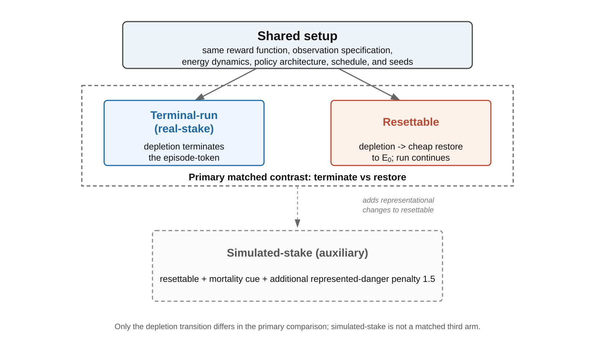
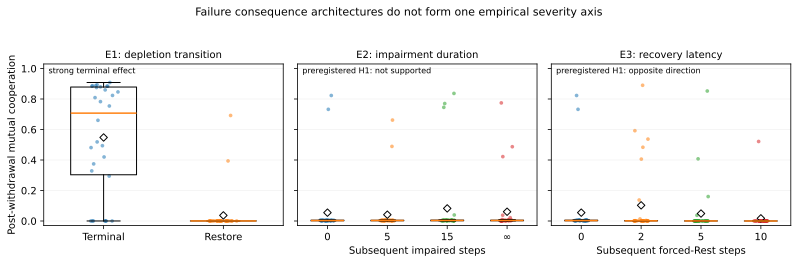

# Failure Is Not One-Dimensional: Terminality, Persistent Damage, and Recovery Architecture in Artificial Agents

Yuxin Zhang

Independent Researcher

zyx1st@gmail.com

> **Repository note.** This v18 candidate supersedes v17 for publication development but does not overwrite it. It integrates the original terminal-versus-restore experiment with two later preregistered follow-ups. The follow-ups did not confirm the expected generalization and are retained as part of the main evidence. Historical v16/v17 manuscripts remain unchanged.

## Abstract

Artificial-life comparisons often treat mortality, persistent damage, and difficult recovery as if they lay on a common axis of failure consequence. This paper tests that assumption in a survival-coupled multiagent reinforcement-learning system and uses the results to revise **costly selective closure** (CSC), a comparison protocol rather than a definition or scalar score of life. CSC requires an explicit organizational unit, boundary, timescale, and recovery regime; the evidence-led revision retains selective breadth, maintenance burden, and historical retention as descriptive questions but treats **failure consequence architecture** as structured rather than one-dimensional.

Experiment 1 compared matched REINFORCE agents whose energy depletion either terminated the current episode-token or restored the depleted agent. After withdrawal of a cooperation bonus, mutual cooperation averaged **0.55 under terminal failure versus 0.04 under restoration across 30 paired seeds** (`p < 0.0001`), with the separation surviving a zero-penalty ablation, a lives-budget gradient, a payoff sweep, and a frozen-policy common-state probe. Two later, separately repository-preregistered follow-ups then tested generalizations of that interpretation. Experiment 2 held episode length fixed and varied persistence of non-terminal metabolic impairment; the predicted positive gradient was not supported (`rho = 0.055`, `p = 0.071`; `tau_inf - tau0 = 0.0059`, 95% CI `[-0.0292, 0.0443]`). Experiment 3 imposed fully reversible recovery periods of 0, 2, 5, or 10 forced-Rest steps. Its preregistered positive hypothesis also failed; the observed ordered association was instead negative (`rho = -0.704`, `p = 0.00005`), with `k10 - k0 = -0.0373` (95% CI `[-0.0990, -0.0028]`). A common-state frozen-policy probe showed the same direction.

The three interventions therefore do not behave like interchangeable points on one vulnerability or recoverability scale. The supported conclusion is narrower: **terminal failure, persistent impairment, and temporary recovery latency are distinct consequence architectures whose learning effects depend on how they alter continuation, action availability, interaction, and return structure**. The result motivates decomposition of failure consequences rather than a universal life-likeness score or a rule that “more consequence” necessarily produces stronger commitment.

**Keywords**: costly selective closure, artificial life, recovery architecture, reinforcement learning, self-maintenance, preregistration

## 1. Introduction

Artificial life is both a constructive science and a comparative science. It asks not only what living systems already do, but which organizational properties must be built, varied, or removed before life-like phenomena appear. This makes comparison unusually difficult. A synthetic cell, an embodied controller, a software agent, a cellular automaton, and a biological organism can all adapt or persist while relying on very different boundaries, maintenance processes, histories, and recovery infrastructures.

Many mature frameworks already capture important parts of this problem. Autopoiesis and biological autonomy foreground self-production, constraint closure, and self-maintenance (Maturana & Varela, 1980; Moreno & Mossio, 2015). Enactive approaches emphasize adaptivity and precariousness: regulation matters because continued organization is not guaranteed (Di Paolo, 2005; Egbert & Barandiaran, 2011; Beer & Di Paolo, 2023). Dimensional accounts of life and life-likeness explicitly resist a single binary boundary and instead compare properties such as metabolism, regulation, heredity, learning, and homeostasis (Damiano & Stano, 2020; Witkowski & Schwitzgebel, 2024). Active-inference and related approaches supply general formalisms for adaptive organization (Friston, 2013; Kirchhoff et al., 2018; Raja et al., 2021; Aguilera et al., 2022). None of these traditions needs CSC as a replacement.

The narrower problem addressed here is operational. When two artificial systems behave adaptively, researchers still need to specify **which organizational unit is being compared, which support lies inside or outside its boundary, over what timescale continuity is evaluated, and what forms of reset, repair, replacement, or recovery are available**. Without those declarations, claims about “cost,” “mortality,” “irreversibility,” or even “self-maintenance” can shift silently between organizational levels.

An earlier version of CSC attempted to organize this comparison with four profile dimensions: selective breadth, maintenance burden, historical retention, and irreversible vulnerability. The first experiment in the present programme appeared to support the fourth term strongly: terminating an energy-depleted episode produced much more persistent costly cooperation than cheaply restoring depletion. Yet that result has an elementary reinforcement-learning interpretation. Termination changes the future return stream and the distribution of subsequent states. A serious account therefore has to ask whether the observed effect generalizes to other ways of making failure consequential when termination is removed.

This paper reports that test rather than assuming the answer. Two follow-up experiments were preregistered before confirmatory execution. Experiment 2 made non-terminal metabolic damage persist for progressively longer periods while keeping a fixed episode horizon. It did **not** produce the predicted cooperation gradient. Experiment 3 instead made failure impose a fully reversible period in which the affected agent temporarily lost normal action choice. That preregistered positive prediction also failed, and the observed relationship was strongly negative. These results force a conceptual revision: the evidence does not support a one-dimensional vulnerability variable on which terminality, damage persistence, and recovery burden can be ordered.

The paper therefore makes three contributions.

First, it presents CSC as a **declaration-and-profile protocol**. Three descriptive dimensions remain useful: selective breadth (B), maintenance burden (M), and historical retention (H). Failure is handled separately through a **consequence architecture** that records the actual transition structure rather than assigning a universal high/low vulnerability score.

Second, it reports a strong controlled terminal-versus-restore effect together with robustness tests: removal of the explicit death penalty, a lives-budget gradient, a payoff sweep, and common-state frozen-policy evaluation.

Third, and more importantly for theory, it reports two preregistered failed generalizations and uses them to narrow rather than rescue the original interpretation. This makes the empirical conclusion deliberately asymmetric: terminal failure has a strong effect in this testbed; persistent impairment does not reproduce it; recovery latency produces an association in the opposite direction. The contribution is therefore not the discovery that “more consequence creates more cooperation.” It is evidence that **consequence architecture must be decomposed rather than treated as a scalar**.

## 2. Related Work and the Comparative Problem

### 2.1 Precariousness, autonomy, and life-likeness

CSC does not claim priority for the idea that living or life-like systems must be vulnerable to failure. Enactive work has made precariousness central to adaptive agency for decades. Beer and Di Paolo (2023) distinguish systemic, processual, and thermodynamic forms of precariousness and treat fragility as constitutive of the normative organization of living systems. Di Paolo (2005) and Egbert and Barandiaran (2011) similarly connect adaptive regulation to viability conditions rather than mere behavioral responsiveness.

Nor is CSC the first multidimensional approach to life. Damiano and Stano (2020) argue that synthetic-cell life-likeness should be assessed organizationally rather than through surface behavioral imitation. Witkowski and Schwitzgebel (2024) explicitly discuss multiple dimensions of life as an alternative to a sharp life/nonlife boundary. The present work therefore does not claim novelty for dimensionality itself.

Artificial mortality also has direct precedents. Korecki, Carissimo, and Lund (2023) introduce irreversible death states in reinforcement-learning agents and use “stories of failure” to improve successor behavior. Chen and Chen (2026) construct a mortality-grounded embodied agent in which bodily history and persistent versus reset consequences matter for social learning and continued viability. These works are close conceptual neighbors and make any broad claim that “mortality matters” non-novel.

### 2.2 Termination, reset cost, and action availability in reinforcement learning

The mechanism-level ingredients of the experiments are also established reinforcement-learning problems. Termination changes the return available to an agent under discounted objectives. Work on average-reward reinforcement learning has explicitly introduced **reset cost** to handle tasks with termination; Hisaki and Ono’s (2024) RVI-SAC, for example, automatically adjusts reset cost when applying continuing-task methods to environments with terminal events. The general point that termination and reset rules affect optimization is therefore not a discovery of CSC.

Likewise, Experiment 3 does not claim novelty for restricted action availability. Stochastic-action-set MDPs formalize situations in which not every action is available at every state, and policy-gradient methods have been developed for those settings (Boutilier et al., 2018; Chandak et al., 2020). The contribution of Experiment 3 is not “actions can become unavailable,” but its role as a preregistered discriminating test of a proposed CSC generalization.

### 2.3 The remaining gap

The remaining comparative gap is narrower and more methodological. Artificial-life discussions often move between statements such as:

- this agent can die;
- this process is resettable;
- this system is damaged by failure;
- recovery is costly;
- the organization is precarious;
- the same policy or lineage persists.

Those statements need not refer to the same organizational level or the same transition structure. A token may terminate while a controller lineage survives. An agent may suffer internal damage while retaining all future reward-bearing time. A system may lose actions temporarily while remaining fully restorable. A copied process may preserve function without preserving the same token. Treating all such cases as values of one “vulnerability” variable risks conflating qualitatively different architectures.

CSC is revised here to make those distinctions explicit. Its empirical role is not to prove which architecture is “more alive,” but to force comparisons to state what is maintained, what fails, what survives, and what recovery actually changes.

## 3. Costly Selective Closure as a Declaration-and-Profile Protocol

For present purposes, **costly selective closure** denotes a comparative protocol for asking how a declared organizational unit maintains a selective mode of coupling under ongoing burden, retained historical constraint, and a specified architecture of failure and recovery. It is not a definition of life, a universal scalar, or a claim that all relevant properties reduce to one mechanism.

### 3.1 Required declaration

A CSC comparison is well formed only after four contextual commitments are declared:

1. **organizational unit** — what exactly is being profiled;
2. **boundary** — which resources and supports count as internal or external;
3. **timescale** — over what interval maintenance, history, and failure are evaluated;
4. **recovery regime** — which forms of reset, repair, replacement, copying, or lineage continuation are available.

These declarations determine whether a cost is borne by the unit, whether historical structure belongs to the same organization, and what a failure transition actually removes.

### 3.2 Selective breadth (B)

Selective breadth asks how many partially independent environmental, bodily, temporal, or social variables materially constrain the system’s regulation. It is a functional question rather than a universal number. In a particular model, effective-rank statistics, sensitivity analyses, controllability measures, or task-factor ablations may serve as local proxies, but no one proxy defines B across substrates.

### 3.3 Maintenance burden (M)

Maintenance burden asks what ongoing cost must be paid to preserve the declared organization. Gross energy consumption alone is insufficient. A cost contributes to M only insofar as failure to bear it threatens functioning or continuation at the declared level. Costs absorbed by a trainer, server, host, caregiver, backup process, or external repair infrastructure should not silently be attributed to the profiled unit.

### 3.4 Historical retention (H)

Historical retention asks how prior organization remains effective in later organization. Relevant mechanisms include learned parameters, explicit memory, morphology, structural remodeling, inherited constraints, accumulated bodily history, and other processes by which past regulation changes future possibilities. H is therefore broader than a memory buffer and need not track the same organizational level as token continuity.

### 3.5 Consequence architecture is not a scalar V

The original CSC formulation treated **irreversible vulnerability (V)** as a fourth dimension asking what is lost under failure and how cheaply the loss can be reversed. The experiments reported here show why that formulation is too coarse.

The revised protocol uses **consequence architecture** as a structured descriptor rather than a scalar. Depending on the system, it records such features as:

- whether failure terminates the declared unit or permits continuation;
- whether state is restored, repaired, replaced, copied, or permanently altered;
- whether impairment changes future resource acquisition;
- whether actions become unavailable;
- whether recovery consumes time or interaction opportunities;
- whether reward-bearing or viability-bearing opportunity is removed;
- whether historical organization persists in the same token, a controller lineage, or a successor;
- which external infrastructure absorbs the failure.

The key lesson from the present experiments is negative but useful: there is currently no empirical justification for mapping these features onto a single ordered scale on which “more consequential” necessarily means “more cooperation,” “more commitment,” or “more life-likeness.”

### 3.6 A profile is not a score

CSC does not combine B, M, H, and consequence architecture into a universal life score. A system can have broad adaptive coupling while being externally maintained; another can have narrow coupling but strong historical persistence; a third can terminate tokens while preserving controller lineage. The profile is diagnostic. Its purpose is to reveal which architectural differences a comparison would otherwise hide.

### 3.7 Organizational levels

Three levels are particularly important in the experiments below:

- **episode-token** — the currently running episode;
- **controller-lineage** — the policy parameters that persist and continue learning across episodes;
- **training process** — the larger process that exposes controller lineages to repeated episodes.

Experiment 1 terminates an episode-token, not the learned controller. Experiments 2 and 3 keep the episode-token running. All three preserve controller weights across episodes. No experiment therefore constructs a self-contained digital organism whose controller is physically destroyed by “death.” This limitation is central to interpretation.

## 4. Experimental Programme

### 4.1 Common survival-coupled testbed

The three experiments use the same basic two-agent environment and policy architecture. Two independent REINFORCE learners (Williams, 1992) each receive 12 observation features, pass them through a 16-unit tanh hidden layer, and choose among three actions: `cooperate`, `solo`, or `rest`.

Immediate rewards have a Prisoner’s-Dilemma ordering: unilateral solo action against cooperation receives `1.4`, mutual cooperation `1.0`, mutual solo `0.6`, and cooperation against solo `0.0`. Energy dynamics differ from immediate reward. Each step incurs a metabolic cost of `1.0`; mutual cooperation adds `2.0` energy, producing positive net maintenance, whereas mutual solo adds only `0.7`, producing gradual depletion. This creates a conflict between short-run temptation and longer-run energetic viability.

Training consists of 1,000 episodes with an added mutual-cooperation bonus, followed by 300 online-adaptation episodes after that bonus is removed. Learning continues during withdrawal. Unless a follow-up explicitly changes a consequence mechanism, reward and energy tables, observation specification, network architecture, learning rates, discount factor (`gamma = 0.97`), schedule, and paired seeds are held fixed.

The sequence of experiments is intentionally asymmetric. **Experiment 1 was not preregistered**; it established the original phenomenon and motivated the subsequent causal-decomposition questions. Experiments 2 and 3 were designed only after Experiment 1 was known, and each was separately preregistered in a timestamped repository commit before its confirmatory implementation/execution on seeds `1..30`. These repository preregistrations constrain the follow-up hypotheses and analyses, but they do not turn the full E1/E2/E3 programme into a prospectively preregistered study. The follow-ups are therefore interpreted as preregistered tests of specific generalizations from an earlier observed result.

### 4.2 Experiment 1: terminal failure versus restoration

Experiment 1 compares two primary regimes.

1. **Terminal condition.** When either agent depletes its energy, the current episode-token ends.
2. **Restore condition.** On depletion, the affected agent is restored to `E0 = 6` and the episode continues to the fixed horizon.

The two regimes use the same programmed immediate reward function, observation features, base energy dynamics, policy architecture, schedule, and seeds. A matched depletion penalty of `2.0` is applied in the main comparison. Because the terminal transition ends the future return stream of that episode and changes subsequent state occupancy, termination does not merely relabel the same trajectory; those changes are part of the intervention.

A third historical **simulated-stake** condition remains restore-based while adding a mortality cue and an additional represented-danger penalty. It is auxiliary and is not treated as part of the clean two-condition causal contrast.



**Figure 1.** Experiment 1. Terminal and restore conditions share the same reward and observation specification but differ in the depletion transition. The historical simulated-stake condition is auxiliary.

Experiment 1 also includes four robustness families.

- **Zero-penalty ablation:** the explicit depletion penalty is removed, leaving termination itself as the primary programmed difference.
- **Lives gradient:** the number of permitted episode-token lives is varied across 1, 2, 4, 8, and unbounded.
- **Payoff sweep:** temptation payoff and starvation pressure are varied over six cells.
- **Common-state frozen-policy probe:** policies are evaluated without learning on identical held-out observation states, reducing concern that rollout differences arise only from unequal trajectory length or state occupancy.

### 4.3 Experiment 2: persistent non-terminal metabolic impairment

Experiment 2 was preregistered before its confirmatory code and seeds `1..30` were executed. It was designed to separate **damage persistence** from episode termination.

All conditions are non-terminal and exactly 50 environment steps long. Depletion causes immediate rescue to `E0 = 6`, carries **zero explicit failure reward penalty**, and activates the same metabolic impairment: energy gains are multiplied by `0.75` while damage is active. Only the persistence of that damage differs:

```text
tau0    = immediate recovery
tau5    = 5 subsequent damaged steps
tau15   = 15 subsequent damaged steps
tau_inf = damaged for the remainder of the episode-token
```

The preregistered primary endpoint is final-100-withdrawal mutual cooperation. The primary test is a tie-aware Spearman association over ordered recovery level using condition-label permutations blocked within each of 30 paired seeds. Positive support required `rho > 0` and two-sided `p < 0.05`. Strong manuscript support additionally required `tau_inf - tau0 >= 0.10` with a paired 95% bootstrap confidence interval excluding zero.

### 4.4 Experiment 3: fully reversible recovery latency

After Experiment 2 failed to support the predicted gradient, Experiment 3 was separately preregistered before implementation and confirmatory execution. It asked whether a more directly functional but still non-terminal consequence would reproduce the Experiment 1 direction.

All conditions again remain exactly 50 steps long. On depletion, the agent is immediately rescued to `E0 = 6`, receives no new explicit failure reward penalty, and retains the unchanged reward and base energy tables. The sole ordered manipulation is the number of subsequent recovery steps during which the failed agent does not choose a policy action and instead executes the pre-existing `rest` action:

```text
k0  = 0 forced-recovery steps
k2  = 2
k5  = 5
k10 = 10
```

Because forced recovery mechanically prevents voluntary mutual cooperation, those steps were excluded from the primary cooperation denominator. The preregistered primary endpoint is therefore mutual cooperation over **eligible decision steps** in the final 100 withdrawal episodes, where both agents begin the step outside recovery and can choose normally.

The primary statistical test matches Experiment 2: tie-aware Spearman over the ordered latency conditions with blocked-by-seed two-sided permutation. Positive support required `rho > 0` and `p < 0.05`; strong support additionally required `k10 - k0 >= 0.10` with a paired 95% confidence interval excluding zero.

A preregistered secondary probe evaluates frozen end-of-withdrawal policies on a common bank of 2,000 decision-capable paired states, with no recovery forcing applied during evaluation. This probe can inform interpretation but cannot rescue a failed primary hypothesis.

## 5. Results

### 5.1 Experiment 1: terminal failure strongly changes learned policy

After the cooperation bonus is withdrawn, mean mutual cooperation is `0.548` in the terminal condition and `0.0367` in the restore condition across 30 paired seeds. The paired difference is approximately `0.511`, with the two-sided paired sign-flip permutation test at the 20,000-resample resolution floor (`p < 0.0001`). The auxiliary simulated-stake condition averages `0.0725`, remaining much closer to restore than terminal.

The zero-penalty ablation retains the main separation: post-withdrawal cooperation is approximately `0.50` under terminal failure and `0.05` under restoration (`p < 0.0001`). Thus the main result cannot be attributed solely to the manually specified depletion penalty.

The lives-gradient also produces the predicted dose response within Experiment 1’s termination family. As the permitted number of lives increases from 1 toward unbounded restoration, cooperation falls from roughly `0.54` toward `0.16` and then approximately `0.03`; the tie-aware blocked-by-seed Spearman test is strongly negative (`p < 0.0001`). Across the six payoff-sweep cells, the one-life condition remains above the unbounded-lives condition.

The common-state frozen-policy probe reduces a second alternative explanation. At end-of-withdrawal, frozen terminal policies produce mean expected mutual cooperation `0.485` on 2,292 matched mortality-free observations, compared with `0.030` for restore. The paired difference is `+0.454` with 95% CI `[0.346, 0.557]` and `p < 0.0001`. At end-of-training the corresponding difference is `+0.503` (95% CI `[0.385, 0.612]`, `p < 0.0001`). The policy difference therefore survives evaluation on identical states.

### 5.2 Experiment 1 is attractor-sensitive, not a uniform shift

The mean terminal-condition effect should not be mistaken for a uniform movement of every seed. The seed distribution is strongly heterogeneous. A substantial subset learns and preserves high cooperation, whereas several seeds remain near the low-cooperation regime. Descriptively, 17 of 30 terminal seeds end above `0.50` post-withdrawal cooperation, while 7 of 30 remain below `0.05`.

This pattern is more consistent with the intervention changing the probability of entering or remaining in a cooperative policy basin than with adding the same cooperation increment to every run. That interpretation is descriptive rather than a separately preregistered attractor test, but it matters for the follow-ups: a useful generalization should affect the distribution of learned regimes, not merely a pooled arithmetic mean.

### 5.3 Experiment 2: persistent impairment does not reproduce the effect

Experiment 2 materially changed damaged-state occupancy while preserving a fixed 50-step horizon. Mean damaged-agent-step fraction rose from `0.000` under `tau0` to `0.189` under `tau5` and approximately `0.525` under `tau15`/`tau_inf`. Depletion frequency also increased at longer damage durations. The manipulation was therefore not a no-op.

Nevertheless, the preregistered behavioral hypothesis was not supported:

```text
rho = +0.0548074683
blocked-by-seed two-sided p = 0.0707964602
```

The locked endpoint contrast was also negligible:

```text
tau_inf - tau0 = +0.0059066667
95% CI = [-0.0291613333, +0.0443466667]
```

Condition means were `0.0548`, `0.0413`, `0.0827`, and `0.0607` for `tau0`, `tau5`, `tau15`, and `tau_inf` respectively. All four medians were near `0.003`, and the higher means were driven by a small number of high-cooperation seeds. The result therefore does not support the claim that simply making non-terminal metabolic damage persist longer stabilizes costly cooperation.

### 5.4 Experiment 3: recovery latency produces the opposite direction

Experiment 3 also passed its manipulation checks. Mean forced-recovery agent-step fraction increased from `0.000` (`k0`) to `0.064` (`k2`), `0.160` (`k5`), and `0.350` (`k10`), while all episode lengths remained exactly 50 steps. Eligible decision-step fraction correspondingly declined from `1.000` to `0.879`, `0.724`, and `0.546`. Forced-recovery steps were excluded from the primary cooperation denominator.

The preregistered positive hypothesis nevertheless failed, and the observed association was strongly negative:

```text
rho = -0.7037203560
blocked-by-seed two-sided p = 0.0000499975
```

The locked endpoint contrast was also opposite the predicted direction:

```text
k10 - k0 = -0.0373433866
95% CI = [-0.0989698089, -0.0027866667]
```

Mean post-withdrawal eligible-step cooperation was:

| condition | mean | median | seeds > 0.50 |
|---|---:|---:|---:|
| `k0` | 0.05477 | 0.00280 | 2/30 |
| `k2` | 0.10270 | 0.00103 | 3/30 |
| `k5` | 0.04885 | 0.00028 | 1/30 |
| `k10` | 0.01743 | 0.00000 | 1/30 |

The arithmetic means are not strictly monotonic because `k2` contains several high-cooperation attractor seeds. However, the overall preregistered ordinal statistic is strongly negative, and the paired `k10` primary endpoint is lower than `k0` for all 30 confirmatory seeds.

The common-state probe points in the same direction. Frozen policies evaluated on the same 2,000 decision-capable paired states yield expected mutual-cooperation means of `0.04139`, `0.08355`, `0.03393`, and `0.01240` for `k0`, `k2`, `k5`, and `k10`, with a descriptive ordered `rho = -0.80044`. For every paired confirmatory seed, `k10` is also below `k0` on this identical state bank. The negative direction therefore appears in the learned policies themselves and is not only an arithmetic consequence of spending more rollout time in forced recovery.

### 5.5 Evidence across the three experiments

The three experiments do not form a single monotonic severity series. They test qualitatively different transition architectures.

| intervention | episode termination? | persistent internal impairment? | temporary action loss? | result relative to positive CSC prediction |
|---|---:|---:|---:|---|
| E1 terminal vs restore | yes in terminal condition | no | termination removes future token steps | strong positive terminal effect |
| E2 damage persistence | no | yes | no | no support |
| E3 recovery latency | no | no, fully reversible | yes | strong opposite-direction association |



**Figure 2.** Seed-level post-withdrawal cooperation across the three consequence interventions. Points are the 30 paired seeds; boxes summarize the seed distributions and open diamonds mark arithmetic means. E1 shows the terminal-versus-restore contrast. E2 and E3 show the two separately repository-preregistered follow-ups. The figure is descriptive; confirmatory inference follows the pre-specified tests reported in Sections 5.3 and 5.4.

The evidence therefore rejects the simple bridge:

```text
more difficult recovery
=> greater effective vulnerability
=> more stable costly cooperation
```

No such one-dimensional implication survives all three tests.

## 6. Discussion

### 6.1 The main result is architectural, not a new reinforcement-learning law

Experiment 1 has a standard RL explanation: terminating a trajectory changes discounted return and removes future within-episode state-action opportunities. The experiment should not be presented as discovering that termination matters to a reward-maximizing learner. Reset-cost methods and the broader RL literature already make that point explicit (Hisaki & Ono, 2024).

What Experiment 1 contributes in this context is a controlled ALife comparison: a recovery rule that could easily be dismissed as implementation detail changes which social policy regimes are learned in a survival-coupled environment. The zero-penalty, lives-gradient, payoff, and common-state checks establish that this is a robust property of the reported architecture rather than a single hand-tuned reward penalty or a denominator artifact.

The follow-ups then show why the effect should not be generalized carelessly. If the relevant causal variable were simply “failure has more persistent consequences,” Experiment 2 should have produced the predicted ordered effect. It did not. If the variable were “the unit itself must bear more recovery burden or lose more action opportunity,” Experiment 3 should have produced the predicted positive effect. It instead moved strongly in the opposite direction.

### 6.2 Consequence architecture cannot currently be reduced to scalar vulnerability

The strongest conceptual inference is therefore a restriction, not a new universal law. Terminality, persistent impairment, recovery latency, and action availability are different mechanisms. Each changes a different part of the learning problem:

- **terminality** removes the remainder of the current episode-token’s return stream and state trajectory;
- **persistent impairment** changes energy acquisition while leaving reward-bearing time and normal actions available;
- **recovery latency** preserves the horizon but temporarily changes action availability, partner interaction, the number of genuine decisions, and the return timing of earlier actions.

Calling all three “more vulnerability” hides the variables that actually differ. The original scalar-like V formulation is therefore retired in the evidence-led version of CSC.

This revision also guards against a common conceptual shortcut in cross-substrate comparison. A biological death, a digital rollback, a persistent lesion, a temporary maintenance interval, a hardware replacement, and a checkpoint restoration are not automatically ordered instances of the same property. They may be comparable only after their transition structures and organizational levels are declared.

### 6.3 Why Experiment 3’s negative direction is informative but not a universal law

Experiment 3 produced a statistically strong association opposite the preregistered prediction. It would be equally inappropriate to overreact by claiming that costly recovery generally suppresses cooperation.

Forced Rest simultaneously changes action availability, interaction experienced by the partner, genuine decision frequency, the timing of discounted returns, and the states encountered during learning. Existing work on stochastic action sets already shows that action availability is itself a substantive decision-process variable (Boutilier et al., 2018; Chandak et al., 2020). The present result is therefore architecture-specific unless replicated using a different recovery mechanism.

The epistemically important point is narrower: a manipulation that intuitively appears to make failure “more costly to the unit” can push learned policy in the opposite direction from terminal failure. That is sufficient to reject a scalar vulnerability interpretation.

### 6.4 Consequence architecture as a structured descriptor

A useful consequence description should answer at least five questions.

1. **Continuity:** does the same declared unit continue after failure?
2. **State inheritance:** which internal variables, learned structures, or histories persist?
3. **Opportunity loss:** which future actions, interactions, or reward/viability opportunities are removed?
4. **Recovery source:** is recovery performed by the unit, the environment, an external operator, a copy, or a successor?
5. **Recovery timing:** how much environment time and organizational time are consumed before normal regulation resumes?

These questions do not imply a universal ordering. Their purpose is to make interventions comparable enough that empirical work can discover which combinations matter in particular systems.

### 6.5 What remains of CSC

The evidence-led CSC proposal is intentionally smaller than the original four-dimensional heuristic. B, M, and H remain descriptive dimensions because the present experiments do not challenge their role as comparative questions. They are also not empirically validated by this paper; they remain protocol components for future work.

The former V term is different. Because this paper directly attempted to operationalize and generalize it, the failed follow-ups matter. V should not survive merely because it is theoretically attractive. Replacing it with consequence architecture makes the protocol less elegant but more faithful to the evidence.

This is a productive loss of elegance. A comparison framework should become more structured when experiments show that a proposed axis collapses distinct mechanisms.

### 6.6 Relation to precariousness and artificial mortality

The revision does not displace enactive precariousness. Beer and Di Paolo’s (2023) account concerns systemic, processual, and thermodynamic fragility at a much richer organizational level than the simple RL testbed used here. CSC’s consequence architecture is instead a methodological prompt: before calling an artificial system precarious, mortal, or self-maintaining, identify which unit can fail and what the failure transition changes.

Similarly, Korecki et al. (2023) and Chen and Chen (2026) already demonstrate that mortality and persistent bodily consequence can be meaningful artificial-agent design features. The present sequence is complementary. Its distinctive value lies in the matched E1 contrast followed by preregistered attempts to decompose the interpretation—and in retaining those follow-ups when they fail to support the preferred theory.

### 6.7 Limitations

Several limitations substantially bound the conclusions.

First, Experiment 1 was not preregistered. Experiments 2 and 3 were formulated after its result was known and were then separately locked in timestamped repository commits before confirmatory execution. Their preregistration strengthens the follow-up tests but does not provide prospective confirmation of the entire experimental sequence.

Second, all experiments use one small REINFORCE architecture. They do not establish algorithm-general effects. Actor-critic or average-reward methods could respond differently, particularly because bootstrapping changes how terminal and continuing transitions enter value targets.

Third, the environment hand-designs the survival coupling. Energy dynamics, actions, and maintenance conditions are specified rather than evolved or learned from a richer embodiment. The experiments therefore study how a controller adapts within a maintenance architecture, not how maintenance organization itself emerges.

Fourth, episode-token termination is not controller destruction. The controller lineage persists across episodes. Any claim about death must therefore remain level-indexed.

Fifth, cooperation is attractor-sensitive across seeds. Means alone can obscure a mixture of high- and low-cooperation regimes. The present paper adds descriptive distribution summaries but does not supply a complete dynamical-systems analysis of attractor formation.

Sixth, Experiment 3’s forced-Rest manipulation bundles several effects. Its opposite-direction result is useful for falsifying the proposed positive generalization, but it does not identify which bundled component caused the negative shift.

Finally, the paper does not validate B, M, and H as universal dimensions or provide calibrated cross-substrate metrics. CSC remains a comparison protocol whose value depends on whether future work can operationalize its questions without hiding architecture-specific mechanisms.

### 6.8 Future work without positive-result hunting

The next scientific step should not be an Experiment 4 chosen merely to recover a positive CSC prediction. The current sequence already contains one strong positive result, one preregistered null/no-support result, and one preregistered opposite-direction result. Repeatedly changing the consequence mechanism until the preferred sign appears would increase researcher degrees of freedom without clarifying the theory.

Further work is justified when motivated by an independent question. Useful directions include:

- replicating the E1/E2/E3 distinctions with actor-critic or average-reward learners;
- testing embodied systems in which maintenance actions compete directly with task actions;
- allowing repair mechanisms themselves to be learned or evolved;
- comparing token continuity with controller destruction or lineage replacement;
- studying whether different consequence architectures alter attractor selection, not only average cooperation;
- applying the declaration protocol to synthetic cells, collective agents, or open-ended evolutionary systems.

The central empirical target should be **which transition structures matter and why**, not whether a generic vulnerability score can be rescued.

## 7. Conclusion

Costly selective closure is best treated as a disciplined comparison protocol rather than a scalar theory of life-likeness. The protocol asks researchers to declare the organizational unit, boundary, timescale, and recovery regime; to profile selective breadth, maintenance burden, and historical retention; and to describe failure consequences structurally rather than compressing them into one vulnerability number.

The experimental sequence motivates that revision. Terminal failure produces much higher post-withdrawal costly cooperation than cheap restoration in the reported survival-coupled REINFORCE environment, and that contrast survives multiple robustness checks. But persistent non-terminal metabolic impairment does not reproduce the expected positive gradient, and fully reversible recovery latency produces a strong association in the opposite direction from the preregistered hypothesis.

The scientific lesson is therefore not that greater failure severity universally generates stronger commitment. It is that **terminality, impairment, restoration, and recovery are distinct architectures with distinct learning consequences**. Artificial-life comparisons should expose those differences rather than treating them as interchangeable indicators of “stake.”

That conclusion is narrower than the original CSC vulnerability proposal, but it is also more testable. A framework for life-likeness should be willing to lose a simple dimension when experiments show that the dimension conflates mechanisms.

## Data and Code Availability

The reproduction package contains the Experiment 1 code and fixed result files, the preregistrations and first confirmatory result artifacts for Experiments 2 and 3, statistical procedures, invariant tests, and figure-generation assets. Experiment 2 and Experiment 3 preserve their first confirmatory outcomes and their preregistration provenance; no unfavorable result was replaced by a tuned rerun.

The Experiment 2 and Experiment 3 preregistrations are **timestamped repository preregistrations**, not registrations in a third-party preregistration service. In each case the locked design commit predates the confirmatory implementation/execution record retained in the repository.

The historical code uses the regime label `real` for the Experiment 1 terminal condition. The manuscript uses **terminal** to avoid implying that one software condition possesses metaphysically “real” stakes.

A static review package should be supplied through a route that does not require reviewers to reveal identity through repository permissions or authentication logs.

## AI Assistance Disclosure

OpenAI ChatGPT was used during the September 2026 revision process for literature organization, manuscript restructuring, wording assistance, code-review support, and consistency checks, including GPT-5.6 Sol during the evidence-led revision. The reported experimental values derive from the committed experiment code and result artifacts rather than from generative-model output. The author determined the hypotheses, accepted the preregistered unfavorable follow-up results, verified the reported claims against the preserved outputs, and takes responsibility for the manuscript.

## References

- Aguilera, M., Millidge, B., Tschantz, A., & Buckley, C. L. (2022). How particular is the physics of the free energy principle? *Physics of Life Reviews, 40*, 24–50.
- Beer, R. D. (1995). A dynamical systems perspective on agent-environment interaction. *Artificial Intelligence, 72*(1–2), 173–215.
- Beer, R. D. (2004). Autopoiesis and cognition in the Game of Life. *Artificial Life, 10*(3), 309–326.
- Beer, R. D., & Di Paolo, E. A. (2023). The theoretical foundations of enaction: Precariousness. *BioSystems, 223*, 104823. https://doi.org/10.1016/j.biosystems.2022.104823
- Boutilier, C., Cohen, A., Daniely, A., Hassidim, A., Mansour, Y., Meshi, O., Mladenov, M., & Schuurmans, D. (2018). Planning and learning with stochastic action sets. In *Proceedings of the Twenty-Seventh International Joint Conference on Artificial Intelligence* (pp. 4674–4682). https://doi.org/10.24963/ijcai.2018/650
- Chan, B. W.-C. (2019). Lenia: Biology of artificial life. *Complex Systems, 28*(3), 251–286.
- Chandak, Y., Theocharous, G., Metevier, B., & Thomas, P. S. (2020). Reinforcement learning when all actions are not always available. *Proceedings of the AAAI Conference on Artificial Intelligence, 34*(04), 3381–3388. https://doi.org/10.1609/aaai.v34i04.5740
- Chen, S., & Chen, T. (2026). Synthetic Linguistic Agency: How an Embodied Mortal Agent Learns Linguistic Affordances through Consequential Social Experience. *arXiv preprint arXiv:2608.27843*.
- Damiano, L., & Stano, P. (2020). On the “life-likeness” of synthetic cells. *Frontiers in Bioengineering and Biotechnology, 8*, 953. https://doi.org/10.3389/fbioe.2020.00953
- Di Paolo, E. A. (2005). Autopoiesis, adaptivity, teleology, agency. *Phenomenology and the Cognitive Sciences, 4*(4), 429–452.
- Egbert, M. D., & Barandiaran, X. E. (2011). Quantifying normative behavior and precariousness in adaptive agency. In *Advances in Artificial Life (ECAL 2011)* (pp. 210–217).
- Friston, K. J. (2013). Life as we know it. *Journal of the Royal Society Interface, 10*(86), 20130475.
- Hisaki, Y., & Ono, I. (2024). RVI-SAC: Average reward off-policy deep reinforcement learning. In *Proceedings of the 41st International Conference on Machine Learning* (PMLR 235, pp. 18352–18373).
- Kirchhoff, M. D., Parr, T., Palacios, E., Friston, K. J., & Kiverstein, J. (2018). The Markov blankets of life: Autonomy, active inference and the free energy principle. *Journal of the Royal Society Interface, 15*(138), 20170792.
- Korecki, M., Carissimo, C., & Lund, T. (2023). aRtificiaL death: learning from stories of failure. *Proceedings of the 2023 Conference on Artificial Life*, 41. https://doi.org/10.1162/isal_a_00633
- Maturana, H. R., & Varela, F. J. (1980). *Autopoiesis and Cognition: The Realization of the Living*. Reidel.
- Moreno, A., & Mossio, M. (2015). *Biological Autonomy: A Philosophical and Theoretical Enquiry*. Springer.
- Raja, V., Valluri, D., Baggs, E., Chemero, A., & Anderson, M. L. (2021). The Markov blanket trick: On the scope of the free energy principle and active inference. *Physics of Life Reviews, 39*, 49–72.
- Williams, R. J. (1992). Simple statistical gradient-following algorithms for connectionist reinforcement learning. *Machine Learning, 8*, 229–256.
- Witkowski, O., & Schwitzgebel, E. (2024). The ethics of life as it could be: Do we have moral obligations to artificial life? *Artificial Life, 30*(2), 193–215. https://doi.org/10.1162/artl_a_00436

## Appendix A. Experiment 1 Details

### A.1 Environment

Two agents share a symmetric survival environment with horizon `T = 50`. Each has initial energy `E0 = 6`, cap `Emax = 10`, and fixed metabolic cost `1.0` per step. The immediate reward / energy-gain matrix is:

| own \\ partner | cooperate | solo | rest |
|---|---|---|---|
| cooperate | 1.0 / +2.0 | 0.0 / +0.0 | 0.2 / +0.4 |
| solo | 1.4 / +1.2 | 0.6 / +0.7 | 0.9 / +1.0 |
| rest | 0.25 / +0.5 | 0.25 / +0.5 | 0.25 / +0.5 |

A metabolic cost of `1.0` is then subtracted. Thus mutual cooperation produces positive net energy while mutual solo gradually depletes both agents.

### A.2 Policy and training

Each policy has 12 input features, 16 tanh hidden units, and three action logits. REINFORCE uses standardized discounted returns, learning rate `0.04`, and `gamma = 0.97`. Training lasts 1,000 episodes with cooperation bonus `1.0`; withdrawal lasts 300 episodes with the bonus removed and learning continuing. Main, zero-penalty, and lives-gradient experiments use 30 paired seeds; payoff-sweep cells use 15 paired seeds.

### A.3 Common-state probe

Held-out policies from bank-generation seeds `1001–1010`, disjoint from evaluation seeds `1–30`, generate mortality-free observation states. States are stratified by energy and time-to-horizon; equal numbers from terminal and restore regimes are drawn within shared-support cells. The final bank contains 2,292 paired observations. Frozen policies are evaluated without learning using expected mutual cooperation `P(CC|s) = P1(C|s1) × P2(C|s2)`.

## Appendix B. Experiment 2 Confirmatory Guard

Experiment 2 preregistered its ordered conditions, paired seeds `1–30`, primary endpoint, blocked-by-seed permutation test, significance criterion, and `+0.10` endpoint threshold before confirmatory execution. The first confirmatory artifact is preserved in the reproduction package. No post-result retuning was used to replace the no-support outcome.

## Appendix C. Experiment 3 Confirmatory Guard

Experiment 3 was separately preregistered after the Experiment 2 result. Before confirmatory seeds `1–30` were run, the latency levels `0/2/5/10`, fixed 50-step horizon, immediate rescue, zero new failure penalty, eligible-step primary endpoint, blocked-by-seed permutation test, common-state secondary probe, and `+0.10` endpoint threshold were locked. The first confirmatory artifact is preserved. The observed negative direction is reported without reversing the preregistered positive hypothesis after seeing the data.
