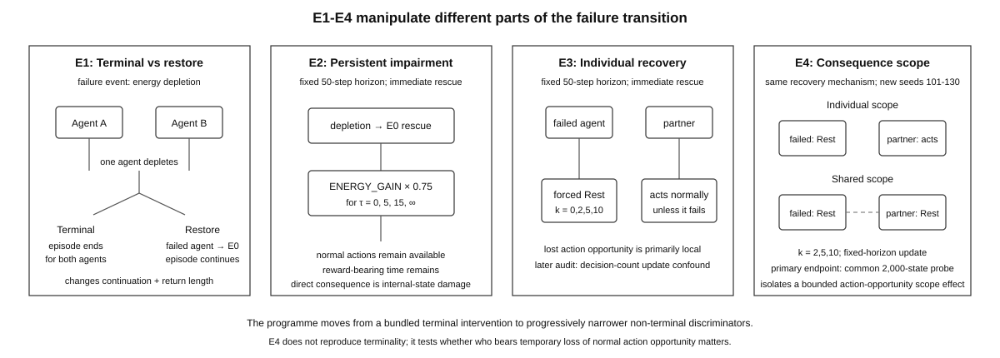
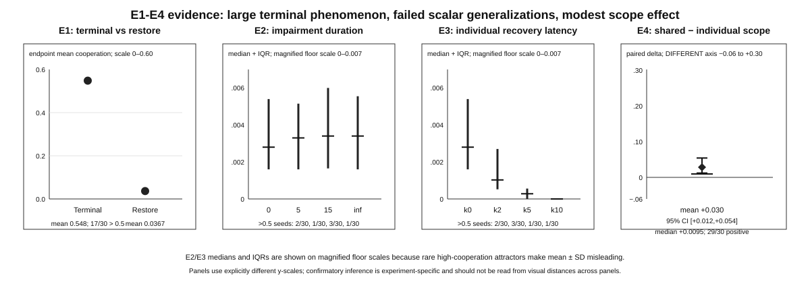

# Who Bears Failure? Consequence Scope and Terminality in Survival-Coupled Artificial Agents

Yuxin Zhang

Independent Researcher

zyx1st@gmail.com

> **Repository note.** This v19.1 candidate is a reviewer-hardening revision of v19. It adds no new confirmatory experiment, does not alter the locked outcomes of Experiments 1–4, and treats the additional E4 individual-scope latency analysis as explicitly post-hoc and exploratory.

## Abstract

Artificial-life systems can be made consequential in different ways: episodes can terminate, internal state can be persistently impaired, recovery can consume action opportunities, or one agent's failure can also remove opportunities from others. These interventions are often discussed under broad labels such as mortality, precariousness, vulnerability, or recovery cost, but they need not alter the same part of an agent's future. We study this distinction in a two-agent survival-coupled REINFORCE testbed and ask a narrower question: **which units lose future opportunities when one unit fails?**

Experiment 1, which was not preregistered, found a large terminal-versus-restore difference. After withdrawal of a cooperation bonus, mean mutual cooperation was about 0.55 when energy depletion terminated the current episode-token and about 0.04 when depletion triggered restoration, with the separation surviving zero-penalty, lives-budget, payoff, and common-state frozen-policy checks. Two later repository-preregistered follow-ups did not support simple generalizations. Experiment 2 varied the persistence of non-terminal metabolic impairment while leaving immediate reward, normal action availability, and reward-bearing time intact; its preregistered positive gradient was not supported. Experiment 3 imposed fully reversible individual-scoped recovery latency; its preregistered positive hypothesis also failed, and the observed ordinal association was negative.

A fourth preregistered experiment then held the non-terminal recovery architecture fixed while changing **consequence scope**: only the failed agent lost normal action opportunity, or both agents did. On a common 2,000-state frozen-policy endpoint, shared scope increased learned mutual-cooperation propensity by about +0.030 on average across latencies (95% CI [0.012, 0.054], paired sign-flip p = 0.00015), with 29/30 collapsed seed contrasts positive. The preregistered +0.10 strong-effect threshold was not reached. A post-hoc exploratory analysis of the individual-scope E4 cells further found that the negative latency ordering seen in E3 persisted under E4's corrected fixed-horizon update, weakening the possibility that E3's direction was solely a decision-count-normalization artifact.

The evidence supports a bounded conclusion: **consequence scope is empirically relevant under the matched E4 recovery design, while the much larger E1 terminality phenomenon remains mechanistically unresolved**. E1 and E4 differ in update semantics, evaluation endpoint and state bank, confirmatory seed set, and baseline regime, so their effect magnitudes are descriptive rather than a controlled decomposition. Artificial-life comparisons should therefore state not only whether failure is costly or recoverable, but which organizational units lose future action, interaction, or return opportunities when failure occurs.

**Keywords**: artificial life, consequence scope, terminality, recovery architecture, reinforcement learning, cooperation

## 1. Introduction

Artificial life is both a constructive and a comparative science. It asks which organizations can sustain, regulate, reproduce, adapt, or act in ways associated with living systems, and which architectural differences matter when those capacities are implemented in very different substrates. Such comparisons are difficult because words such as *death*, *damage*, *reset*, *recovery*, *precariousness*, and *self-maintenance* can refer to different organizational levels and different transition structures.

A biological organism that dies, a robot whose controller reboots, a simulated agent whose episode terminates, a learned policy that persists across terminated episodes, and a copied software process restored from checkpoint may all be described as "failing." Yet their consequences are not equivalent. Failure may destroy a current token while preserving a lineage; leave the token intact but impair future resource acquisition; temporarily remove actions; be repaired externally; or cause partners or higher-level organizations to lose future opportunities as well.

Existing work already supplies richer conceptual vocabularies than a simple alive/dead distinction. Autopoietic and autonomy traditions emphasize self-production, constraint closure, and self-maintenance (Maturana & Varela, 1980; Moreno & Mossio, 2015). Enactive accounts make precariousness and viability central to adaptive agency (Di Paolo, 2005; Egbert & Barandiaran, 2011; Beer & Di Paolo, 2023). Dimensional approaches to life-likeness explicitly resist reducing life to one binary property (Damiano & Stano, 2020; Witkowski & Schwitzgebel, 2024). Artificial-agent work has also directly explored mortality, persistent bodily consequence, reset, and successor learning (Korecki et al., 2023; Chen & Chen, 2026). The present paper does not claim priority for any of these ideas.

The narrower problem studied here emerged from an earlier comparison protocol called **costly selective closure** (CSC). CSC asked how a declared organizational unit maintains selective coupling under ongoing burden, historical constraint, and non-trivial failure. An early version treated irreversible vulnerability as if different failures might be ordered on one dimension. The first experiment in the present programme appeared consistent with that intuition: agents learned much more persistent costly cooperation when depletion terminated the current episode-token than when depletion was restored.

That result immediately raised a standard reinforcement-learning objection. Termination changes future discounted return and removes later state-action opportunities. A terminal transition is therefore not merely intuitively "more serious"; it changes the optimization problem. If the phenomenon reflected a broader failure-consequence principle, some non-terminal ways of making failure consequential should reproduce at least part of the effect.

The programme therefore became a sequence of discrimination tests. Experiment 2 asked whether longer-lasting internal metabolic impairment would produce an ordered cooperation gradient while episode length remained fixed. It did not. Experiment 3 asked whether making recovery consume more of the failed agent's future action opportunities would do so. That positive prediction also failed; the observed association was negative. Those outcomes made a simple scalar interpretation untenable, but did not identify what about terminality mattered.

A post-E3 causal analysis then highlighted a distinction hidden inside the original terminal manipulation. In Experiment 1, when either member of the dyad depleted its energy, **the entire episode ended**. The partner therefore lost the remainder of its within-episode future too. In Experiment 3, the burden was primarily local: the depleted agent was forced to Rest while the partner remained active. This suggested a more specific experimental variable: **consequence scope**, or which units lose future action or return-bearing opportunity when one unit fails.

Experiment 4 was preregistered to test that variable. It reused the non-terminal forced-recovery architecture but compared two scopes. Under **individual scope**, only the failed agent lost normal action choice for a fixed interval. Under **shared scope**, one agent's failure caused both agents to lose normal action choice for the same interval. E4 also changed the policy-update implementation to remove a decision-count-dependent normalization/scaling confound present in E3 and used a condition-independent common state bank as its primary endpoint.

The result was positive but modest. Shared scope increased learned mutual-cooperation propensity relative to individual scope, and the collapsed direction was positive in 29 of 30 seeds. Yet the mean effect was only about +0.03, below the preregistered +0.10 strong-effect threshold. Because E1 and E4 differ in more than scope—most importantly in update rule, endpoint/state bank, seeds, and terminal versus continuing dynamics—their numerical effect sizes should not be interpreted as a controlled variance decomposition.

The paper therefore makes four bounded contributions. First, it reports a strong terminal-versus-restore cooperation effect in a survival-coupled multi-agent testbed together with several robustness checks. Second, it reports two preregistered failed generalizations rather than hiding them: persistent internal impairment did not reproduce the effect, and individual-scoped recovery latency moved in the opposite ordinal direction. Third, it reports a preregistered scope discriminator showing that the distribution of failure-triggered action-opportunity loss across agents changes learned policy, although modestly and through a bundled recovery manipulation. Fourth, it proposes a consequence-description discipline for artificial-life comparison: declare the organizational unit, boundary, timescale, recovery regime, and scope of lost future opportunity instead of collapsing distinct transitions into a generic severity or vulnerability score.

The conclusion is deliberately narrower than a general theory of life or mortality. We do not show that shared fate universally creates cooperation, that terminality has been fully explained, that these agents are alive, or that CSC as a whole has been experimentally validated. We show that one often-hidden architectural choice—**who loses future opportunity when one agent fails**—is experimentally detectable in this testbed and should be made explicit in cross-system comparison.

## 2. Related Work

### 2.1 Precariousness, autonomy, and life-likeness

Precariousness has long been central to enactive and autonomy-oriented accounts of agency. Di Paolo (2005) links adaptivity to regulation relative to viability conditions, while Egbert and Barandiaran (2011) formalize normative behavior and precariousness in adaptive systems. Beer and Di Paolo (2023) distinguish systemic, processual, and thermodynamic forms of precariousness and argue that fragility is constitutive of living organization rather than an accidental defect. The present work does not redefine precariousness. Its narrower contribution is to show that, in one artificial-agent testbed, several operationalizations of failure consequence are behaviorally non-equivalent.

Synthetic-cell and life-likeness research likewise resists one-dimensional definitions. Damiano and Stano (2020) emphasize organizational rather than merely surface similarity in synthetic cells, while Witkowski and Schwitzgebel (2024) discuss multiple dimensions relevant to life and moral status. These literatures motivate careful comparison but do not determine which failure transitions should be treated as equivalent in a particular computational model.

### 2.2 Artificial mortality and consequential embodiment

Artificial mortality is not new. Korecki, Carissimo, and Lund (2023) use irreversible artificial death states and successor learning, while Chen and Chen (2026) study a mortality-grounded embodied agent whose persistent bodily history shapes social and linguistic learning. Such work makes broad claims such as "mortality matters" non-novel. The present experiments instead focus on matched manipulations within one small system and on what changes when different parts of an interaction future are removed.

The level of analysis matters. In E1 an episode-token terminates, but the controller-lineage survives across episodes and continues learning. The experiment therefore does not implement literal controller destruction. It studies how a repeated-learning process changes when one type of failure removes the remainder of a current interaction token for both agents.

### 2.3 Termination, reset cost, and action availability in reinforcement learning

The reinforcement-learning ingredients are also familiar. Termination changes future return. Reset costs and continuing-task formulations explicitly address how terminal events alter optimization; Hisaki and Ono (2024), for example, introduce adaptive reset cost in an average-reward setting. The fact that termination can matter to a reward-maximizing learner is not our discovery.

Likewise, restricted action availability is a mature decision-process problem. Stochastic-action-set MDPs and reinforcement-learning methods for unavailable actions formalize cases in which an agent cannot always select every action (Boutilier et al., 2018; Chandak et al., 2020). E3 and E4 do not claim novelty for action restriction itself. They use temporary action loss as a controlled intervention on failure consequence.

### 2.4 Social dependence and consequence scope

The additional question raised by this programme concerns **scope**. A consequence may be borne only by the unit that crosses a failure threshold, or it may alter the future available to partners, collectives, or higher-level organizations. In social and collective systems, this distinction can change incentives even when the immediate reward table is unchanged.

The generic proposition that shared consequence can promote cooperation is not new. Tampuu et al. (2017), for example, used a cooperative two-agent Pong reward scheme in which both players were penalized whenever the ball left play regardless of which player missed; this team-scoped consequence encouraged collaborative play. In *Artificial Life*, Scott and Pitt (2023) explicitly study cooperative-survival games in which no one survives unless everyone survives, linking collective survival dependence to self-organization in artificial societies. These precedents rule out priority claims for shared penalty, shared fate, or cooperative survival as such.

The contribution here is narrower. Tampuu et al. change event rewards, whereas E4 keeps the programmed immediate reward table fixed and changes who temporarily loses normal action opportunity after failure. Scott and Pitt study richer collective-survival systems with several resource and governance mechanisms, whereas the present programme uses a small matched RL testbed to decompose an initially large terminal-versus-restore phenomenon. The novelty claim therefore lies in the **E1–E4 experimental decomposition**—including two preregistered unfavorable generalization tests and a later preregistered scope discriminator—not in the idea that team-level or shared consequences can support cooperation.

## 3. Conceptual Motivation: Describing Failure Consequences

The experiments were motivated by CSC, but the evidence has progressively reduced the role CSC should play in the paper. The protocol is retained only as conceptual provenance and as a discipline for declaring what is being compared.

A comparison should specify at least four contextual commitments:

1. **organizational unit** — what exactly is being profiled;
2. **boundary** — which resources and supports count as internal or external;
3. **timescale** — over what interval continuity, maintenance, and failure are evaluated;
4. **recovery regime** — what forms of reset, repair, replacement, copying, or continuation are available.

The E1–E4 sequence suggests that failure should then be described structurally rather than with one scalar vulnerability score. At minimum, six questions are useful:

1. **Continuity:** does the same declared unit continue after failure?
2. **State inheritance:** which learned, bodily, or historical structures survive?
3. **Opportunity loss:** which future actions, interactions, rewards, or viability opportunities disappear?
4. **Recovery source:** is recovery performed by the unit, environment, external operator, copy, or successor?
5. **Recovery timing:** how much environment time and organizational time are consumed before normal regulation resumes?
6. **Consequence scope:** which units lose future opportunity when one unit fails?

This descriptor is not a validated ontology. The present experiments directly test only a small subset of these distinctions, and E4 tests consequence scope only within one non-terminal forced-recovery architecture.

Three organizational levels should also remain separate:

- **episode-token** — the currently running interaction episode;
- **controller-lineage** — policy parameters that persist across episodes;
- **training process** — the larger repeated-learning process.

E1 terminates the episode-token, not the controller-lineage. E2–E4 keep the episode-token running. All experiments preserve learned controller parameters across episodes.

## 4. Experimental Programme

### 4.1 Common survival-coupled testbed

All four experiments use the same basic two-agent environment and policy architecture. Two independent REINFORCE learners (Williams, 1992) receive 12 observation features, pass them through a 16-unit tanh hidden layer, and choose among three actions: `cooperate`, `solo`, or `rest`.

Immediate rewards have a Prisoner's-Dilemma ordering. Unilateral Solo against Cooperate receives `1.4`, mutual cooperation `1.0`, mutual Solo `0.6`, and Cooperate against Solo `0.0`. Rest yields `0.25` to the resting agent. Energy dynamics are distinct from immediate reward. Each step incurs metabolic cost `1.0`; mutual cooperation adds `2.0` energy, mutual Solo adds `0.7`, Solo against Cooperate adds `1.2`, Cooperate against Solo adds `0.0`, and Rest adds `0.5`. Thus cooperation can support energetic maintenance even though unilateral Solo has the larger immediate reward.

Policies are trained for 1,000 episodes with an added mutual-cooperation bonus, followed by 300 online-adaptation episodes after the bonus is withdrawn. Learning continues during withdrawal. The base discount factor is `gamma = 0.97` and learning rate is `0.04`.

The experimental chronology is important. **E1 was not preregistered.** It established the initial phenomenon. E2 and E3 were formulated after E1 was known and separately locked in timestamped repository preregistrations before their confirmatory execution on seeds `1..30`. E4 was formulated after E1–E3 causal analysis, then separately preregistered before implementation and before confirmatory seeds `101..130` were run. The programme should therefore be read as discovery followed by successive prospectively constrained discrimination tests, not as one prospectively preregistered four-experiment study.



**Figure 1.** Experimental architecture across E1–E4. E1 bundles dyad-level episode termination with loss of future within-token return; E2 holds the horizon fixed while impairing internal energy acquisition; E3 localizes temporary loss of normal action opportunity to the failed agent; E4 keeps the non-terminal recovery mechanism but compares individual with shared failure-triggered recovery. The sequence progressively narrows the mechanism question rather than treating the interventions as points on one severity scale.

### 4.2 Experiment 1: terminal failure versus restoration

E1 compares two primary regimes.

1. **Terminal condition.** When either agent depletes its energy, the current episode-token ends for the dyad.
2. **Restore condition.** On depletion, the affected agent is restored to `E0 = 6` and the episode continues.

The same programmed immediate reward function, observation features, base energy dynamics, policy architecture, training schedule, and matched seeds are used. A depletion penalty of `2.0` is applied in the main comparison. Because terminality removes the remainder of the current token's future for both agents, termination changes future return, state occupancy, and realized trajectory length as part of the intervention.

The historical E1 result files were analysed using a two-sided two-sample label-permutation test with 20,000 resamples. Although matched seeds were used across regimes, that historical test pools outcomes and permutes regime labels rather than exploiting pairing. We retain the historical analysis and separately report a post-hoc paired sign-flip sensitivity analysis on the fixed committed outcomes. No retraining is involved and the historical test is not retroactively relabelled.

E1 also includes four robustness families: a zero-penalty ablation; a lives-budget gradient from one life toward unbounded restoration; a six-cell payoff sweep; and a common-state frozen-policy probe that evaluates learned policies on identical held-out observation states.

### 4.3 Experiment 2: persistent non-terminal metabolic impairment

E2 was preregistered to ask whether **damage persistence** could reproduce an ordered version of the E1 effect without termination.

All conditions remain exactly 50 environment steps. Depletion carries zero explicit failure reward penalty and immediately restores energy to `E0 = 6`. The manipulation multiplies subsequent `ENERGY_GAIN` by `0.75` while damage is active. Damage duration is ordered as immediate recovery, 5 steps, 15 steps, or the remainder of the episode.

A crucial construct boundary is that damaged state does **not** directly change the immediate reward table, remove normal policy actions, or remove reward-bearing environment time. It can affect learning indirectly through energy observations, low-energy indicators, later state occupancy, depletion frequency, and failure-history features. E2 therefore tests persistent internal metabolic impairment, not every possible form of persistent consequence.

The preregistered primary endpoint is final-100-withdrawal mutual cooperation. A tie-aware Spearman association over ordered damage duration is tested by condition-label permutations blocked within seed. Strong support additionally required the endpoint difference between persistent damage and immediate recovery to be at least `+0.10` with a positive paired bootstrap interval.

### 4.4 Experiment 3: individual-scoped recovery latency

E3 was separately preregistered after E2 failed to support the expected gradient. It asked whether a more directly functional but still reversible failure consequence would reproduce the E1 direction.

All episodes remain exactly 50 environment steps. On depletion, energy is immediately restored to `E0 = 6`, no new explicit failure reward penalty is added, and the failed agent then executes forced Rest for `k = 0,2,5,10` subsequent environment steps. During those steps it does not sample a normal policy action. The partner remains decision-capable unless separately recovering.

Because forced-recovery steps mechanically prevent voluntary mutual cooperation, the primary rollout endpoint counts cooperation only on **eligible decision steps**, where both agents begin the step free to choose normally. The preregistered positive hypothesis uses a blocked-by-seed ordered Spearman test. A condition-independent 2,000-state frozen-policy probe was preregistered as a secondary policy-level check.

E3 has an interpretation boundary discovered during later code audit. Its masked policy update standardizes returns over the condition-dependent subset of genuine decision steps and divides gradients by the number of genuine decisions. As recovery latency increases, that normalization population and gradient divisor change. This is not an implementation error relative to the locked E3 design, but it is a mechanism-identification confound. The common-state probe shows that learned policies differ, but it cannot remove how those policies were trained.

### 4.5 Experiment 4: individual versus shared consequence scope

E4 was preregistered to ask whether the *scope* of the same failure-triggered action-opportunity loss matters. The six confirmatory cells cross:

```text
scope = individual, shared
latency k = 2, 5, 10
```

All conditions keep a fixed 50-step environment horizon, the same programmed immediate reward and energy tables, immediate `E0 = 6` rescue after depletion, zero explicit failure reward penalty, the same policy architecture, learning rates, cooperation-bonus schedule, and matched seed within each scope/latency comparison.

Under **individual scope**, only the failed agent is forced to Rest for the next `k` steps. Under **shared scope**, failure of either agent installs the same `k`-step forced-Rest interval for both agents. If an agent actually depletes during recovery it is restored to `E0`; shared recovery can therefore generate additional failures through the existing Rest energy dynamics and refresh the shared interval.

E4 also changes the policy-update rule to remove the specific E3 decision-count scaling confound. Discounted returns are computed over all 50 environment steps, return mean and variance are computed over the complete 50-element return vector, score-function gradients are created only for genuine policy decisions, and accumulated gradients are divided by the fixed horizon `50` rather than by the number of genuine decisions. A preregistered invariant required `k=0` to match the original update numerically when every step is a genuine decision.

Confirmatory seeds were locked to `101..130`, disjoint from earlier confirmatory seeds. The primary endpoint is policy-level: after withdrawal, frozen learned policies are evaluated on the same condition-independent bank of exactly 2,000 paired decision-capable states. The bank is generated from fresh, untrained policies using seeds `2001..2010`, four 50-step episodes per seed, with an individual-scope `k=0` environment and cooperation bonus off. Bank-generation seeds are disjoint from confirmatory seeds, and because `k=0` is used, no bank state is created during forced recovery.

For each confirmatory seed and latency, expected mutual cooperation under shared scope minus individual scope is computed on the common bank. The three nonzero latencies are then averaged within seed **before** the sole confirmatory paired sign-flip test. The test uses 20,000 sign-flip resamples; the paired bootstrap interval uses 10,000 resamples. Preregistered support requires a positive mean collapsed scope effect and two-sided `p < 0.05`. Strong support additionally requires a mean effect of at least `+0.10` with a positive lower confidence bound. Latency-specific effects are secondary and cannot replace the collapsed primary test.

Mechanism diagnostics record failure-triggering action pairs, first-failure categories, active-partner actions during individual recovery, forced occupancy, eligible-decision fraction, failure frequency, and genuine policy-decision counts. These diagnostics describe how the manipulation operates; they were not substitute primary endpoints.

## 5. Results

### 5.1 Experiment 1: a large terminal-versus-restore difference

After the cooperation bonus is withdrawn, mean mutual cooperation is approximately `0.548` in the terminal condition and `0.0367` in the restore condition across 30 matched seeds. The historical two-sided two-sample label-permutation test gives a mean difference of approximately `+0.511` and reaches the 20,000-resample floor (`p < 0.0001`).

Because the design used matched seeds, a later paired sign-flip sensitivity analysis was applied to the same fixed outcomes. It reaches the same resampling floor: 24 of 30 paired differences are positive, 2 are zero, and 4 are negative. This is a post-hoc sensitivity analysis, not a replacement for the historical E1 test.

The zero-penalty ablation retains the separation: cooperation is about `0.50` under terminal failure and `0.05` under restoration. The one-life to unbounded-lives gradient is strongly negative (`rho` approximately `-0.44`, `p < 0.0001`), and terminal/one-life conditions remain above restore/unbounded conditions across all six payoff-sweep cells.

The common-state frozen-policy probe also preserves the difference. At end of withdrawal, terminal policies yield mean expected mutual cooperation `0.485` on 2,292 matched mortality-free observations compared with `0.030` for restore, a paired difference of `+0.454` with 95% CI `[0.346, 0.557]` and `p < 0.0001`. At end of training the corresponding difference is `+0.503` (95% CI `[0.385, 0.612]`). The effect therefore exists in the learned policies and is not solely a consequence of unequal rollout occupancy.

The seed distribution is heterogeneous. Seventeen of 30 terminal seeds end above `0.50` post-withdrawal cooperation, while seven remain below `0.05`. The intervention appears to change the probability of entering or retaining cooperative policy basins rather than applying a uniform increment to every seed.

### 5.2 Experiment 2: persistent internal impairment does not reproduce E1

E2 clearly changed the internal viability trajectory. Damaged-agent-step fraction rises from zero under immediate recovery to about `0.53` under persistent damage, and depletion frequency also increases.

The preregistered behavioral gradient is nevertheless not supported (`rho = 0.055`, blocked-by-seed two-sided `p = 0.071`). The persistent-damage endpoint differs from immediate recovery by only `+0.006`, with 95% CI approximately `[-0.029, +0.044]`. That interval excludes the preregistered `+0.10` strong-effect threshold.

The correct conclusion is construct-specific. Persistent metabolic impairment that changes energy acquisition and state occupancy, while leaving immediate reward, normal actions, and reward-bearing time intact, does not reproduce the E1 cooperation effect in this testbed. This result does not establish that every form of persistent non-terminal consequence is behaviorally irrelevant.

### 5.3 Experiment 3: individual recovery latency moves in the opposite ordinal direction

E3 passes its manipulation checks. Forced-recovery occupancy increases with latency while episode length remains fixed at 50 steps. The preregistered positive hypothesis fails. The observed ordered association is instead negative (`rho = -0.704`, `p < 0.0001`). The `k10 - k0` endpoint difference is `-0.037`, with 95% CI approximately `[-0.099, -0.003]`.

The statistic is strong in ordinal terms, but the absolute effect is modest and the regime is floor-dominated. Median cooperation is already about `0.003` at `k0` and reaches zero at `k10`. Arithmetic means are not strictly monotonic because `k2` contains several high-cooperation attractor seeds. The common-state frozen-policy probe shows the same negative direction, so the result is not merely produced by excluding forced-recovery steps from the cooperation denominator. However, because E3 also changes the condition-dependent decision-return normalization set and gradient averaging divisor, its negative direction should not be promoted to an architecture-general law about recovery burden.

#### Exploratory cross-check under the corrected E4 update

The first E4 confirmatory artifact already contains individual-scope cells at `k=2,5,10` trained with the corrected fixed-horizon update. We therefore performed a **post-hoc exploratory** analysis of those existing rows; no retraining and no additional confirmatory run were performed. On E4's primary common-state endpoint, mean expected mutual cooperation decreases from `0.0401` at `k=2` to `0.0276` at `k=5` and `0.0155` at `k=10`; medians are `0.00187`, `0.00084`, and `0.00062`, respectively. A three-level blocked-by-seed tie-aware Spearman analysis gives `rho = -0.494` with two-sided 20,000-permutation `p = 0.00005`. The eligible-rollout endpoint shows the same ordering (`0.0546`, `0.0381`, `0.0248`; exploratory `rho = -0.461`, `p = 0.00005`).

This cross-check weakens the hypothesis that E3's negative direction was **solely** produced by its decision-count-dependent normalization/scaling. It does not convert E3 into a positive confirmatory finding, and it is not a preregistered replication: E4 lacks `k=0`, uses new seeds, uses a different common-state bank, and was designed for the scope contrast rather than for this latency analysis.

### 5.4 Experiment 4: shared consequence scope has a small, preregistered positive effect

E4 passed its preregistered invariant gate before confirmatory execution. The first and only confirmatory run evaluated six scope/latency cells across 30 new matched seeds and the common 2,000-state policy bank.

The preregistered latency-collapsed primary effect was:

```text
mean(shared - individual) = +0.02998
95% paired bootstrap CI   = [+0.01195, +0.05387]
two-sided sign-flip p     = 0.00015
```

The confirmatory support criterion is met, whereas the preregistered `+0.10` strong-effect criterion is not. Twenty-nine of 30 collapsed seed contrasts are positive, one is negative, and the median collapsed difference is about `+0.0095`. The distribution is right-skewed, with a few larger attractor shifts contributing substantially to the mean.

Latency-specific values are secondary:

| Recovery latency | Mean shared-individual | Median | 95% paired bootstrap CI | Positive / negative seeds |
|---|---:|---:|---|---:|
| `k=2` | +0.0075 | +0.0015 | [-0.0349, +0.0517] | 22 / 8 |
| `k=5` | +0.0618 | +0.0052 | [+0.0196, +0.1141] | 28 / 2 |
| `k=10` | +0.0206 | +0.0127 | [+0.0139, +0.0279] | 30 / 0 |

There is no monotonic increase of the scope effect with latency, and no such pattern was preregistered as necessary. The secondary eligible-rollout endpoint points in the same direction, with a collapsed shared-minus-individual difference about `+0.033` and 95% CI approximately `[+0.012, +0.062]`.

The primary endpoint remains floor-dominated. Under individual scope, the numbers of seeds whose common-state expected mutual cooperation exceeds `0.5` are `1/30`, `1/30`, and `0/30` for `k=2,5,10`; under shared scope they are `1/30`, `2/30`, and `1/30`. Thus 29/30 positive paired directions primarily indicate a coherent policy shift within a largely non-cooperative regime, not a mass transition of seeds into a cooperative attractor. The effect is statistically coherent but behaviorally modest.

Mechanism diagnostics further qualify the interpretation. During individual recovery, the still-active partner chooses Solo roughly 91–96% of the time. Shared recovery therefore changes at least two things at once: it makes the partner lose its own normal action opportunities, and it removes the partner's opportunity to exploit a temporarily recovering opponent. The experiment identifies the effect of this **bundled shared recovery/action-opportunity architecture**; it does not separately identify those two submechanisms.

Failure triggers themselves are dominated by mutual-Solo states rather than by `failed Cooperate versus partner Solo`, so the stronger asymmetric-victim account receives only partial diagnostic support. Shared recovery also changes occupancy strongly: at `k=10`, both agents are forced for about 60% of environment steps, the eligible-decision fraction falls to about 40%, and repeated Rest dynamics generate additional failures. The common-state frozen-policy endpoint prevents these occupancy differences from mechanically defining the measured endpoint, but learned policies are legitimately shaped by those training dynamics. The extra forced occupancy could create countervailing effects on cooperation; the present design does not identify their sign separately.



**Figure 2.** Distribution-aware summary of E1–E4. E1 shows the terminal and restore endpoint means together with seed-heterogeneity annotations. E2 and E3 show medians and interquartile ranges rather than mean ± SD because their distributions are strongly floor-dominated and contain rare high-cooperation attractors. E4 shows the paired shared-minus-individual effect on a separate delta axis, together with its mean, 95% paired bootstrap interval, median, and positive-seed count. The E4 axis is intentionally different and should not be read as a common scale with E1–E3. Confirmatory inference follows the experiment-specific tests in the text.

### 5.5 Integrated E1–E4 evidence

The four experiments support a structural decomposition that is more informative than treating failure as a single severity axis.

| Experiment | Failure consequence | Who loses normal future opportunity? | Main result |
|---|---|---|---|
| E1 | episode termination | both agents lose remaining token future | large terminal > restore phenomenon |
| E2 | persistent internal metabolic impairment | neither directly loses normal action/time | preregistered positive generalization not supported |
| E3 | temporary forced recovery | failed agent primarily | preregistered positive H1 fails; negative ordinal association |
| E4 | same temporary recovery, scope manipulated | failed agent only vs both agents | shared > individual, modest preregistered effect |

Three conclusions are directly supported. First, prolonging the specific internal impairment used in E2 does not reproduce E1. Second, increasing the individual recovery latency used in E3 does not reproduce E1 and instead yields a negative ordering; that ordering also appears in a post-hoc cross-check of E4's individual-scope cells under the corrected update. Third, under E4's matched non-terminal recovery design, changing from individual to shared recovery produces a positive but modest scope effect.

A fourth statement is deliberately left unresolved: **how much of the E1 terminal-versus-restore phenomenon is caused by consequence scope, terminal return truncation, continuation structure, or interactions among them**. E1 and E4 differ in update semantics, endpoint and state bank, seed set, and baseline dynamics, so their numerical magnitudes are not a controlled decomposition.

## 6. Discussion

### 6.1 What Experiment 1 establishes

E1 establishes a large and robust difference between two failure transitions in this specific survival-coupled REINFORCE architecture. The terminal condition changes which policy regimes are learned and retained after cooperation-subsidy withdrawal. Zero-penalty, lives-gradient, payoff-sweep, and common-state checks reinforce that empirical fact.

Terminality is nevertheless a bundled intervention. When either agent fails, both lose the remainder of the current episode-token. The return stream is truncated, later state occupancy disappears, realized trajectory length changes, and the historical update normalization/averaging is applied to a shorter trajectory. E1 therefore cannot by itself identify a unique mechanism.

The relevant ALife question is not whether RL termination changes optimization—it does—but which aspects of a failure transition correspond to organizational dependence, shared viability, or boundary structure in artificial systems.

### 6.2 E2: internal impairment without direct opportunity loss is insufficient here

E2 is most informative when its construct boundary is respected. It successfully increases damaged-state occupancy and later depletion, but the damage itself does not directly remove reward-bearing time, normal actions, or immediate reward. Much of the manipulation therefore reaches the learning problem only indirectly through changed observations and later trajectories.

Its no-support result should not be used as a sweeping falsification of persistent consequence. It shows that making this internal viability variable worse and longer-lasting is not enough, by itself, to reproduce the E1 policy regime. The confidence interval additionally excludes the preregistered +0.10 endpoint effect, making the result stronger than a simple failure to cross a significance threshold.

### 6.3 E3: individual recovery burden is not equivalent to terminality

E3 tests a more functional consequence: the failed agent loses normal action opportunities for a period of environment time. Yet the result moves in the opposite direction from the preregistered prediction.

The original E3 result must retain its update-mechanics caveat, because its normalization set and gradient divisor vary with genuine decision count. The E4 individual-scope cross-check nevertheless matters: the same negative latency ordering appears after switching to fixed-horizon normalization/scaling. This does not establish a general reverse law, but it makes a purely normalization-artifact explanation less plausible.

More importantly, individual recovery changes the social interaction presented to the partner. A still-active partner can exploit a recovering Rest agent and overwhelmingly chooses Solo in that window. Increasing individual recovery may therefore amplify an asymmetric interaction structure rather than simply make failure "more costly." E3 breaks the simple bridge from greater burden to greater cooperation; it does not replace that bridge with a universal opposite.

### 6.4 Consequence scope is detectable but modest

E4 uses one non-terminal recovery architecture under individual versus shared scope. Its preregistered result establishes that this scope manipulation changes learned mutual-cooperation propensity.

The effect is statistically coherent but practically modest. The positive direction across 29 of 30 collapsed seeds is not equivalent to 29 behavioral regime changes: most cell-level policies remain near the non-cooperative floor. This is why E4 is more useful as a mechanism discriminator than as a stand-alone large-effect result.

The manipulation also should not be named more purely than it is. Shared recovery removes the partner's normal action opportunity and simultaneously removes the individual-recovery exploitation window. The safest description is therefore **shared failure-triggered recovery/action-opportunity consequence**, not an abstract or universal "shared fate" variable.

### 6.5 Why terminality remains mechanistically live

E4 demonstrates that scope matters in a matched non-terminal design, but it does not identify what fraction of E1's terminality phenomenon is attributable to scope. A direct numerical comparison between `+0.030` in E4 and the much larger E1 separation is only descriptive because at least four design differences intervene:

1. **update semantics:** E4 uses full-horizon return normalization and fixed `/50` gradient scaling, whereas E1 uses the historical update;
2. **evaluation endpoint and state bank:** E1's headline result includes rollout and its own 2,292-state probe, whereas E4's confirmatory primary endpoint is a distinct 2,000-state common-bank probe;
3. **confirmatory seeds:** E1 uses seeds `1..30`, while E4 uses new seeds `101..130`;
4. **baseline dynamics and floor:** E4's individual-scope cells are already largely near the non-cooperative floor, constraining the meaning of absolute effect differences.

Under terminality, once either agent depletes, neither experiences any later state in that token. Under shared recovery, both continue through Rest transitions, accrue reward and energy changes associated with Rest, can experience further failures, and eventually resume normal decisions. Terminality also eliminates all later within-token rewards rather than replacing normal actions with Rest.

The current experiments therefore do **not** distinguish whether terminality and scope act additively, interact, or are mediated by another feature of the transition architecture. A matched factorial continuation experiment would be needed for that decomposition.

### 6.6 A structured consequence descriptor

The evidence suggests a practical comparison rule. Statements such as "this agent can die," "recovery is costly," or "failure is irreversible" should be unpacked into transition questions:

1. does the declared unit continue?
2. which state/history is inherited?
3. which future actions, interactions, rewards, or viability opportunities are removed?
4. who performs recovery?
5. how much time does recovery consume?
6. **which unit or units bear those losses?**

Only a subset of these questions is experimentally separated here. The list is therefore a methodological descriptor, not a validated six-dimensional theory. Its purpose is to prevent distinct interventions from being treated as interchangeable before they have been experimentally related.

### 6.7 CSC after the experiments

CSC survives in a smaller role than earlier versions proposed. Its useful contribution here is the insistence that a comparison declare an organizational unit, boundary, timescale, and recovery regime, and ask whether maintenance or failure costs are borne by the unit being discussed or by external infrastructure.

The experiments do not validate CSC's selective-breadth, maintenance-burden, or historical-retention dimensions. Those ideas should not occupy the evidential center of this article. CSC is best treated as the conceptual origin of the question that the experiments progressively refined.

The original scalar-like vulnerability term is not retained. E2–E4 show that at least internal impairment, action-opportunity loss, and consequence scope should remain analytically distinct unless a future model establishes their equivalence.

### 6.8 Relation to precariousness, mortality, and individuality

The scope result should not be confused with a new definition of precariousness. Enactive precariousness concerns richer organizational dependence than this small RL testbed. Nor is the generic cooperation benefit of shared consequence new: team-scoped penalties already appear in multi-agent reinforcement learning (Tampuu et al., 2017), and interdependent cooperative survival is already an explicit *Artificial Life* topic (Scott & Pitt, 2023). The present contribution is the controlled decomposition that identifies a modest scope-sensitive policy effect after preserving two preregistered unfavorable generalization tests.

The result is nevertheless relevant to individuality and collective organization. A failure can remain local to one component, or it can change the future available to a larger interacting unit. The present paper provides a concrete, deliberately small experimental handle on that distinction rather than a general theory of collective individuality.

### 6.9 Limitations

Several limitations substantially bound the conclusions.

First, E1 was not preregistered. E2, E3, and E4 were each designed after earlier results were known, although each was locked before its own confirmatory execution. The programme therefore narrows hypotheses sequentially rather than providing one fully prospective four-experiment confirmation.

Second, all experiments use one small two-agent REINFORCE architecture with a 16-unit hidden layer. Effects may differ under actor-critic, average-reward, model-based, recurrent, population-learning, or evolutionary systems. The current study is a controlled minimal testbed, not an algorithm-general demonstration.

Third, the environment hand-designs survival coupling. Maintenance actions, energy dynamics, and recovery mechanisms do not emerge endogenously. The experiments study policy adaptation within a designed maintenance architecture, not the evolution or self-production of that architecture.

Fourth, episode-token termination is not controller destruction. Controller parameters persist across episodes. Claims about mortality must remain indexed to organizational level.

Fifth, restoration to `E0 = 6` is environmental support. It can function as replenishment and reduce incentives to avoid depletion. This is a real property of E2–E4 rather than a neutral background fact.

Sixth, cooperation is attractor-sensitive and floor-dominated in several non-terminal conditions. Means can be influenced by rare high-cooperation basins. We therefore report medians, seed-direction counts, and cooperative-attractor counts where relevant, but do not provide a full dynamical-systems analysis of basin formation.

Seventh, E4's shared manipulation bundles at least two submechanisms: the active partner loses its own action opportunity and the partner loses an exploitation window against a recovering opponent. The experiment does not isolate those components. Shared Rest also creates substantial forced occupancy and additional failures at longer latency, which may exert countervailing learning effects whose sign is not separately identified.

Eighth, E1 and E4 do not form a controlled terminality-by-scope factorial experiment. Their effect sizes should not be interpreted as proportions of one another for the four design reasons listed in Section 6.5.

Finally, the post-hoc E4 individual-latency analysis was motivated after seeing the E3/E4 relationship. It is useful for checking whether the E3 sign survives the corrected update, but it is exploratory and cannot replace a preregistered replication.

### 6.10 Future work and stopping rule

The current evidence does not require an immediate Experiment 5. E4 was executed once under preregistration and produced a bounded positive scope result; adding experiments merely to enlarge the effect would undermine the evidential discipline of the sequence.

The most informative next experiment, if the unresolved mechanism question becomes worth pursuing, would use a **matched terminality × consequence-scope design** under one update rule, one seed set, and one evaluation bank. Its hard design problem is defining individual termination without silently changing the partner's transition semantics. A related cleaner intervention could keep the partner decision-capable while equalizing the reward available against a recovering opponent, thereby separating partner opportunity loss from exploitation-window removal.

Other useful directions include algorithm replication, evolved or learned repair, and collective systems in which organizational boundaries themselves can change. Such work would extend the mechanism question rather than rescue a scalar vulnerability construct.

For the current article, the appropriate stopping point remains the E1–E4 sequence: one strong discovery result, two preregistered failed generalizations, one preregistered scope discriminator with a real but modest effect, and a clearly delimited post-hoc cross-check that does not alter the confirmatory record.

## 7. Conclusion

Failure in an artificial agent is not fully described by saying that it is severe, recoverable, irreversible, or costly. A failure transition also has a **scope**: it determines which organizational units lose future action, interaction, return, or viability opportunities.

In the present survival-coupled multi-agent testbed, terminal failure produces a large cooperation separation relative to restoration. Persistent internal metabolic impairment does not reproduce that phenomenon. Individual-scoped recovery latency moves in the opposite ordinal direction from the preregistered positive prediction, and the same negative ordering appears in a post-hoc cross-check under E4's corrected update. When the non-terminal recovery manipulation is shared across both agents, learned mutual-cooperation propensity increases relative to individual scope, but only modestly and under a bundled recovery architecture.

The strongest conclusion is therefore neither "mortality creates cooperation" nor "shared fate creates cooperation." It is narrower and more testable: **the scope of failure-triggered future opportunity loss is an empirically relevant part of the learning problem, while the specific causal structure behind the larger terminality phenomenon remains unresolved.**

Artificial-life comparisons should accordingly ask not only what can fail and how recovery occurs, but **who loses future opportunity when failure happens**.

## Data and Code Availability

The reproduction package preserves the E1 code and fixed result files; timestamped repository preregistrations, invariant tests, first confirmatory artifacts, and result records for E2–E4; statistical procedures; and figure-generation assets.

E1 retains its historical two-sample label-permutation analysis. A separate post-hoc paired sign-flip sensitivity audit is reproduced directly from committed outcomes without retraining or replacing the historical result.

E2, E3, and E4 use **timestamped repository preregistrations**, not third-party preregistration services. The exact locked-design commits are:

```text
Experiment 2: 5852e60d82efc14748ae3478ee2400b4d3600839
Experiment 3: 0c599c14ea24196c6e2d411ecd0e4e17124f18f1
Experiment 4: 66cb46c45e99c5535c1f63b9c200ff9dbe911506
```

The E4 first-confirmatory artifact is identified in the repository by run/artifact IDs and SHA-256 hashes. The post-hoc individual-scope latency cross-check is preserved separately at `papers/costly_selective_closure_supplement/results/consequence_scope_E4_individual_latency_exploratory.json`, including its source artifact hash, all 90 source rows used in the analysis, and an explicit exploratory-status notice.

The historical code uses the regime label `real` for the E1 terminal condition. The manuscript uses **terminal** to avoid implying that one software condition possesses metaphysically "real" stakes.

A static reviewer reproduction package should be provided through a route that does not require reviewers to reveal identity through repository permissions or authentication logs.

## AI Assistance Disclosure

OpenAI ChatGPT was used during the September 2026 revision process for literature organization, manuscript restructuring, wording assistance, code-review support, experimental-governance checks, consistency review, and post-hoc analysis scripting. Reported confirmatory numerical results derive from committed experiment code and preserved result artifacts rather than from generative-model output. The author determined the hypotheses, approved the preregistrations, accepted unfavorable confirmatory outcomes, verified claims against preserved outputs, and takes responsibility for the manuscript.

## References

- Beer, R. D., & Di Paolo, E. A. (2023). The theoretical foundations of enaction: Precariousness. *BioSystems, 223*, 104823. https://doi.org/10.1016/j.biosystems.2022.104823
- Boutilier, C., Cohen, A., Daniely, A., Hassidim, A., Mansour, Y., Meshi, O., Mladenov, M., & Schuurmans, D. (2018). Planning and learning with stochastic action sets. In *Proceedings of the Twenty-Seventh International Joint Conference on Artificial Intelligence* (pp. 4674–4682). https://doi.org/10.24963/ijcai.2018/650
- Chandak, Y., Theocharous, G., Metevier, B., & Thomas, P. S. (2020). Reinforcement learning when all actions are not always available. *Proceedings of the AAAI Conference on Artificial Intelligence, 34*(04), 3381–3388. https://doi.org/10.1609/aaai.v34i04.5740
- Chen, S., & Chen, T. (2026). Synthetic Linguistic Agency: How an Embodied Mortal Agent Learns Linguistic Affordances through Consequential Social Experience. *arXiv preprint arXiv:2608.27843*.
- Damiano, L., & Stano, P. (2020). On the "life-likeness" of synthetic cells. *Frontiers in Bioengineering and Biotechnology, 8*, 953. https://doi.org/10.3389/fbioe.2020.00953
- Di Paolo, E. A. (2005). Autopoiesis, adaptivity, teleology, agency. *Phenomenology and the Cognitive Sciences, 4*(4), 429–452.
- Egbert, M. D., & Barandiaran, X. E. (2011). Quantifying normative behavior and precariousness in adaptive agency. In *Advances in Artificial Life (ECAL 2011)* (pp. 210–217).
- Hisaki, Y., & Ono, I. (2024). RVI-SAC: Average reward off-policy deep reinforcement learning. In *Proceedings of the 41st International Conference on Machine Learning* (PMLR 235, pp. 18352–18373).
- Korecki, M., Carissimo, C., & Lund, T. (2023). aRtificiaL death: learning from stories of failure. *Proceedings of the 2023 Conference on Artificial Life*, 41. https://doi.org/10.1162/isal_a_00633
- Maturana, H. R., & Varela, F. J. (1980). *Autopoiesis and Cognition: The Realization of the Living*. Reidel.
- Moreno, A., & Mossio, M. (2015). *Biological Autonomy: A Philosophical and Theoretical Enquiry*. Springer.
- Scott, M., & Pitt, J. (2023). Interdependent Self-Organizing Mechanisms for Cooperative Survival. *Artificial Life, 29*(2), 198–234. https://doi.org/10.1162/artl_a_00403
- Tampuu, A., Matiisen, T., Kodelja, D., Kuzovkin, I., Korjus, K., Aru, J., Aru, J., & Vicente, R. (2017). Multiagent cooperation and competition with deep reinforcement learning. *PLOS ONE, 12*(4), e0172395. https://doi.org/10.1371/journal.pone.0172395
- Williams, R. J. (1992). Simple statistical gradient-following algorithms for connectionist reinforcement learning. *Machine Learning, 8*, 229–256.
- Witkowski, O., & Schwitzgebel, E. (2024). The ethics of life as it could be: Do we have moral obligations to artificial life? *Artificial Life, 30*(2), 193–215. https://doi.org/10.1162/artl_a_00436

## Appendix A. Experiment 1 Details

### A.1 Environment

Two agents share a symmetric survival environment with horizon `T = 50`. Each has initial energy `E0 = 6`, cap `Emax = 10`, and fixed metabolic cost `1.0` per step. The immediate reward / energy-gain matrix is:

| own \\ partner | cooperate | solo | rest |
|---|---|---|---|
| cooperate | 1.0 / +2.0 | 0.0 / +0.0 | 0.2 / +0.4 |
| solo | 1.4 / +1.2 | 0.6 / +0.7 | 0.9 / +1.0 |
| rest | 0.25 / +0.5 | 0.25 / +0.5 | 0.25 / +0.5 |

A metabolic cost of `1.0` is then subtracted. Thus mutual cooperation produces positive net energy while mutual Solo gradually depletes both agents.

### A.2 Policy and training

Each policy has 12 input features, 16 tanh hidden units, and three action logits. REINFORCE uses standardized discounted returns, learning rate `0.04`, and `gamma = 0.97`. Training lasts 1,000 episodes with cooperation bonus `1.0`; withdrawal lasts 300 episodes with the bonus removed and learning continuing. Main, zero-penalty, and lives-gradient experiments use 30 paired seeds; payoff-sweep cells use 15 paired seeds.

### A.3 E1 common-state probe

Held-out policies from bank-generation seeds `1001–1010`, disjoint from evaluation seeds `1–30`, generate mortality-free observation states. States are stratified by energy and time-to-horizon; equal numbers from terminal and restore regimes are drawn within shared-support cells. The final bank contains 2,292 paired observations. Frozen policies are evaluated without learning using expected mutual cooperation `P(CC|s) = P1(C|s1) × P2(C|s2)`.

## Appendix B. Experiment 2 Confirmatory Design

E2 preregistered ordered damage-persistence conditions, paired seeds `1–30`, its blocked-by-seed primary test, significance rule, and `+0.10` endpoint threshold before confirmatory execution. Its locked design commit is `5852e60d82efc14748ae3478ee2400b4d3600839`. The first confirmatory artifact is preserved. No post-result retuning replaced the no-support outcome.

## Appendix C. Experiment 3 Methods and Confirmatory Design

E3 was separately preregistered after E2. Before confirmatory seeds `1–30` were run, latency levels `0/2/5/10`, fixed 50-step horizon, immediate rescue, zero new failure penalty, eligible-step primary endpoint, blocked-by-seed permutation test, common-state secondary probe, and `+0.10` endpoint threshold were locked at commit `0c599c14ea24196c6e2d411ecd0e4e17124f18f1`.

E3's common-state bank is condition-independent. Freshly initialized, untrained policies with seeds `1001..1010` are run for four 50-step episodes per seed in `k=0`, producing exactly 2,000 paired decision-capable observations. Frozen final policies from each confirmatory condition are then evaluated on the same bank using expected mutual cooperation `P1(C|s1) × P2(C|s2)`.

The E3 masked update computes discounted returns over the full trajectory, attributes score-function gradients only to genuine policy decisions, standardizes returns over the condition-dependent subset of genuine decision steps, and divides the accumulated gradient by the number of genuine decisions. This last pair of choices creates the later-identified decision-count-dependent scaling/normalization caveat.

The first confirmatory artifact is preserved. The observed negative direction is reported without reversing the preregistered positive hypothesis after seeing the data.

## Appendix D. Experiment 4 Methods and Confirmatory Design

E4 was preregistered before implementation or confirmatory execution at commit `66cb46c45e99c5535c1f63b9c200ff9dbe911506`. It locked individual versus shared scope, nonzero latencies `2/5/10`, seeds `101..130`, fixed 50-step horizon, immediate rescue, zero failure penalty, fixed-horizon return normalization and gradient scaling, a common 2,000-state frozen-policy primary endpoint, latency-collapsed paired sign-flip inference, and the `+0.10` strong-effect threshold.

### D.1 Fixed-horizon update

For every 50-step E4 trajectory, discounted returns are computed across all environment steps and standardized over all 50 returns. Score-function gradients are accumulated only at steps on which the policy actually chose an action. The gradient is then divided by fixed horizon `T=50`, not by the number of genuine decisions. Forced Rest therefore remains in the return stream without being treated as a sampled policy action.

### D.2 Common state bank

The E4 bank uses seeds `2001..2010`; each seed initializes two fresh, untrained policies and an individual-scope `k=0` environment. Four 50-step bonus-off episodes per seed produce exactly 2,000 paired decision-capable states. The same frozen bank is used for every E4 confirmatory policy. The primary endpoint is the mean of `P1(C|s1) × P2(C|s2)` over those 2,000 paired states.

### D.3 Diagnostic definitions

For each withdrawal episode:

- **forced-agent fraction** = forced agent-steps divided by `2T`;
- **both-forced fraction** = steps with both agents inactive divided by `T`;
- **exactly-one-forced fraction** = steps with exactly one inactive agent divided by `T`;
- **eligible fraction** = steps beginning with both agents decision-capable divided by `T`;
- **partner action during individual recovery** = the active partner's chosen action whenever exactly one agent is inactive;
- failure categories record whether a failed agent was in `Cooperate vs Solo`, `Solo vs Cooperate`, mutual Cooperate, mutual Solo, an interaction involving Rest, or another state.

Under shared scope, any failure installs the same recovery interval for both agents. These diagnostics therefore quantify a bundled shared-recovery process rather than a pure latent "shared fate" variable.

The first and only E4 confirmatory run met the preregistered positive-support rule but not the `+0.10` strong-effect rule. No second confirmatory run or parameter retuning was used.

## Appendix E. Post-hoc E4 Individual-Scope Latency Cross-Check

The exploratory analysis in Section 5.3 uses only the already-preserved E4 first-confirmatory artifact. It selects the 90 individual-scope rows (`30 seeds × 3 latencies`) and applies a three-level blocked-by-seed tie-aware Spearman permutation analysis to the common-state endpoint and, separately, the eligible-rollout endpoint. The analysis was specified after inspecting the relationship between E3 and E4 and is therefore not confirmatory.

The derived record is stored at `papers/costly_selective_closure_supplement/results/consequence_scope_E4_individual_latency_exploratory.json`. It records the source confirmatory run (`34977281851`), artifact (`10400498866`), confirmatory head SHA (`96e9a8bf0a1a45a39c7327533477e1bb76633d89`), source JSON SHA-256 (`74b4452a90231dbefdac82fc18373cbecf346df75948092366cb49e6a23406b5`), analysis seeds, summary statistics, and all 90 source rows used for the calculation.
