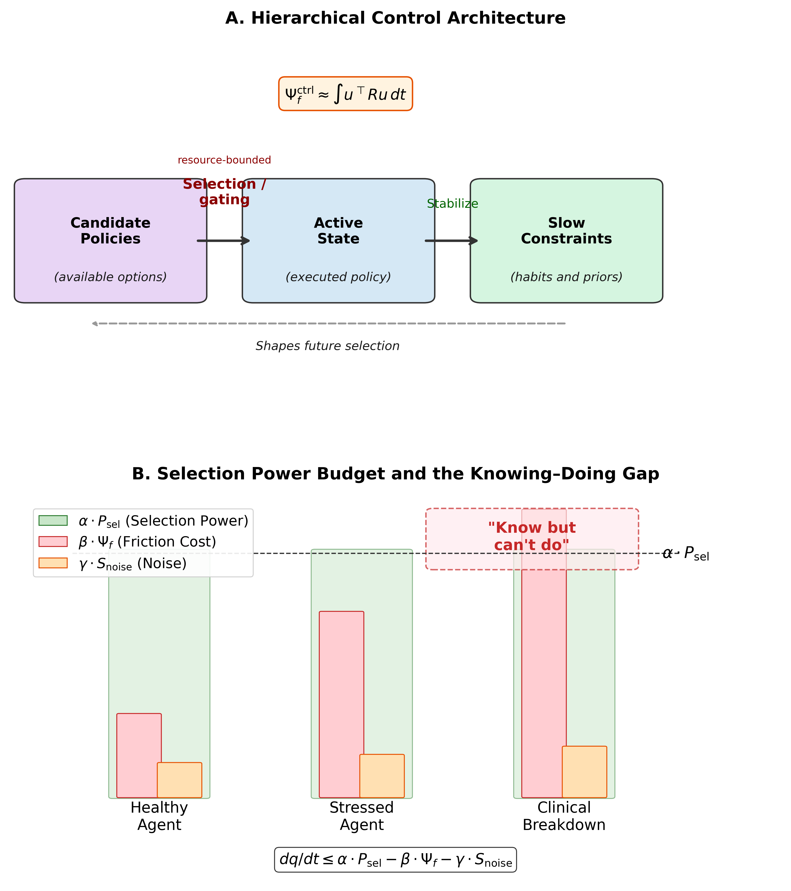
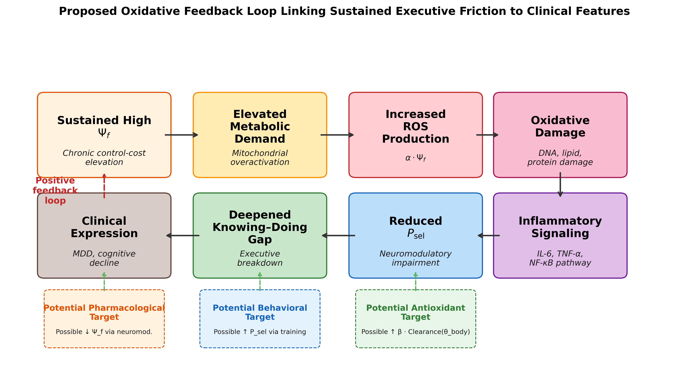
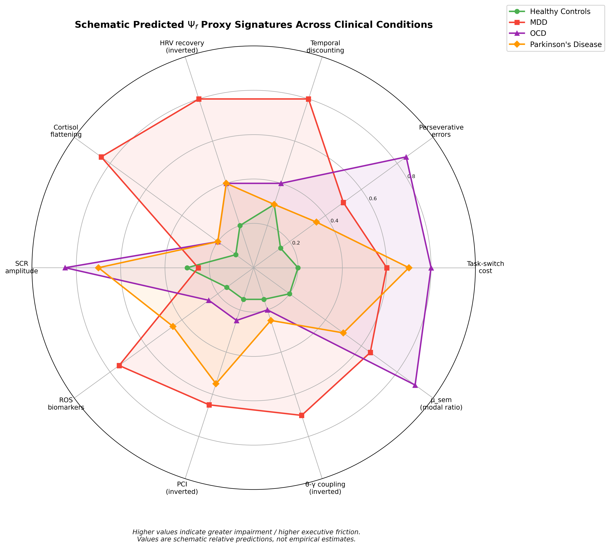
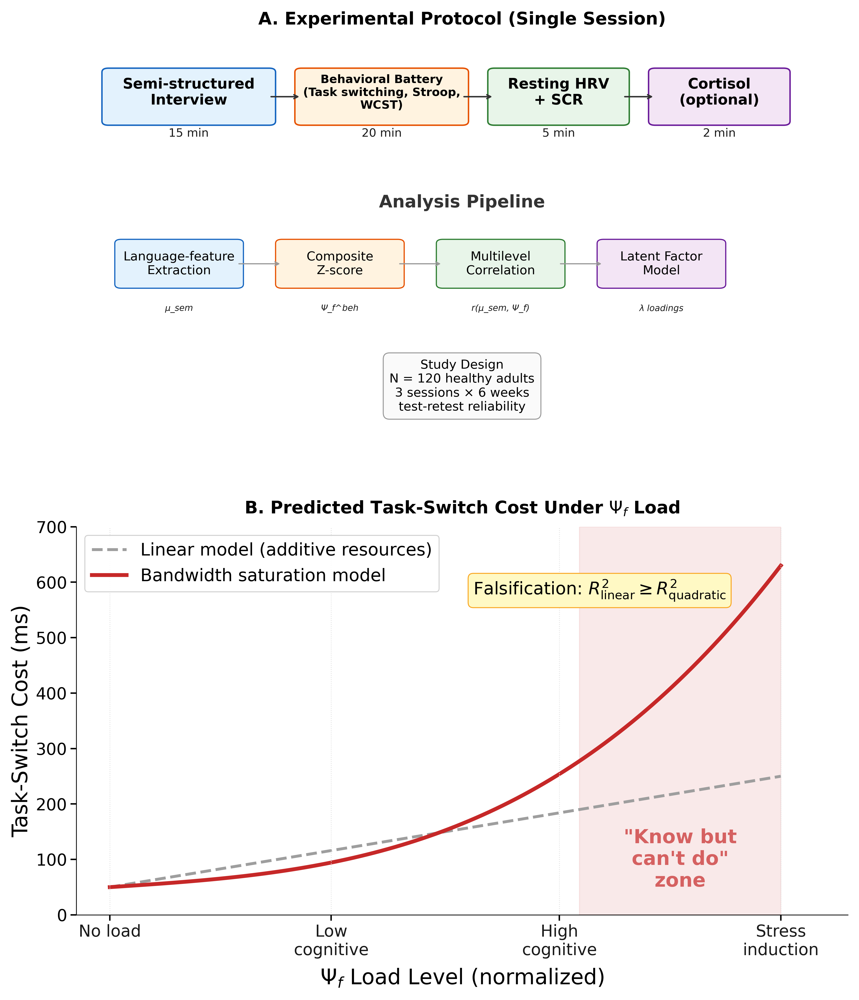

# A Translational Cross-Modal Control-Cost Framework for Executive Breakdown

Yuxin Zhang^1^\*

^1^ Independent Researcher, Kaili, Guizhou, China

\* **Correspondence:** Yuxin Zhang, zyx1st@gmail.com

**ORCID:** Yuxin Zhang, https://orcid.org/0009-0007-6659-8518

**Article type**: Hypothesis and Theory
**Target journal**: Frontiers in Neuroscience
**Running title**: Control-Cost in Executive Breakdown
**Word count**: ~10,000 words (main text, excluding abstract, figures, tables, captions, and references)
**Abstract**: 208 words
**Figures/Tables**: 5 figures; 5 tables
**Keywords**: executive friction, executive dysfunction, translational neuroscience, task-switching, psychophysiology, biomarker, clinical neuroscience, computational psychiatry

---

## Abstract

Across neurological and neuropsychiatric conditions, patients often know what they should do yet cannot bring themselves to do it. This dissociation between intact knowledge and failed implementation, which we call the knowing-doing gap, is clinically important but lacks a unified, measurable account. We propose that converting knowledge into action carries a cost, termed *executive friction* ($\Psi_f$), and that behavior breaks down when this cost exceeds the control resources available to pay it. The proposal is specified at two levels: a measurable factor estimated from observable indicators, and a family of candidate mechanisms in which friction is read either as accumulated control effort or as departure from a habitual default. We model distress as depending on how rapidly friction is rising and on how the person appraises the situation, and we treat executive collapse as the point at which control demands outstrip available capacity. The central contribution is practical: a low-cost testing chain combining behavioral control tasks, shifts in the language of ability (for example, "can" versus "cannot"), and autonomic physiology (heart-rate variability and skin conductance), with neural and biochemical measures kept as optional add-ons. Depression, obsessive-compulsive disorder, and Parkinson's disease serve as contrasting test cases with distinct predicted signatures rather than as replacements for existing diagnostic categories. We present five preregistration-ready hypotheses with explicit rejection criteria. No new data are reported.

---

## 1. Introduction

### 1.1 The Knowing–Doing Gap

Consider three clinical scenarios. A patient with Parkinson's disease can describe, in precise detail, the sequence of movements required to stand from a chair, yet remains seated, unable to initiate the motor program. A patient with obsessive-compulsive disorder recognizes that her hand-washing compulsion is irrational and disproportionate, yet cannot resist executing it. A patient with major depressive disorder articulates what steps would improve his situation (exercise, social contact, medication adherence), yet lies immobile, unable to translate knowledge into action.

These scenarios share a striking structural similarity: the agent's representational model of the world and of appropriate action remains intact, while the capacity to *implement* that knowledge is compromised. We refer to this dissociation between knowing and doing as the *knowing–doing gap*. It is among the most clinically significant yet theoretically underspecified phenomena in cognitive neuroscience. Executive function research has catalogued the behavioral signatures of the gap extensively (Miyake et al., 2000; Diamond, 2013; Friedman and Robbins, 2022), and neuroimaging studies have identified associated neural substrates (Stuss and Alexander, 2007; Miller and Cohen, 2001). Yet no existing framework provides a *unified quantitative account* that explains why knowledge and action can decouple, predicts when they will, and specifies how to measure the decoupling across behavioral, physiological, neural, and linguistic domains.

The gap itself is not a new observation. Social and health psychology have long studied the "intention–behavior gap," and the implementation-intention literature shows that specifying when, where, and how one will act measurably improves the translation of goals into behavior, with identifiable physiological correlates (Gollwitzer, 1999; Wieber et al., 2015). In clinical science, the same decoupling recurs across disorders: goal-directed control gives way to habit in obsessive-compulsive disorder (Gillan et al., 2016), initiation fails despite preserved motor knowledge in Parkinson's disease, and intended action stalls in major depressive disorder, motivating transdiagnostic accounts of executive dysfunction (Snyder et al., 2015; McTeague et al., 2017). What remains underrepresented is not the phenomenon but a single, formally defined, measurable *quantity* that ties these scattered descriptions together, explains the gap as one specific failure mode, and yields disorder-differentiating predictions. That quantity is what the present framework proposes.

### 1.2 Limitations of Current Frameworks

Several theoretical frameworks each name a real piece of the knowing–doing gap, but none supplies the missing element: a single cost quantity that is measurable across behavior, physiology, and language at once. We review five, noting for each what it captures and what it leaves out.

**Cognitive load theory** (Sweller, 1988; Sweller et al., 2019) quantifies the demands placed on working memory during learning and task execution. While influential in educational psychology, it remains a purely behavioral construct without physiological or neural grounding, and it does not address the *maintenance cost* of sustaining a selected state over time against competing defaults.

**The Free Energy Principle** (FEP; Friston, 2010) provides an elegant variational framework in which organisms minimize prediction error. The complexity term in variational free energy ($D_{KL}[Q \| P]$) captures part of what we mean by friction: the cost of maintaining a model that deviates from priors. However, FEP treats this cost as something to be *minimized*, and does not provide a framework for situations in which sustained high deviation cost is adaptive (creative problem-solving, or ethical resistance to default heuristics), or for the *failure mode* in which deviation cost overwhelms the system's capacity.

**Integrated Information Theory** (IIT; Tononi et al., 2016) offers a scalar measure of consciousness ($\Phi$) based on the irreducibility of cause-effect structures. While $\Phi$ captures integration, it does not address the *dynamic cost* of maintaining integrated states or the transition costs between states. It provides a snapshot measure, not a cost function.

**Allostatic load** (McEwen, 1998; McEwen and Stellar, 1993) captures the cumulative physiological cost of chronic stress adaptation, but operates at too coarse a temporal grain to explain moment-to-moment executive breakdowns, and lacks a formal connection to information-theoretic quantities.

**Classical ego depletion models** conceptualize self-control as a limited resource (Baumeister et al., 1998), but glucose-specific substrate interpretations have received substantial methodological criticism, weak meta-analytic support, and replication concerns (Hagger et al., 2016; Vadillo et al., 2016). This motivates treating metabolic readouts as testable correlates rather than fixed assumptions.

The critical gap is this: none of these frameworks provides a *single formally defined quantity* that (a) is grounded in information-theoretic and energetically interpretable resource-budget terms, (b) generates measurable predictions across behavioral, physiological, neural, and linguistic domains simultaneously, (c) explains the knowing–doing gap as a specific failure mode, and (d) produces disorder-specific clinical predictions. The construct proposed below is designed to fill exactly this gap. It connects aspects of, and extends selected cost-related aspects of, the frameworks above rather than competing with or replacing them: it relates to cognitive load on the behavioral side, to allostatic load on the physiological side, and to variational complexity on the information-theoretic side, while adding the cross-modal and dissociation predictions that none of them makes (developed in Section 6.2).

### 1.3 Contribution and Scope

In plain terms, this work proposes a single idea and then builds it out. The idea is that turning knowledge into action has a cost, which we call *executive friction*, and that when this cost grows too high, three things follow. Behavior can break down abruptly rather than gradually. The language people use about action can shift in a measurable way, tilting from "can" toward "cannot." And behavioral, physiological, and linguistic measures should move together, because they reflect one underlying cost rather than three unrelated problems. The framework is deliberately designed to be tested with low-cost, widely available methods, using depression, obsessive-compulsive disorder, and Parkinson's disease as contrasting clinical test cases. Everything that follows, including the formal notation, is in service of making that one idea measurable and falsifiable.

More formally, this manuscript is positioned as a translational neuroscience hypothesis paper on executive breakdown under resource-bounded action selection. We introduce *executive friction* ($\Psi_f$) as a latent cross-modal control-cost factor and evaluate it as a candidate bridge between computational theory, clinically accessible biomarkers, and disorder-differentiating predictions. The $\Psi_f$ framework makes three specific predictions that are jointly stronger than prior accounts: a nonlinear critical-load transition ($\rho_c$), context-sensitive modal-language shifts ($\mu_{\text{sem}}$), and convergence of behavioral-linguistic-physiological indicators onto a single latent factor. The core validation chain is intentionally low-cost and scalable: behavioral control tasks, adjusted modal-language scores, and autonomic physiology (HRV/SCR, with cortisol optional). Higher-cost neural and biochemical measures are treated as optional adjudication layers rather than prerequisites. Major depressive disorder, obsessive-compulsive disorder, and Parkinson's disease are included as boundary use cases for stress-testing parameter drift and dissociation patterns, not as attempts to replace disease-specific pathophysiology. The main text is written in standard hierarchical-control and predictive-processing language, and Appendix A is kept strictly as optional notation support rather than as an entry point to any larger philosophical system.

This is a theoretical and computational contribution aimed at empirical translation. No new data are reported. Consistent with the *Frontiers in Neuroscience* Hypothesis and Theory format, the paper advances a testable model within a specific area of investigation (the knowing-doing gap in executive dysfunction), and provides measurement strategy, falsification rules, and clinically tractable protocols for future adjudication.

### 1.4 Standard Control Terms Used in This Manuscript

To reduce interpretation burden, the main text uses established control-theoretic and predictive-processing language throughout:

- $\Psi_f$: estimable control/execution cost (latent cross-modal factor), termed "executive friction."
- $P_{\text{sel}}$: available control budget (selection capacity proxy).
- candidate policy space: the set of task-relevant options or policies available to the agent.
- active state: the currently implemented percept-action or task-control state.
- slow constraints: habits, priors, hyperpriors, and trait-like parameters that shape future selections.
- resource-bounded selection/gating mechanism: the control process that maps candidate policies into active execution under finite neural and bodily resources.

Readers who prefer compact symbols can consult Appendix A, but the argument of the paper does not depend on any special notation.

---

## 2. A Hierarchical Control Framework for Executive Friction

### 2.1 A Minimal Hierarchical Control Scaffold

The framework developed here can be read entirely within standard hierarchical control language. The three-part decomposition is a pragmatic level-of-description choice rather than a new ontology. Readers do not need to adopt any broader philosophical framework to evaluate $\Psi_f$: the same equations are intended to be compatible with working-memory gating accounts, resource-rational control formulations, and active-inference/predictive-coding control loops (Miller and Cohen, 2001; Frank et al., 2004; Friston, 2010; Shenhav et al., 2017).

**Candidate policy space.** This denotes the task-relevant set of candidate states or strategies available to the agent at a given time.

**Active state.** This denotes the perceptual interpretation and action policy currently being implemented.

**Slow constraints.** These are the slower variables that shape future selections, including habits, model priors, hyperpriors, and trait-like control limits.

These layers are linked by a **resource-bounded selection mechanism**, which maps candidate policies into executed states:

$$x_{\text{act}}(t) = \operatorname{Select}_{\theta}\!\left[\Pi(t)\right] \tag{1}$$

where $\Pi(t)$ denotes the candidate policy space, $x_{\text{act}}(t)$ the active state, and $\theta$ the finite embodiment parameters (e.g., network weights, neuromodulatory state, and metabolic constraints). The subscript $\theta$ emphasizes resource-bounded selection.

Slow constraints update through stabilization:

$$z(t+1) = \operatorname{Stabilize}\!\left(z(t),\; x_{\text{act}}(t+1)\right) \tag{2}$$

Within this architecture, the key claim is that maintaining or switching the active state relative to a baseline policy trajectory incurs a measurable control cost, termed executive friction ($\Psi_f$), that constrains executive function.

### 2.2 Executive Friction ($\Psi_f$): Formal Definition

We define executive friction through a two-level specification, and the distinction between the two levels is important, so we state it up front. **Definition 1A specifies how $\Psi_f$ is estimated from observable data**: it is the operational, measurement-level definition, and it is what the empirical program actually fits. **Definition 1B offers candidate mechanistic interpretations** of what could generate that estimated quantity: these are competing theoretical models, tested against each other, and none of them is required in order to estimate $\Psi_f$ in the first place. A reader who accepts only Definition 1A can still use the entire measurement and clinical program that follows. Throughout, the term "executive friction" denotes the cross-layer maintenance and switching cost that an agent incurs when sustaining or reconfiguring an active control state against baseline defaults.

**Definition 1A (Level-0 empirical latent variable).** At the measurement level, $\Psi_f$ is a latent factor jointly loaded by behavioral, linguistic, and physiological indicators (with neural and biochemical indicators used as expansion modalities). This is the definition the analysis estimates directly:

$$y_k = \lambda_k \Psi_f + \varepsilon_k,\quad k=1,\dots,K \qquad \text{(3a)}$$

where $y_k$ are standardized observed indicators, $\lambda_k$ are factor loadings, and $\varepsilon_k$ are residuals. This is the estimand used in structural equation modeling (SEM) and confirmatory factor analysis (CFA).

**Definition 1B (Level-1 mechanistic control cost).** Definition 1B proposes what could physically generate the latent factor of 1A. We give two candidate mechanisms and treat them as rival models to be compared on data, not as established facts. Let the state dynamics be

$$
\begin{aligned}
\dot{x}(t)&=f_\theta(x,t)+B_\theta(x,t)\,u(t)+\xi(t),\\
\dot{x}_0(t)&=f_\theta(x,t)+\xi(t)\quad \text{when }u(t)=0
\end{aligned}
\qquad \text{(3b)}
$$

where $x(t)$ is the system state, $f_\theta$ is the uncontrolled (drift) dynamics, $u(t)$ is the control input, $B_\theta$ maps control input onto the state, and $\xi(t)$ is a zero-mean stochastic noise term representing intrinsic neural and measurement variability (e.g., a Wiener increment). Setting $u(t)=0$ gives $\dot{x}_0$, the no-control *baseline drift* trajectory, i.e., what the system would do if no control effort were spent.

The *first* candidate reads friction as **accumulated control effort**: the running total of how hard the controller has to push to keep the state on course rather than letting it drift,

$$\Psi_f^{\text{ctrl}}(T)=\int_0^T u(t)^\top R\,u(t)\,dt,\quad R\succ 0 \tag{3c}$$

where $R\succ 0$ is a positive-definite cost matrix weighting the effort. The *second* candidate reads friction instead as **departure from the habitual default policy**, measured as the information-geometric distance between the current control distribution $q_t$ and the baseline-policy distribution $q_t^0$, accumulated over time,

$$\Psi_f^{\text{info}}(T)=\int_0^T D_{KL}\!\left(q_t\parallel q_t^0\right)dt \qquad \text{(3d)}$$

where $D_{KL}$ is the Kullback–Leibler divergence and $q_t^0$ denotes the baseline-policy distribution. Intuitively, (3c) charges for *how much force* the controller applies, whereas (3d) charges for *how far* the chosen policy strays from habit; the two can diverge, which is what makes them empirically separable. Under regularity conditions (e.g., locally smooth trajectories and second-order KL expansion in exponential-family neighborhoods), the KL form admits a Fisher-metric approximation:

$$\Psi_f^{\text{KL-2nd}}(T)\approx \int_0^T \dot{\vartheta}(t)^\top g_F(\vartheta)\dot{\vartheta}(t)\,dt \qquad \text{(3d')}$$

(Amari, 2016). In this paper, $\Psi_f$ denotes the Level-0 latent construct, while Equations (3c), (3d), and (3d') are treated as competing/related mechanism models to be compared empirically rather than universally equivalent identities.

**Mechanism-model comparison plan.** Equation (3c) is treated as a control-energy model best matched to trial-level demand manipulations (e.g., switch/inhibition load), whereas Equations (3d)/(3d') are treated as distributional-deviation models for belief-drift or habit-override regimes. In empirical programs, matched hierarchical models will be fit to the same outcomes and compared with out-of-sample criteria (leave-one-out cross-validation, LOO, and the Widely Applicable Information Criterion, WAIC, with Bayes factors where model regularity allows). Pre-registered interpretation is: if the 3c-family wins, friction is operationally summarized as control effort; if 3d/3d' wins, friction is better summarized as information-geometric deviation; if no mechanism family dominates, Equation (3a) remains the estimand and mechanism equations are treated as context-specific modules.

Definitions 1A and 1B specify executive friction itself. We now turn to the *distress* that accompanies it, which is a separate quantity: an agent can carry high friction quietly, and what hurts is friction that is rising quickly and is appraised as threatening. Definition 2 captures this. We write it as a "hazard function," meaning the momentary risk that distress crosses into a felt state, and this risk rises with the rate of change of friction and with the person's appraisal of the situation.

**Definition 2 (Distress Hazard Family).** Subjective distress is modeled as a hazard-family function of *smoothed* friction change and appraisal state:

$$h_{\text{distress}}(t)=\sigma\!\left(a\,\frac{d\widetilde{\Psi}_f^{(\tau)}(t)}{dt}+c\,\text{Appraisal}(t)-b\right) \tag{4}$$

where $\widetilde{\Psi}_f^{(\tau)}$ is a smoothed friction trajectory (window $\tau$), $\sigma(\cdot)$ is a monotone link (e.g., logistic), and Appraisal captures contextual evaluation (Gaab et al., 2005). In the local linear limit with approximately constant appraisal, Equation (4) reduces to the familiar approximation $\text{distress}\propto d\Psi_f/dt$. This preserves the core intuition that rapidly increasing friction is destabilizing while avoiding the stronger and less defensible claim that all pain is solely driven by raw derivatives.

For pre-registration, $\tau$ is treated as a sensitivity parameter (default grid: 10 s, 30 s, 60 s, or trial-window analogs), and Appraisal is measured block-wise on a 0-100 challenge/threat scale immediately after each block to reduce retrospective distortion.

Having defined friction (Definition 1) and the distress that tracks it (Definition 2), we now state the budget that decides whether the system holds together at all. The intuition is an accounting one: an agent has a finite control budget, friction and noise draw on it, and whatever remains determines whether the current task-state can be kept orderly or begins to fall apart.

**Definition 3 (Selection Budget Inequality; Thermodynamic-Inspired).** The rate of change of macroscopic task-state order $q(x_{\text{act}})$, operationalizable as mutual information density, topological invariants, or compression ratio, is bounded by:

$$\frac{dq}{dt} \leq \alpha \cdot P_{\text{sel}}(t) - \beta \cdot \Psi_f(x_{\text{act}};\theta) - \gamma \cdot S_{\text{noise}} \tag{5}$$

where $P_{\text{sel}}(t)$ is the *selection power* (the net control budget available for maintaining and extending the current active state), $\Psi_f$ is the friction cost, $S_{\text{noise}}$ is the environmental noise entropy, and $\alpha, \beta, \gamma > 0$ are coupling constants.

This inequality is the master budget constraint of the present framework. It states that an agent's capacity to maintain or increase order in its active control state is bounded by available selection power minus friction and noise costs. In early-phase experiments, $q(x_{\text{act}})$ is treated as a boundary variable rather than a mandatory primary endpoint; optional operationalizations include compression ratio, entropy-rate surrogates, or task-state stability metrics. When $P_{\text{sel}} < \beta \cdot \Psi_f + \gamma \cdot S_{\text{noise}}$, the system enters *order collapse* ($dq/dt < 0$), manifesting as cognitive disorganization or executive failure.

**Definition 4 (Parameter Dynamics).** The embodiment parameters $\theta$ evolve under three competing pressures: error-driven learning, friction-potential descent, and homeostatic recoil. Because none of the five phase-1/2 hypotheses directly test these slow dynamics (which operate over weeks to months rather than within-session timescales), the formal equation is presented in Appendix B. For present purposes, the key implication is that therapeutic interventions can be modeled as modifying either the learning rate, the friction landscape, or the homeostatic set point, distinctions that become empirically testable only in longitudinal treatment designs beyond the scope of the current validation roadmap.

### 2.3 The Knowing–Doing Gap as Bandwidth Saturation

The knowing–doing gap emerges naturally from the selection-budget inequality (Equation 5). Consider an agent whose slow constraints and learned model correctly specify the appropriate action, such as the patient who knows she should exercise or the surgeon who knows the next step of the procedure. The knowledge representation is intact.

Throughout this manuscript, **selection power** ($P_{\text{sel}}$) is the primary term; "bandwidth" is used only as an informal synonym for residual selection capacity.

However, *implementing* this knowledge requires converting it into an active action state through a resource-bounded selection or gating process. This conversion consumes selection power $P_{\text{sel}}$ and incurs executive friction $\Psi_f$. When the agent is already operating under high baseline friction (due to chronic stress, neurodegeneration, or pathological parameter configurations), the remaining selection power may be insufficient to execute the known action.

Formally, the agent enters the knowing–doing gap when:

$$P_{\text{sel}}^{\text{residual}} = P_{\text{sel}} - \beta \cdot \Psi_f^{\text{baseline}} < \Psi_f^{\text{action}} \tag{7}$$

where $\Psi_f^{\text{baseline}}$ is the friction cost of maintaining the current state, and $\Psi_f^{\text{action}}$ is the additional friction cost of initiating the target action. The agent's learned model is intact (she "knows"), but the selection/gating system lacks the residual capacity to execute (she "can't do").

This formulation makes a specific prediction: the knowing–doing gap should be *nonlinearly* related to baseline friction load. At low $\Psi_f^{\text{baseline}}$, adding task demands produces proportional increases in task-switching cost (linear regime). As $\Psi_f^{\text{baseline}}$ approaches $P_{\text{sel}}$, small additional demands produce steep performance collapse (saturation regime).

To parameterize this as a fit-ready critical phenomenon, define normalized control load:

$$\rho(t)=\frac{\beta\cdot\Psi_f^{\text{baseline}}(t)}{P_{\text{sel}}(t)} \tag{7a}$$

and model switch cost with a changepoint:

$$C_{\text{switch}}(\rho)=c_0+c_1\rho+c_2(\rho-\rho_c)_+^2,\quad (x)_+=\max(x,0) \tag{7b}$$

where $\rho_c$ is the estimated critical point. The model predicts a stable linear region for $\rho<\rho_c$ and accelerated cost growth for $\rho\ge\rho_c$, with $\rho_c$ expected in a high-load band near resource saturation. Empirically, $\rho_c$ can be estimated via segmented regression, threshold mixed models, or Bayesian changepoint inference.

### 2.4 Relationship to Predictive Processing and Free Energy Minimization

Why relate the proposal to the Free Energy Principle at all? Two reasons. First, FEP is currently the most influential formal account of neural cost, so showing that executive friction connects to it demonstrates that $\Psi_f$ is not an ad hoc quantity but a recognizable generalization of an established one. Second, the connection sharpens exactly where our claim departs from FEP, and that departure is the clinically load-bearing part of the argument. Concretely, $\Psi_f$ bears a formal relationship to the complexity term in variational free energy. In the FEP framework, the variational free energy $F$ decomposes as:

$$F = \underbrace{D_{KL}[Q(\theta) \| P(\theta)]}_{\text{Complexity}} - \underbrace{\mathbb{E}_{Q}[\ln P(\text{data} | \theta)]}_{\text{Accuracy}} \tag{8}$$

The complexity term $D_{KL}[Q \| P]$ penalizes posteriors that deviate from priors, formally analogous to the information-geometric friction form in Equation (3d). In this reading, $\Psi_f$ generalizes complexity cost by (a) accumulating over time, (b) applying to executed percept-action control rather than beliefs alone, and (c) linking to energetic budgets through Equation (5).

The critical distinction between the present framework and standard FEP is in the normative implication. FEP implies that systems *should* minimize free energy and, by extension, minimize the complexity cost. The present framework allows that some states *require* sustained high $\Psi_f$: creative insight that resists premature closure, ethical choices that resist default heuristics, or grief that maintains connection to the departed. In these cases, high $\Psi_f$ is not pathological but constitutive of the valued state. Pathology arises not from high $\Psi_f$ per se, but from *unsustainable* $\Psi_f$, that is, when the cost chronically exceeds the agent's selection power budget.

This distinction has immediate clinical relevance: the therapeutic goal is not to eliminate $\Psi_f$ (which would eliminate agency) but to restore the balance between $\Psi_f$ and $P_{\text{sel}}$, either by reducing unnecessary friction or by expanding selection power capacity.

### 2.5 Dimensionalization and Identifiability (Empirical Budget Form)

Equation (5) is used in this manuscript as an **empirically identifiable statistical budget model**, not as a closed-form physical law with fixed SI units. For phase-1/2 inference, we estimate all terms in standardized space:

$$\frac{d\widetilde{q}}{dt} \leq w_0 + \alpha\,\widetilde{P}_{\text{sel}} - \beta\,\widetilde{\Psi}_f - \gamma\,\widetilde{S}_{\text{noise}} + \varepsilon_t \qquad \text{(5z)}$$

where tildes denote z-scored quantities, and $\alpha,\beta,\gamma$ are regression weights to be estimated from data (not universal physical constants). In this form, $\widetilde{q}$ is a dimensionless state-stability/order index, and all predictors are unitless standardized indicators. Minimal proxy anchoring follows Table 1: $\widetilde{P}_{\text{sel}}$ from HRV/SCR recovery indicators, $\widetilde{\Psi}_f$ from latent-factor estimation over behavioral-linguistic-physiological indicators, and $\widetilde{S}_{\text{noise}}$ from task conflict/entropy manipulations.

For confirmatory phase-1 analyses, we operationalize $q(x_{\text{act}})$ with a minimal observable index:

$$q^*(t)=\frac{1}{2}z\!\left(-H_{\text{error},w}(t)\right)+\frac{1}{2}z\!\left(-CV_{\text{RT},w}(t)\right) \tag{5q}$$

where $H_{\text{error},w}$ is windowed response-error entropy and $CV_{\text{RT},w}$ is windowed reaction-time coefficient of variation. Response-error entropy is computed as follows: within a sliding window of $w$ consecutive trials, each response is assigned to an outcome category (for example correct, commission error, omission error), the empirical probabilities $p_c$ of these categories are estimated, and their Shannon entropy $H_{\text{error},w}=-\sum_c p_c \log p_c$ is taken. Low entropy means responding is consistent and predictable (a stable control state); high entropy means outcomes are scattered across categories (a disorganized one). Because both terms in $q^*$ are sign-flipped and z-scored, higher $q^*$ indicates greater local task-state stability, i.e., both more predictable errors and less variable reaction times.

Interpretively, $q^*$ captures a minimal "order/stability" surrogate: stable control states should show lower local error unpredictability and lower RT dispersion. To separate this from generic arousal/fatigue accounts, phase-1 models include baseline arousal and block-order covariates; if $q^*$ variance is explained by arousal/fatigue alone while budget terms contribute no directional signal, the Eq. (5) interpretation is weakened. The confirmatory phase-1 test for Eq. (5) is directional and statistical: whether $\widetilde{P}_{\text{sel}}$, $\widetilde{\Psi}_f$, and $\widetilde{S}_{\text{noise}}$ jointly predict $d q^*/dt$ with expected signs, rather than whether Eq. (5) is a literal thermodynamic identity.

For changepoint testing, we retain the theoretical ratio in Equation (7a) and additionally define a phase-1 robust approximation:

$$\rho^{*}(t)=z\!\left(\Psi_f^{\text{baseline, latent}}(t)\right)-z\!\left(P_{\text{sel}}^{\text{proxy}}(t)\right) \tag{7c}$$

which avoids instability of ratio estimators in low-denominator regions. Both forms express the same thing: how close friction has come to exhausting control capacity. In the ratio form (Eq. 7a) this is friction divided by capacity; in the difference form (Eq. 7c) it is standardized friction minus standardized capacity. The *critical point* $\rho_c$ (or $\rho_c^*$) is the value of this quantity at which the system's behavior changes character, marking the boundary between the regime where added demand raises switch cost gently and roughly linearly, and the regime where the residual budget is nearly spent and small additional demands trigger steep collapse. It is a statistical changepoint estimated from data, not a claim about a universal thermodynamic constant.

*Insert Figure 1 near here.*

---

## 3. Operationalization: Four Proxy Classes for $\Psi_f$

A theoretical construct is scientifically useful only to the extent that it can be measured. We now derive four classes of proxy measures for $\Psi_f$, each grounded in established measurement paradigms but unified under a common latent variable interpretation. The central claim of this section is that $\Psi_f$ is not reducible to any single proxy but manifests as a correlated pattern across behavioral, physiological, neural, and linguistic indicators.

### 3.0 Validation-First Prioritization

To maximize empirical tractability, this manuscript adopts a staged validation strategy. The **core validation chain** uses low-cost modalities that can be replicated broadly: behavioral control-cost tasks, the linguistic modal-ratio probe ($\mu_{\text{sem}}$), and low-cost physiology (HRV and SCR; cortisol optional). High-cost markers (ROS assays, PCI, Fisher-geometry readouts, and theta-gamma coupling) are treated as **expansion layers** for later-phase adjudication rather than prerequisites for first-pass falsification. Failure of expansion markers to add value does not invalidate the core-chain model.

For transparency, we explicitly map model terms to measurable proxies:

*Insert Table 1 near here.*

### 3.1 Behavioral Proxies

**Task-switching cost.** When an agent must reconfigure the active control state to serve a new task rule, the reconfiguration incurs executive friction proportional to the distance between the current and target control configurations. The classical task-switching cost, namely the increase in reaction time and error rate on switch trials relative to repeat trials (Monsell, 2003; Kiesel et al., 2010), directly indexes this reconfiguration friction. Computational accounts further decompose this cost into reconfiguration and interference-control components (Yeung and Monsell, 2003; Brown et al., 2007), supporting model-based estimation of behavioral friction. We predict that task-switching cost scales with $\Psi_f$ across individuals and within individuals across conditions.

**Perseverative errors.** In the Wisconsin Card Sorting Test (WCST; Berg, 1948) and related paradigms, perseverative errors reflect the agent's failure to abandon a high-friction configuration: the previous sorting rule has become deeply anchored (high $\Psi_f^{\text{switch}}$) and the system cannot pay the switching cost. The number of perseverative errors indexes the *viscosity* $\eta$ of the parameter space: $\eta \propto \partial\Psi_f / \partial\theta$.

**Stroop interference.** The Stroop effect (Stroop, 1935) measures the friction cost of suppressing a default selection (word reading) in favor of a non-default selection (color naming). The Stroop interference ratio (incongruent RT / congruent RT) provides a normalized behavioral index of the friction differential between default and non-default selections.

**Temporal discounting.** Steep temporal discounting (the preference for smaller-sooner over larger-later rewards) reflects the high friction cost of maintaining a non-default, future-oriented active control state (Bickel et al., 2012). The temporal discounting rate $k$ in the hyperbolic model ($V = A / (1 + kD)$) can be interpreted as a proxy for the friction cost of temporal extension of the selection horizon. This interpretation is consistent with effort-based decision frameworks that treat control allocation as a cost-benefit computation (Westbrook and Braver, 2015).

**Composite score.** We propose a composite behavioral $\Psi_f$ score computed as the average of standardized (Z-scored) values across: (a) mean task-switching cost, (b) WCST perseverative error proportion, (c) Stroop interference ratio, and (d) temporal discounting rate.

### 3.2 Physiological Proxies (Core and Expansion)

**Heart rate variability (HRV) recovery.** Vagal-mediated HRV reflects the capacity of the autonomic nervous system to regulate arousal, a physiological substrate of selection power $P_{\text{sel}}$. The neurovisceral integration model (Thayer and Lane, 2009) establishes that high resting HRV indexes flexible autonomic control, while reduced HRV indexes rigidity. We predict that *HRV recovery slope* (the rate at which HRV returns to baseline following a stressor) indexes the system's capacity to dissipate $\Psi_f$. Slow recovery indicates sustained high friction; rapid recovery indicates efficient friction resolution.

**Cortisol circadian rhythm.** The diurnal cortisol curve (cortisol awakening response and diurnal slope) reflects the integrity of the hypothalamic-pituitary-adrenal axis. Chronic high $\Psi_f$ is predicted to flatten the cortisol curve (reducing the morning peak and elevating the evening nadir), reflecting exhaustion of the neuroendocrine substrate that supports selection power (Adam et al., 2017). We propose the cortisol awakening response (CAR) magnitude and the diurnal cortisol slope (DCS) as complementary physiological proxies.

**Skin conductance response (SCR).** Phasic SCR amplitude during decision-making tasks reflects momentary spikes in autonomic arousal associated with conflict and uncertainty, that is, acute increases in $d\Psi_f/dt$. SCR peak amplitude during high-conflict choices (e.g., the Iowa Gambling Task; Bechara et al., 1994) provides a real-time physiological index of the hazard function (Equation 4). Importantly, SCR is treated here as an *acute-state* readout, most appropriate for within-task or cue-locked friction peaks. It is not assumed to track slow, chronic friction accumulation on its own; for chronic-load interpretations (for example in MDD), SCR is therefore read alongside slower measures such as HRV recovery, cortisol slope, and trait-level behavioral composites.

**Reactive oxygen species (ROS) as a biochemical signature (expansion layer).** We propose a link between $\Psi_f$ and oxidative stress for later-phase testing. The sustained energetic expenditure required to maintain high-friction states should produce elevated mitochondrial activity and, consequently, elevated ROS production. We formalize this as:

$$\frac{d[\text{ROS}]}{dt} = \alpha \cdot \Psi_f(\text{control allocation}) - \beta \cdot \text{Clearance}(\theta_{\text{body}}) \tag{9}$$

where $\alpha$ is the friction-to-oxidative-load coupling coefficient and $\beta \cdot \text{Clearance}$ represents antioxidant clearance capacity. Equation (9) is a simplified coupling model: the linear coupling $\alpha \cdot \Psi_f$ abstracts over multiple intervening biochemical steps (sustained neural metabolic demand $\rightarrow$ mitochondrial electron-transport load $\rightarrow$ superoxide production). In empirical use, $\alpha$ is a regression coefficient estimated from data, not a fixed biophysical constant; future mechanistic elaboration may replace the linear term with a saturating or threshold function. Measurable ROS biomarkers include the reduced-to-oxidized glutathione ratio (GSH/GSSG), malondialdehyde (MDA), 8-hydroxy-2'-deoxyguanosine (8-OHdG), and superoxide dismutase (SOD) activity. This is deliberately positioned as a phase-3 extension after core low-cost validation succeeds.

**Falsification condition for ROS coupling.** If experimentally induced high-$\Psi_f$ tasks (e.g., sustained task-switching under time pressure) do not produce elevated ROS relative to low-$\Psi_f$ control tasks, or if antioxidant supplementation (increasing $\beta$) does not modulate behavioral $\Psi_f$ proxies, the ROS-friction coupling model is rejected.

### 3.3 Neural Proxies

Neural proxies provide mechanistic depth but are not required for phase-1 falsification. They are treated as expansion modalities to test whether control-cost signatures generalize from low-cost measures to circuit-level dynamics.

**Perturbational Complexity Index (PCI).** PCI quantifies the complexity of the cortical response to transcranial magnetic stimulation perturbation, capturing the system's capacity for differentiated, integrated processing (Casali et al., 2013). We interpret PCI as indexing the residual control capacity of the selection/gating system: high PCI reflects high residual $P_{\text{sel}}$, while low PCI reflects depleted capacity. PCI should decrease under high $\Psi_f$ load and correlate negatively with behavioral $\Psi_f$ proxies.

**Fisher information metric.** The Fisher information matrix $g_F$ captures the curvature of the neural state-space manifold, that is, how sharply the system's responses change as parameters vary. We propose that the empirical Fisher condition number $\log \kappa(g_F)$, the Fisher volume term $\log \det(g_F)$, and the maximum eigenvalue drift $\lambda_{\max}(g_F)$ serve as neural proxies for $\Psi_f$ during state transitions (Amari, 2016). Specifically, transitions between cognitive states (e.g., task switches) should produce Fisher metric peaks *preceding* behavioral performance degradation, a "structural reconfiguration signal" that indexes friction before it manifests behaviorally.

**Theta-gamma coupling in prefrontal cortex.** Theta-phase/gamma-amplitude coupling (TGC) in prefrontal regions implements a multiplexing mechanism that constrains working memory capacity to approximately 5–7 items (Lisman and Idiart, 1995; Lundqvist et al., 2011). We interpret TGC integrity as an index of selection capacity: degraded TGC under high $\Psi_f$ should predict working memory failures and executive breakdowns. Specifically, the phase-amplitude coupling modulation index (Tort et al., 2010) should decrease as behavioral $\Psi_f$ composite scores increase.

**Thalamo–basal ganglia gating integrity.** The thalamus–basal ganglia circuit functions as a selection gate that determines which candidate action trajectories are projected into overt execution. Gate integrity can be indexed through reinforcement-learning model parameters (learning rate, exploration-exploitation balance) derived from probabilistic reversal-learning tasks (Frank et al., 2004). Degraded gating (as in Parkinson's disease) should produce specifically elevated $\Psi_f$ for action initiation while leaving cognitive $\Psi_f$ relatively preserved.

### 3.4 Linguistic Proxy: The Modal Mechanics Probe

We introduce a novel, non-invasive proxy for $\Psi_f$ based on the distribution of modal verbs in natural language production. We term this the *modal mechanics probe* (hypothesis H72 in the present framework).

**Theoretical rationale.** Modal verbs encode speakers' orientation toward necessity, obligation, possibility, and desire (Palmer, 2001; van der Auwera and Plungian, 1998). The deontic–epistemic distinction in linguistic typology (Nuyts, 2001) maps directly onto an agency dimension: deontic modals (must, should, have to) express external or internalized obligations constraining action, while dynamic modals (can, want to, choose to) express the speaker's capacity or willingness to act. Developmental evidence shows that children acquire possibility modals before necessity modals, paralleling the emergence of agency and self-regulation (Papafragou, 2000), suggesting that modal usage tracks experienced control capacity from early in language development. We hypothesize that the balance between *constraint-oriented* modals (must, should, have to, cannot) and *possibility-oriented* modals (can, might, could, want to) reflects the speaker's experienced level of executive friction. High $\Psi_f$ (experienced as constraint, obligation, and restriction) should bias language production toward constraint modals. Low $\Psi_f$ (experienced as agency, possibility, and flow) should bias toward possibility modals.

This directionality is consistent with broader evidence that clinically relevant affective-control states leave measurable signatures in language production (Rude et al., 2004), including large-scale clinical NLP evidence that natural language markers can prospectively index depression risk (Eichstaedt et al., 2018). While these prior studies focused on pronoun use and general negative affect words rather than modal verbs specifically, the present proposal extends the same logic to a targeted, mechanistically interpretable subchannel: if control cost constrains action selection, and modal verbs encode the speaker's perceived action affordances, then modal distributions should function as a semantic readout of control-cost state. This bridge between psycholinguistic modal semantics and executive-control cost is explicitly exploratory and constitutes a novel cross-disciplinary hypothesis to be adjudicated by H72.

**Neurobiological plausibility.** We do not treat $\mu_{\text{sem}}$ as a purely stylistic marker. Under cognitive-control and embodied language accounts, lexical selection under conflict depends on frontally mediated control allocation and policy constraints (Miller and Cohen, 2001; Diamond, 2013). On this view, constraint-heavy modal output is interpretable as a semantic spillover of high control demand, i.e., a downstream linguistic footprint of constrained control budgets rather than a detached linguistic artifact.

**Operational definition.** The semantic modal ratio $\mu_{\text{sem}}$ is defined as:

$$\mu_{\text{sem}} = \frac{\sum_i w_i \cdot \text{Freq}(\text{constraint modal}_i)}{\sum_j w_j \cdot \text{Freq}(\text{possibility modal}_j)} \tag{10}$$

where $w_i, w_j$ are domain-specific weights (initially set to 1.0 for equal weighting) and Freq denotes frequency per 1000 words in a transcribed speech sample. Constraint modals include: *must, have to, need to, should, ought to, cannot, must not*. Possibility modals include: *can, could, may, might, want to, would like to, choose to*.

**Reproducible scoring protocol and confound control.** To make $\mu_{\text{sem}}$ scale-like rather than anecdotal, we use a residualized score:

$$
\begin{aligned}
\log\mu_{\text{sem}} ={}& b_0+b_1\text{Education}+b_2\text{PromptType}+b_3\text{Interviewer}\\
&+b_4\text{AffectLexiconRatio}+b_5\text{TokenCount}+b_6\text{TypeTokenRatio}+\varepsilon,\\
\mu_{\text{sem}}^{\text{adj}} ={}& \operatorname{Residual}\!\left(\log\mu_{\text{sem}}\right)
\end{aligned}
\qquad \text{(10a)}
$$

This controls for major non-theoretical variance sources: education level, interview context, prompt wording, interviewer style, global affective-word prevalence, and lexical diversity. Recommended reliability checks are split-half agreement, inter-rater agreement for modal tagging (if manual annotation is used), and longitudinal intraclass correlation coefficient (ICC) in repeated sessions. To reduce floor/ceiling instability, analyses should exclude samples with fewer than 10 total modal tokens.

**Cross-language mapping protocol (Mandarin example).** Cross-linguistic adaptation should preserve *semantic role classes* (constraint vs possibility), not literal word matching. For Mandarin Chinese, an initial inventory can be instantiated as:

- Constraint-oriented modals (Mandarin pinyin): bixu, dei, yao, yinggai, buneng, bude
- Possibility-oriented modals (Mandarin pinyin): keyi, neng, keneng, huoxu, xiang, yuanyi

Each language version should report (1) dictionary construction rules, (2) tokenization/segmentation pipeline, (3) ambiguity resolution rules (e.g., deontic vs epistemic usage), and (4) measurement-invariance checks before pooling cross-language samples. The minimum pre-registered sequence is configural then metric invariance (scalar optional); if metric invariance fails, confirmatory analyses remain language-specific and pooled estimates are treated as exploratory only.

**Methodological advantages.** $\mu_{\text{sem}}$ is non-invasive, low-cost, and scalable to large corpora, including interview archives and longitudinal recordings. It is therefore suitable as a phase-1 marker in the core validation chain.

### 3.5 Convergent Validity Architecture

The central operationalization claim is that the four proxy classes converge on a single latent variable, $\Psi_f$, rather than measuring four independent constructs. This claim is testable through structural equation modeling (SEM).

**Proposed model.** The behavioral indicators draw on tasks that Miyake et al. (2000) showed load onto partially separable executive factors (shifting, inhibition, updating). We do not assume these sub-processes are identical; rather, we test whether a *second-order* $\Psi_f$ factor accounts for shared variance across shifting (task-switch cost), inhibition (Stroop interference), and flexibility (WCST perseverative errors), with temporal discounting as an additional indicator from the effort-based decision literature. The confirmatory modeling sequence is therefore:

1. **Within-behavioral CFA**: fit a correlated three-factor Miyake-style model (shifting, inhibition, flexibility) and test whether a second-order general factor provides acceptable fit (comparative fit index, CFI, $> 0.90$; root mean square error of approximation, RMSEA, $< 0.08$).
2. **Cross-modal single-factor CFA** with four indicator classes:
   - Behavioral second-order factor $\rightarrow$ $\Psi_f$ (expected loading: $\lambda > 0.5$)
   - Physiological composite (HRV recovery slope, inverse-coded) $\rightarrow$ $\Psi_f$ ($\lambda > 0.4$)
   - Neural composite (PCI, inverse-coded; Fisher condition number) $\rightarrow$ $\Psi_f$ ($\lambda > 0.4$)
   - Linguistic index ($\mu_{\text{sem}}$) $\rightarrow$ $\Psi_f$ ($\lambda > 0.3$)

For staged validation, we use a nested modeling strategy. **Core model (phase 1/2):** behavioral second-order factor + linguistic + low-cost physiology. **Expansion model (phase 3):** add neural and ROS blocks and test whether they improve fit and prediction beyond the core model.

**Expected correlation structure.** Within-domain correlations should be moderate to strong ($r = 0.4$–$0.7$); between-domain correlations should be weak to moderate ($r = 0.20$–$0.45$). We set these expectations conservatively relative to typical cross-modal correlations in the clinical psychophysiology literature. If between-domain correlations fall below $r = 0.15$ uniformly, the unitary latent variable interpretation is rejected in favor of independent constructs.

**Minimum survivable model if single-factor fails.** The fallback is pre-registered rather than post hoc: (a) a two-factor model separating control-performance (behavioral + physiology) from semantic-constraint (linguistic, plus optional neural/expansion indicators), and (b) a bifactor model with one general factor plus modality-specific factors. The framework is retained only if the general factor shows stable loadings and predicts critical-load outcomes beyond modality factors; otherwise, the theory is downgraded to a family of modality-indexed frictions ($\Psi_f^{(m)}$) rather than one unitary latent variable.

**Discriminant validity.** $\Psi_f$ should be empirically distinguishable from general cognitive ability (IQ), general psychopathology ($p$-factor), and trait neuroticism. We predict that $\Psi_f$ shows incremental validity over these constructs in predicting task-switching cost and clinical executive dysfunction.

*Insert Figure 2 near here.*

---

## 4. Clinical Mapping: $\Psi_f$ Across Disorders

The $\Psi_f$ framework generates disorder-specific predictions that go beyond the generic claim that "executive function is impaired." Each clinical condition is modeled as a distinct perturbation of the $\Psi_f$ dynamics, producing a characteristic *friction signature* across the four proxy classes.

### 4.1 Major Depressive Disorder: Sustained Friction with Oxidative Coupling

In the $\Psi_f$ framework, major depressive disorder (MDD) is modeled as a state of *chronic friction elevation* in which $d\Psi_f/dt$ remains positive over extended periods, leading to progressive exhaustion of selection power and oxidative stress accumulation.

**Mechanism.** The depressed agent's learned model may be accurate or even hyperaccurate ("depressive realism"; Alloy and Abramson, 1979): the agent correctly identifies what actions would be beneficial. However, the friction cost of *initiating* state transitions ($\Psi_f^{\text{action}}$) chronically exceeds the available residual selection power ($P_{\text{sel}}^{\text{residual}}$). The agent enters a stable low-energy attractor in which inaction minimizes acute distress ($d\Psi_f/dt \approx 0$) at the cost of chronic friction accumulation.

The ROS coupling equation (Equation 9) generates a specific pathophysiological chain: sustained $\Psi_f \rightarrow$ elevated metabolic demand $\rightarrow$ increased mitochondrial ROS production $\rightarrow$ oxidative damage $\rightarrow$ inflammatory signaling $\rightarrow$ further reduction of $P_{\text{sel}}$ through immune-mediated neuromodulatory changes. This positive feedback loop is consistent with the inflammatory hypothesis of depression (Maes et al., 2011; Miller and Raison, 2016) and provides a mechanistic link between the cognitive and immunological dimensions of MDD. In this manuscript, however, these arrows are treated as **directional hypotheses subject to prospective testing rather than established causal pathways**; cross-sectional data can establish compatibility but not causal direction.

**Predicted friction signature.** Core chain prediction for depression is: (a) elevated behavioral $\Psi_f$ composite, particularly temporal discounting and task-switching cost; (b) reduced HRV recovery slope and altered SCR/cortisol profile; and (c) elevated $\mu_{\text{sem}}$ with predominance of obligation/constraint modals. Expansion prediction is reduced PCI/degraded theta-gamma coupling plus elevated ROS biomarkers (reduced GSH/GSSG ratio, elevated MDA).

*Insert Figure 3 near here.*

### 4.2 Obsessive-Compulsive Disorder: Switching Viscosity

OCD is modeled as a pathological elevation of *switching viscosity* $\eta$, the resistance of the parameter space to state transitions. This is not a new parameter but the same viscosity introduced behaviorally in Section 3.1, where perseverative errors were said to index $\eta \propto \partial\Psi_f/\partial\theta$: the sensitivity of friction to changes in the control parameters. High viscosity means that moving the parameters even slightly incurs a large friction increment, so the system resists transitions. The compulsive behavior occupies a local minimum in the friction landscape with extremely steep walls, making it energetically prohibitive to transition to alternative states.

**Mechanism.** We model OCD switching viscosity using a network-modulated gradient flow:

$$\frac{d\theta_i}{dt}= -\frac{\nabla_i \Phi(\theta)}{1+\lambda d_i} + \epsilon_i(t),\quad \lambda>0 \tag{11}$$

where $\Phi(\theta)$ is the friction potential, $d_i$ is the network degree (or weighted centrality) of node $i$, and $\epsilon_i(t)$ is noise. High-centrality nodes update more slowly because effective step size is reduced by $(1+\lambda d_i)^{-1}$. Local trapping strength is quantified by curvature:

$$\Psi_f^{\text{switch}}(\theta_i)\propto \lambda_{\max}\!\left(\nabla^2_{\theta_i}\Phi(\theta)\right) \tag{11a}$$

so compulsive states correspond to deep, high-curvature local wells that raise transition cost.

**Predicted friction signature.** OCD is characterized by: (a) dramatically elevated task-switching cost *specifically* for uncertainty- and contamination-related stimuli; (b) elevated SCR during obsession-related cues (acute $d\Psi_f/dt$ spikes); and (c) the highest $\mu_{\text{sem}}$ values, dominated by "must/have to" constructions. Expansion prediction is relatively preserved PCI (system not globally bandwidth-depleted but dynamically stuck). The proposed discriminator from depression is elevated *switching* friction with comparatively preserved maintenance capacity. We stress that this is a claim about relative profile, not a clean dividing line: depression also impairs task-switching, so the two conditions overlap on any single switching measure. The framework's differentiating bet is therefore on the *pattern* across proxies (in OCD, cue-specific switching cost and the highest constraint-modal $\mu_{\text{sem}}$ against comparatively preserved maintenance and global PCI; in MDD, broader maintenance-side involvement with cortisol flattening and oxidative coupling) rather than on switching cost alone. Because this overlap is a genuine boundary risk for the account, we return to it explicitly in the Limitations (Section 6.3).

### 4.3 Parkinson's Disease: Selection Gate Degradation

Parkinson's disease (PD) is modeled as a degradation of the thalamo-basal ganglia selection gate, the circuit that converts motor plans stored in slower control variables into initiated actions in the active motor state.

**Mechanism.** The dopaminergic signal-to-noise ratio in the striatum serves as a gain parameter for the gate. As dopaminergic neurons in the substantia nigra degenerate, the gate's capacity to distinguish candidate actions diminishes, and initiation friction rises (Frank et al., 2004; Redgrave et al., 2010). We use a dimensionless embodied anchoring index:

$$\tilde{\kappa}_{\text{body}}(t)=\frac{\text{GripForce}(t)/F_0}{\Psi_f^{\text{initiation}}(t)/\Psi_0} \tag{12}$$

where $F_0$ and $\Psi_0$ are participant-specific normalization constants (e.g., baseline grip force and baseline initiation friction estimate). The anchoring index is not an independent construct: its denominator, $\Psi_f^{\text{initiation}}$, is simply the action-initiation friction $\Psi_f^{\text{action}}$ from the knowing–doing inequality (Eq. 7) applied to the motor domain, and the ratio expresses how much realized bodily output (grip force) a unit of initiation friction actually yields. As dopaminergic availability decreases, initiation friction rises, and $\tilde{\kappa}_{\text{body}} \rightarrow 0$: the agent can generate a motor plan but fails to anchor execution in embodied output. This is the motor-domain instance of the general knowing–doing gap, where "knowing" is the intact motor plan and "can't do" is the failure to pay $\Psi_f^{\text{action}}$.

**Predicted friction signature.** PD is characterized by: (a) elevated task-switching cost for motor tasks with relatively preserved cognitive switching (early stages); (b) elevated SCR during motor initiation attempts with less pronounced endocrine flattening; and (c) $\mu_{\text{sem}}$ elevation concentrated in motor-action expressions. Expansion prediction is region-specific PCI reduction in motor cortex with relative prefrontal preservation.

For empirical PD cohorts, a minimal adjustment set should include dopaminergic medication state (ON/OFF and levodopa-equivalent daily dose), disease duration, motor severity (e.g., UPDRS), sleep status, and major psychiatric comorbidity.

### 4.4 Differential Prediction Table

The clinical utility of $\Psi_f$ depends on its capacity to generate *disorder-specific* predictions, not merely generic "executive dysfunction" claims. Table 2 summarizes the predicted friction signatures across conditions.

*Insert Table 2 near here.*

Core-chain inference in this manuscript is based primarily on behavioral + linguistic + low-cost physiological rows. ROS and neural rows are treated as expansion targets for later-phase adjudication.

To sharpen falsifiability, we propose two discriminator patterns. **Pattern A (OCD dissociation):** OCD should show a clearer constraint-dominant $\mu_{\text{sem}}$ profile than controls and typically than MDD, while PCI remains approximately near control range in expansion cohorts. **Pattern B (PD motor selectivity):** PD should show substantially larger motor-switch impairment than cognitive-switch impairment in early-stage cohorts. In contrast, single-resource formulations (including standard single-task EVC fits or undifferentiated global-deficit accounts) typically predict more monotonic cross-domain impairment and weaker dissociation in these paired contrasts.

These predictions are falsifiable: if, for example, OCD patients do not show the highest $\mu_{\text{sem}}$ values, or if PD patients show generalized rather than motor-specific switching cost elevation, the disorder-specific $\Psi_f$ models require revision.

*Insert Figure 4 near here.*

### 4.5 Competing Explanations and Decisive Phase-2 Tests

To reduce over-interpretation risk, each disorder signature is paired with a concrete competing explanation and a decisive phase-2 contrast:

- **MDD:** versus generic symptom-severity accounts. Decisive test: whether high $\Psi_f$ profile predicts a specific combination (high temporal discounting + slow HRV recovery + elevated $\mu_{\text{sem}}$) rather than uniform global impairment alone.
- **OCD:** versus generalized anxiety/rumination accounts. Decisive test: domain-specific switching viscosity plus highest $\mu_{\text{sem}}$ under preserved global PCI-range indices in expansion cohorts.
- **PD:** versus global psychomotor slowing. Decisive test: motor-selective switch impairment with comparatively preserved cognitive switching in early-stage cohorts, plus initiation-specific autonomic spikes.

If these contrasts fail, the clinical mapping should be downgraded to transdiagnostic severity effects rather than disorder-specific signatures.

---

## 5. Falsifiable Hypotheses and Proposed Experimental Protocols

We now present five pre-registration-ready hypotheses derived from the $\Psi_f$ framework. Each hypothesis specifies the prediction, the falsification criterion, the required sample size, and the core measurement protocol. We emphasize that these hypotheses are designed to be *individually falsifiable*: rejection of any single hypothesis does not invalidate the entire framework but constrains its scope.

### 5.1 Hypothesis H72: Modal Verb Patterns Reflect Executive Friction

**Prediction.** Within-subject adjusted modal ratio $\mu_{\text{sem}}^{\text{adj}}$ (Equation 10a) is higher in **self-decision narratives** than in **neutral factual retell** prompts, and the context contrast $\Delta\mu_{\text{sem}}^{\text{adj}}$ is expected to show small-to-moderate positive association with the behavioral $\Psi_f$ composite (task-switch cost + Stroop interference + perseverative errors) and inverse association with HRV recovery slope. We further predict incremental validity after adding symptom controls (PHQ-9, GAD-7, or equivalent), affective-word ratio, and block-wise appraisal ratings.

**Protocol.** $N = 120$ healthy adults, tested in three sessions over six weeks. Each session includes: (1) two fixed prompt blocks (neutral factual retell and self-decision narrative; total 15 minutes), recorded and transcribed; (2) behavioral battery (task switching, Stroop, WCST); and (3) HRV + SCR recording (cortisol optional for the core chain). Prompt administration is standardized: factual block uses a fixed non-evaluative script (e.g., "describe yesterday's routine chronologically"), decision block uses a fixed self-choice script (e.g., "describe an unresolved decision and candidate actions"), each with fixed speaking duration and counterbalanced order across sessions. After each block, participants provide a 0-100 challenge/threat appraisal score used in Equation (4)-linked analyses. $\mu_{\text{sem}}$ is extracted with a pre-registered modal dictionary and residualized using Equation (10a). Interviewer identity is modeled as a random effect (random intercept plus context slope when estimable). Samples with fewer than 10 modal tokens are excluded a priori.

**Statistical analysis.** Multilevel models with random intercepts and slopes are used for within-subject association tests. Primary fixed effects are context (decision vs factual), $\Delta\mu_{\text{sem}}^{\text{adj}}$, block-wise appraisal, and their links to behavioral/HRV outcomes. Incremental validity is tested via $\Delta R^2$ after adding PHQ-9 and GAD-7 (Kroenke et al., 2001; Spitzer et al., 2006) or equivalent symptom scales, plus affective-word ratio. If multilingual cohorts are used, configural/metric invariance is tested before pooled confirmatory inference. Test-retest reliability is assessed via ICC for both raw $\mu_{\text{sem}}$ and adjusted $\mu_{\text{sem}}^{\text{adj}}$.

**Falsification criterion.** We specify a primary and a secondary test. The *primary* test is construct validity: whether a decision-vs-factual context effect is observed for $\mu_{\text{sem}}^{\text{adj}}$, which is the within-subject signature the framework predicts. The *secondary* test is incremental utility: whether adjusted $\mu_{\text{sem}}^{\text{adj}}$ adds meaningful predictive variance beyond symptom and affect controls. Full support for the linguistic probe requires both. If *either* test fails, the probe is downgraded and retained only as an exploratory, secondary indicator rather than a core-chain marker. If *both* tests fail, $\mu_{\text{sem}}$ is removed from the core model entirely. This graded rule ties the primary decision to construct validity while still crediting incremental utility as secondary evidence.

**Planning note.** The initial planning value is $N = 120$ across three time points, sized for stable estimation of small-to-moderate within-subject associations under plausible repeated-measures reliability assumptions. Sample sizes were informed by effect-size benchmarks from the task-switching, executive-function, and clinical psychophysiology literatures, while exact power tolerances are intended to be fixed in the public preregistration and accompanying scripts before data collection.

### 5.2 Hypothesis H-NEURO-EXEC-01: Nonlinear Executive Cost Under High $\Psi_f$

**Prediction.** Task-switching cost increases nonlinearly as a function of concurrent normalized load. The confirmatory estimator is $\rho^*$ (Equation 7c), with ratio-based $\rho$ (Equation 7a) as sensitivity analysis. Specifically, a changepoint model (Equation 7b) should show meaningfully better fit than a linear model and yield an identifiable critical point $\rho_c^*$ (and concordant $\rho_c$ in sensitivity checks).

**Protocol.** $N = 80$ healthy adults in a within-subject design. $\Psi_f$ load is manipulated at four levels: (1) single-task switching, (2) low concurrent load, (3) high concurrent load, and (4) social-evaluative stress. Task-switching cost is measured at each level; HRV and SCR are recorded to estimate concurrent load. For phase-1 estimation, baseline friction is operationalized as a latent composite from $\mu_{\text{sem}}^{\text{adj}}$, resting HRV (inverse-coded), and baseline switch cost; $P_{\text{sel}}$ is proxied by normalized HRV/SCR recovery. Primary confirmatory analyses use $\rho^*$ (Eq. 7c); ratio-based $\rho$ (Eq. 7a) is pre-specified sensitivity analysis.

**Falsification criterion.** If a linear model provides comparable or better fit in the **primary $\rho^*$ analysis**, or if no positive $\rho_c^*$ is identifiable, the bandwidth-saturation account is rejected in favor of additive resource models. Ratio-based $\rho$ results are reported as sensitivity checks.

### 5.3 Hypothesis H-MET-01: Free Choice Metabolic Premium

**Prediction.** Decisions that require overriding default or habitual responses (operationalized as choosing the counter-habitual option in a trained stimulus-response compatibility task) produce higher *autonomic control cost* (primary endpoint: SCR amplitude) than decisions aligned with trained responses, and this cost differential is predicted by the individual's behavioral $\Psi_f$ composite score. Blood glucose change is treated as a secondary exploratory endpoint because the glucose-specific ego-depletion mechanism remains contested (Baumeister et al., 1998; Hagger et al., 2016; Vadillo et al., 2016).

**Protocol.** $N = 60$ healthy adults. Phase 1 (training): participants learn a stimulus-response mapping over 200 trials. Phase 2 (test): on 50% of trials, participants are instructed to execute the *opposite* of their trained response. SCR is recorded continuously as the primary physiological endpoint; capillary blood glucose (pre/post Phase 2) is collected as a secondary exploratory endpoint. Behavioral $\Psi_f$ composite is measured in a separate session.

**Falsification criterion.** If SCR amplitude does not differ between habitual and counter-habitual responses, or if the SCR difference shows no reliable relation to the $\Psi_f$ composite, the primary metabolic-premium hypothesis is rejected. A null glucose effect alone does not falsify H-MET-01 but constrains substrate-level interpretations.

### 5.4 Hypothesis H-CLIN-DEP-01: ROS–$\Psi_f$ Coupling in Depression

**Prediction.** In a sample of MDD patients ($n = 40$) and matched healthy controls ($n = 40$), the behavioral $\Psi_f$ composite score predicts ROS biomarker levels (GSH/GSSG ratio) with a positive association of at least small-to-moderate magnitude in the MDD group. HRV mediation is tested as a compatibility model in cross-sectional data and is not interpreted as causal directionality.

**Protocol.** Cross-sectional comparison. Each participant completes the full behavioral task battery (§3.1), provides salivary cortisol and blood samples for ROS assays, and undergoes HRV recording. MDD diagnosis is confirmed via the Structured Clinical Interview for DSM-5 (SCID-5). Predefined exclusion/covariate set includes acute inflammatory disease, systemic steroid or high-dose antioxidant use, unstable medical illness, substance dependence, antidepressant class/dose (e.g., selective serotonin reuptake inhibitors, SSRIs, or serotonin–norepinephrine reuptake inhibitors, SNRIs), illness duration, episode severity, anxiety comorbidity, and sleep-quality index.

**Falsification criterion.** If the $\Psi_f$ composite–GSH/GSSG association is negligible in the MDD group, or if the HRV compatibility model contributes no interpretable structure, the ROS-friction coupling model is rejected for depression.

### 5.5 Hypothesis H-CLIN-OCD-01: Maximal $\mu_{\text{sem}}$ in OCD

**Prediction.** In a three-group comparison (OCD, $n = 30$; MDD, $n = 30$; healthy controls, $n = 30$), we predict $\mu_{\text{sem}}^{\text{OCD}} > \mu_{\text{sem}}^{\text{MDD}} > \mu_{\text{sem}}^{\text{controls}}$, driven specifically by elevated frequency of constraint modals. These two inequalities are not equivalent, and it is worth stating what each one buys. The contrast **OCD > controls** would establish only the weaker, more general claim that friction leaves a constraint-modal signature in language at all; both OCD and MDD are elevated-friction states, so an elevation over healthy controls is expected under the framework but does not by itself distinguish disorders. The contrast **OCD > MDD** is the stronger and genuinely disorder-differentiating claim: it is what the switching-viscosity account specifically predicts (constraint-dominant modal output should peak where switching is most rigidly trapped), and it is the result that would separate $\Psi_f$ from a generic "any distress raises constraint language" account.

**Protocol.** Each participant completes a 20-minute semi-structured clinical interview (using the Yale-Brown Obsessive Compulsive Scale for OCD group, Hamilton Depression Rating Scale for MDD group) plus a standardized free-narrative prompt ("Describe your daily routine and the challenges you face"). Transcripts are analyzed for $\mu_{\text{sem}}$. Minimal adjustment set includes SSRI/antipsychotic augmentation status, benzodiazepine use, illness duration, anxiety and sleep comorbidity indices, and interviewer random effects.

**Falsification criterion.** The two claims are rejected at different levels. If OCD $\mu_{\text{sem}}$ does not reliably exceed *healthy control* $\mu_{\text{sem}}$, the linguistic proxy fails even its weak form, and the modal signature is abandoned as a friction marker. If OCD exceeds controls but does *not* reliably exceed *MDD*, the weak form survives but the disorder-differentiating claim is rejected: $\mu_{\text{sem}}$ is then retained as a transdiagnostic friction index rather than as an OCD-specific signature. Only the joint result OCD > MDD > controls supports the full switching-viscosity prediction.

### 5.6 Proposed Validation Roadmap

We propose a three-phase validation program:

**Phase 1 (core low-cost mechanism test).** Execute H72 and H-NEURO-EXEC-01 using behavioral tasks, $\mu_{\text{sem}}^{\text{adj}}$, HRV, and SCR. Objective: identify whether a stable latent $\Psi_f$ factor and a measurable critical point $\rho_c^*$ exists in healthy cohorts (with ratio-based $\rho_c$ as sensitivity check). $N_{\text{total}} \approx 200$. Estimated timeline: 12 months.

**Phase 2 (core clinical generalization).** Execute H-CLIN-OCD-01 and H-MET-01 with the same low-cost core chain, extending to clinical and quasi-clinical groups while preserving protocol simplicity. $N_{\text{total}} \approx 150$. Estimated timeline: 18 months.

**Phase 3 (high-cost optional adjudication).** Execute H-CLIN-DEP-01 with ROS assays and neural expansion markers (e.g., PCI, theta-gamma coupling, Fisher-geometry metrics) to test whether costly modalities add explanatory value beyond the core chain. These modalities are explicitly optional adjudicators, not prerequisites for validating the core model. $N_{\text{total}} \approx 200$. Estimated timeline: 24 months.

At pre-registration release, the public repository will include: modal dictionaries by language, preprocessing/tokenization scripts, model-specification files (core and fallback), and simulation scripts used to justify decision thresholds.

*Insert Table 3 near here.*

Primary-endpoint decision rules: directional primary tests are one-sided ($\alpha=0.025$); secondary tests use Benjamini-Hochberg FDR control ($q<0.05$). Predefined primary endpoints are: H72 (context effect and incremental validity), H-NEURO-EXEC-01 ($\rho_c^*$ identification), H-MET-01 (SCR contrast), H-CLIN-OCD-01 (group contrast on $\mu_{\text{sem}}$), and H-CLIN-DEP-01 ($\Psi_f$-ROS association). Ratio-based $\rho$ inference is explicitly sensitivity-only.

The one-sided choice is justified by preregistered directional monotonic predictions implied by Equations (4), (5), and (7); all primary effects are also reported with two-sided sensitivity analyses. Exact small-effect cutoffs, model-selection tolerances, and simulation-based design anchors are intended to be fixed in the public preregistration and accompanying scripts before data collection, rather than treated as universal constants in the present theory paper.

*Insert Figure 5 near here.*

---

## 6. Discussion

### 6.1 Theoretical Implications

The $\Psi_f$ framework addresses a persistent gap in cognitive neuroscience: the absence of a cross-modal cost quantity that unifies behavioral, physiological, neural, and linguistic signatures of executive breakdown under a formal selection-budget constraint. By deriving the knowing–doing gap as bandwidth saturation (Equation 7) rather than as a domain-specific failure, the framework generates testable predictions that current models (cognitive load theory, FEP, IIT, allostatic load) do not individually produce.

The key theoretical advance is the *decoupling of knowledge from capacity*. In existing frameworks, executive failure is typically attributed to degraded representations (the agent doesn't know), degraded attention (the agent can't focus), or degraded motivation (the agent doesn't want to). The $\Psi_f$ framework introduces a fourth possibility: the agent knows, can focus, and wants to act, but the *cost of converting knowledge into action* exceeds available resources. This bandwidth saturation account explains why patients often report the phenomenology of "knowing exactly what to do but being unable to do it," a subjective experience that is puzzling under representational, attentional, or motivational accounts.

### 6.2 Comparison with Existing Frameworks

Table 4 compares $\Psi_f$ with five existing frameworks across seven evaluation criteria.

*Insert Table 4 near here.*

This comparison is not intended to argue that $\Psi_f$ replaces or absorbs existing frameworks. Rather, $\Psi_f$ connects aspects of each and extends selected cost-related aspects of them: it relates to cognitive load on the behavioral side, to allostatic load on the physiological side, and to variational complexity on the information-theoretic side, while adding explicit cross-modal latent modeling and dissociation predictions that these frameworks do not individually provide.

Relative to the Expected Value of Control (EVC) framework (Shenhav et al., 2013; Shenhav et al., 2017), $\Psi_f$ is closest to a transmodal control-cost extension. Both treat control as a cost-constrained process, and EVC's effort-cost term and $\Psi_f$'s control-energy integral (Eq. 3c) share formal structure. However, the two frameworks diverge on three points that generate distinguishable predictions:

First, EVC is typically fitted to single-task demand allocations (e.g., proportion congruent effects in Stroop), whereas $\Psi_f$ accumulates *across* tasks and modalities within a session and predicts a *nonlinear* saturation transition ($\rho_c$) that standard EVC cost functions do not produce. A concrete illustration: under EVC, adding concurrent cognitive load to a task-switching paradigm increases effort cost approximately additively; under $\Psi_f$, load accumulates toward a critical point beyond which switch cost accelerates nonlinearly (Eq. 7b). If segmented-regression analyses in H-NEURO-EXEC-01 show that the linear (additive) model fits as well as the changepoint model, the saturation component of $\Psi_f$ is rejected (Table 5), effectively reducing $\Psi_f$ to an EVC-compatible additive formulation.

Second, EVC does not natively generate *cross-domain dissociation* predictions of the kind central to the $\Psi_f$ clinical mapping. For example, the joint prediction that OCD patients show the highest $\mu_{\text{sem}}$ (linguistic domain) while PCI remains near control range (neural domain) is a two-channel dissociation that EVC, as currently specified, does not address because it lacks a linguistic output channel and a cross-modal latent structure.

Third, EVC models control allocation within a trial or block but does not formally incorporate *slow-constraint dynamics* (Eq. B1, Appendix B) governing habit formation, belief revision, and therapeutic change over weeks to months.

These distinctions do not make EVC wrong; they mark scope boundaries. If future EVC extensions incorporate cross-modal indicators, nonlinear saturation, and slow dynamics, the two frameworks may converge. The present contribution is that $\Psi_f$ provides this integration now in a testable form. This positioning is consistent with computational psychiatry goals of mechanistic yet clinically testable bridges (Huys et al., 2016).

### 6.3 Limitations and Boundary Conditions

Several important limitations must be acknowledged.

First, $\Psi_f$ is a *latent construct* inferred from multiple indicators. No single measure is sufficient, and the convergent validity of the four proxy classes is an empirical claim that remains to be tested. If the structural equation model (§3.5) fails to support a single-factor solution, the framework requires fundamental revision.

Second, the modal verb probe ($\mu_{\text{sem}}$) may be *language-specific*. The inventory of modal verbs and their semantic valence varies across languages (Palmer, 2001), and the constraint/possibility distinction may not partition cleanly in all linguistic systems. Cross-linguistic validation with Mandarin Chinese, German, and Arabic modal systems is a necessary follow-up.

Third, distress and pain are *not* assumed to be generated solely by control cost. Equation (4) is a conditional hazard model; nociceptive injury, social threat, affective dysregulation, and appraisal shifts can all elevate distress even when $d\Psi_f/dt$ is modest. This is why we model a hazard family with smoothing and appraisal terms rather than a one-to-one derivative identity.

Fourth, the ROS coupling hypothesis (Equation 9) requires *longitudinal data* to establish temporal precedence. A cross-sectional correlation between $\Psi_f$ and ROS markers, while consistent with the model, does not establish directionality. Prospective designs and intervention studies (manipulating $\Psi_f$ and measuring ROS change) are essential.

Fifth, the equations presented (Equations 3a–5, plus Eq. B1 in Appendix B) use simplified functional forms. In particular, the control-cost quadratic form in Equation (3c), the KL form in Equation (3d), and its local Fisher approximation in Equation (3d') are modeling choices, not identifiability guarantees. The precise friction-cost shape (quadratic, piecewise, exponential, or sigmoidal) remains an empirical question.

Sixth, the framework is *silent on the hard problem of consciousness* in the Chalmersian sense (Chalmers, 1995). $\Psi_f$ provides a measurable correlate of the cost of maintaining conscious states, but it does not explain *why* subjective experience accompanies high-friction processing. We view this as an appropriate scope limitation rather than a deficiency.

Seventh, every proxy proposed here is *indirect*. None of the behavioral, physiological, neural, or linguistic measures observes executive friction directly; each is a downstream correlate standing at some remove from the latent quantity, and each carries its own non-friction variance (task-switch cost reflects general processing speed, HRV reflects fitness and respiration, modal usage reflects register and education). This has two consequences for interpretation. It means construct validity cannot be settled by any single indicator and rests entirely on convergence, so the framework is only as strong as the cross-modal correlation structure in Section 3.5 turns out to be; if that structure is weak, the "friction" label may be over-interpreting a loose bundle of partially related measures. It also means effect sizes at the indicator level will understate the latent association, and that inferences about $\Psi_f$ are conditional on the measurement model rather than read straight off the data. We regard demonstrating that these indirect proxies actually cohere, and discriminate $\Psi_f$ from adjacent constructs, as the central empirical burden of the program rather than a settled premise.

Eighth, the disorder mappings overlap, and the boundaries between them are provisional. The clearest case is switching: OCD is framed as elevated switching viscosity with preserved maintenance, yet depression also impairs switching, and anxiety, rumination, and generalized psychomotor slowing can each mimic parts of the predicted signatures. The framework's disorder-specific claims therefore rest on multivariate *profiles* (Table 2) and on the paired dissociation contrasts of Section 4.5, not on any single proxy, and they are correspondingly vulnerable: if those contrasts fail to separate the conditions, the clinical mapping should be read as a transdiagnostic severity gradient rather than as a set of distinct disorder signatures. We consider this boundary ambiguity a real risk to the account, not a peripheral caveat.

Ninth, this paper reports *no empirical data*. While we have specified protocols with sufficient detail for pre-registration and replication, the entire framework remains at the stage of theoretical proposal until the validation program (§5.6) is executed.

### 6.4 Alternative Models and Decisive Tests

The framework is designed to be partially rejectable rather than all-or-none. Key adjudication rules are:

- If linear models consistently outperform changepoint models, reject the saturation component (Eq. 7b) while retaining additive control-cost formulations.
- If cross-modal convergence fails (between-domain correlations uniformly $<0.15$), reject the single latent-factor claim and move to domain-specific modules.
- If $\mu_{\text{sem}}$ lacks either context sensitivity (primary construct-validity test) or incremental validity (secondary utility test), downgrade the linguistic probe to an exploratory indicator; if it lacks both, remove it from the core chain and retain behavioral-physiological modeling.
- If optional expansion markers (ROS/PCI/Fisher) do not add predictive value, retain the core chain and demote expansion markers to exploratory status.

These outcomes define explicit model-pruning pathways and prevent post hoc theory protection.

*Insert Table 5 near here.*

### 6.5 Translational Potential

If empirically validated, the $\Psi_f$ framework offers several translational applications.

**Transdiagnostic biomarker.** The friction signature profiles (Table 2) could enable a biologically grounded, transdiagnostic classification of executive dysfunction that cuts across traditional categorical diagnoses.

**Passive linguistic monitoring.** $\mu_{\text{sem}}$ can be extracted from clinical interview transcripts, therapy session recordings, or, with appropriate consent and ethical oversight, naturalistic text data. This enables longitudinal $\Psi_f$ tracking without additional testing burden.

**Treatment response prediction.** Therapeutic interventions can be modeled as either reducing $\Psi_f$ (pharmacological approaches targeting the friction cost) or increasing $P_{\text{sel}}$ (behavioral approaches expanding selection power capacity). The $\Psi_f$ trajectory over treatment could serve as an early indicator of therapeutic response, potentially outperforming symptom-based monitoring.

**Intervention design.** The distinction between $\Psi_f$ reduction and $P_{\text{sel}}$ expansion suggests that combination therapies (pairing pharmacological $\Psi_f$ reduction with behavioral $P_{\text{sel}}$ training) should show synergistic effects quantifiable as:

$$\Delta S_{\text{sync}} = \Delta d \cdot (-\Delta\Psi_f) > 0 \tag{13}$$

where a positive synergy metric indicates genuine cross-domain recovery rather than compensation.

---

### 6.6 Conclusion

We have introduced executive friction ($\Psi_f$) as a formally defined, cross-modally operationalizable construct that transforms the control cost of maintaining or switching an active state against baseline defaults into a testable framework for cognitive and clinical dynamics. The construct is grounded in core equations that specify friction accumulation (Eqs. 3a–3d'), the hazard function for subjective distress (Eq. 4), the selection-budget inequality (Eq. 5), and the dynamics of parameter evolution (Eq. B1). We have operationalized $\Psi_f$ through four convergent proxy classes (behavioral, physiological, neural, and linguistic), and demonstrated how the knowing–doing gap emerges as bandwidth saturation when friction cost exceeds available selection power.

The clinical mapping onto major depressive disorder, obsessive-compulsive disorder, and Parkinson's disease generates disorder-specific, falsifiable predictions (Table 2) that distinguish the $\Psi_f$ account from generic executive dysfunction descriptions. Five pre-registration-ready hypotheses with explicit falsification criteria and a three-phase validation roadmap provide the experimental architecture for systematic testing.

The knowing–doing gap is not merely a clinical curiosity but a window into the control-cost structure of agency. Every act of will, from suppressing a craving to overriding a prejudice to initiating a motor sequence, incurs executive friction. Understanding this cost, measuring it, and learning to modulate it may prove to be consequential for cognitive neuroscience, clinical science, and biomarker-driven translational work.

---

## Appendix A. Optional Symbol Mapping and Background Citation

The core model in this manuscript can be read entirely in standard control/predictive-processing language. For readers who prefer compact symbols, the optional shorthand is:

- $\Pi$ -> candidate state/policy space
- $x_{\text{act}}$ -> currently executed active state
- $z$ -> slow prior/habit/hyperprior constraints
- $\operatorname{Select}_{\theta}$ -> resource-bounded selection or gating map
- $\Psi_f$ -> latent control cost
- $P_{\text{sel}}$ -> available control budget
- $S_{\text{noise}}$ -> exogenous or environmental uncertainty load

No commitment to any broader framework is required for evaluating this manuscript's equations, hypotheses, or falsification logic; all claims are self-contained and independently testable. The present paper uses the empirically neutral label "executive friction" throughout and treats Appendix A as optional notation support rather than as a gateway to a larger philosophical system.

---

## Appendix B. Parameter Dynamics Equation (Slow Timescale)

The embodiment parameters $\theta$ evolve according to:

$$\frac{d\theta}{dt} = \underbrace{\eta \cdot A[\sigma, \text{Target}]}_{\text{Learning}} - \underbrace{\delta \cdot \frac{\partial \Phi(\theta)}{\partial \theta}}_{\text{Friction descent}} - \underbrace{\kappa \cdot (\text{Input}_{\text{act}} - \text{Baseline})}_{\text{Homeostatic recoil}} \tag{B1}$$

where $\eta, \delta, \kappa > 0$, $A[\sigma, \text{Target}]$ is the learning signal (error-driven adaptation), $\partial\Phi(\theta)/\partial\theta$ is the gradient of the friction potential (driving parameters toward lower-friction configurations), and the third term captures homeostatic pressure to return to baseline. This equation governs the slow dynamics of habit formation, belief revision, and therapeutic change over weeks to months.

Equation (B1) is not tested in the current phase-1/2 validation roadmap because it requires longitudinal treatment-design data. It is included here for theoretical completeness and to motivate future intervention studies in which pharmacological $\Psi_f$ reduction (modifying $\Phi$) and behavioral $P_{\text{sel}}$ training (modifying $\eta$ or $\kappa$) can be modeled as distinct parameter-level interventions.

---

## Conflict of Interest Statement

The author is an independent researcher with no institutional, commercial, or governmental affiliation, and the work received no funding from any source. To make this transparent for conflict-of-interest assessment: the author has no employment, consultancy, patent, equity, grant, or other financial relationship with any organization that could benefit from the framework proposed here, and no competing academic interest beyond ordinary scholarly authorship. The manuscript cites one item of the author's own prior work (Zhang, 2025, listed in Appendix A) solely as an optional background pointer; that reference is non-commercial, confers no financial interest, and is not required for any claim, equation, or hypothesis in this paper. The author therefore declares that the research was conducted in the absence of any commercial or financial relationships that could be construed as a potential conflict of interest.

## Author Contributions

The author conceived the theoretical framework, developed the formal model, designed the proposed experimental program, prepared the figures and tables, and wrote the manuscript.

## Funding

This work received no external funding.

## Acknowledgments

The author thanks the reviewers for their critical and constructive feedback on the manuscript. (Use of generative AI is disclosed separately in the Generative AI Statement below.)

## Generative AI Statement

The author used generative AI (Anthropic Claude) during manuscript preparation. AI assistance was limited to language editing and structural clarity; the author developed and verified the framework, equations, hypotheses, references, and final content. Generative AI was not used for data generation or statistical analysis. The author takes full responsibility for the accuracy, integrity, and scientific content of the manuscript. This disclosure is provided in the interest of transparency and in accordance with the journal's policy on AI-assisted authorship.

## Data Availability Statement

No empirical datasets were generated or analyzed for this theoretical manuscript. All equations, hypotheses, and analysis plans are fully reported in the main text. Upon empirical execution, the author will release the $\mu_{\text{sem}}$ dictionary specification, analysis code, and pre-registered scripts to support reproducibility.

## Ethics Statement

No human or animal participants were involved in this theoretical work; ethics approval and informed consent were therefore not required.

## Abbreviations

8-OHdG, 8-hydroxy-2'-deoxyguanosine; CAR, cortisol awakening response; CFA, confirmatory factor analysis; CFI, comparative fit index; DCS, diurnal cortisol slope; EVC, expected value of control; FEP, Free Energy Principle; GAD-7, Generalized Anxiety Disorder 7-item scale; GSH/GSSG, reduced-to-oxidized glutathione ratio; HRV, heart rate variability; ICC, intraclass correlation coefficient; IIT, Integrated Information Theory; KL, Kullback–Leibler (divergence); LOO, leave-one-out cross-validation; MDA, malondialdehyde; MDD, major depressive disorder; OCD, obsessive-compulsive disorder; PCI, perturbational complexity index; PD, Parkinson's disease; PHQ-9, Patient Health Questionnaire 9-item scale; RMSEA, root mean square error of approximation; ROS, reactive oxygen species; SCID-5, Structured Clinical Interview for DSM-5; SCR, skin conductance response; SEM, structural equation modeling; SNRI, serotonin–norepinephrine reuptake inhibitor; SOD, superoxide dismutase; SSRI, selective serotonin reuptake inhibitor; TGC, theta-gamma coupling; TMS, transcranial magnetic stimulation; UPDRS, Unified Parkinson's Disease Rating Scale; WAIC, Widely Applicable Information Criterion; WCST, Wisconsin Card Sorting Test.

---

## References

Adam, E. K., Quinn, M. E., Tavernier, R., McQuillan, M. T., Dahlke, K. A., and Gilbert, K. E. (2017). Diurnal cortisol slopes and mental and physical health outcomes: A systematic review and meta-analysis. *Psychoneuroendocrinology*, 83, 25–41.

Alloy, L. B., and Abramson, L. Y. (1979). Judgment of contingency in depressed and nondepressed students: Sadder but wiser? *Journal of Experimental Psychology: General*, 108(4), 441–485.

Amari, S. (2016). *Information Geometry and Its Applications*. Springer.

Baumeister, R. F., Bratslavsky, E., Muraven, M., and Tice, D. M. (1998). Ego depletion: Is the active self a limited resource? *Journal of Personality and Social Psychology*, 74(5), 1252–1265.

Bechara, A., Damasio, A. R., Damasio, H., and Anderson, S. W. (1994). Insensitivity to future consequences following damage to human prefrontal cortex. *Cognition*, 50(1-3), 7–15.

Berg, E. A. (1948). A simple objective technique for measuring flexibility in thinking. *Journal of General Psychology*, 39(1), 15–22.

Bickel, W. K., Jarmolowicz, D. P., Mueller, E. T., Koffarnus, M. N., and Gatchalian, K. M. (2012). Excessive discounting of delayed reinforcers as a trans-disease process contributing to addiction and other disease-related vulnerabilities: Emerging evidence. *Pharmacology & Therapeutics*, 134(3), 287–297.

Brown, J. W., Reynolds, J. R., and Braver, T. S. (2007). A computational model of fractionated conflict-control mechanisms in task-switching. *Cognitive Psychology*, 55(1), 37–85.

Casali, A. G., Gosseries, O., Rosanova, M., Boly, M., Sarasso, S., Casarotto, S., et al. (2013). A theoretically based index of consciousness independent of sensory processing and behavior. *Science Translational Medicine*, 5(198), 198ra105.

Chalmers, D. J. (1995). Facing up to the problem of consciousness. *Journal of Consciousness Studies*, 2(3), 200–219.

Diamond, A. (2013). Executive functions. *Annual Review of Psychology*, 64, 135–168.

Eichstaedt, J. C., Smith, R. J., Merchant, R. M., Ungar, L. H., Crutchley, P., Preotiuc-Pietro, D., et al. (2018). Facebook language predicts depression in medical records. *Proceedings of the National Academy of Sciences*, 115(44), 11203–11208.

Frank, M. J., Seeberger, L. C., and O'Reilly, R. C. (2004). By carrot or by stick: Cognitive reinforcement learning in parkinsonism. *Science*, 306(5703), 1940–1943.

Friedman, N. P., and Robbins, T. W. (2022). The role of prefrontal cortex in cognitive control and executive function. *Neuropsychopharmacology*, 47(1), 72–89.

Friston, K. (2010). The free-energy principle: A unified brain theory? *Nature Reviews Neuroscience*, 11(2), 127–138.

Gaab, J., Rohleder, N., Nater, U. M., and Ehlert, U. (2005). Psychological determinants of the cortisol stress response: The role of anticipatory cognitive appraisal. *Psychoneuroendocrinology*, 30(6), 599–610.

Gillan, C. M., Robbins, T. W., Sahakian, B. J., van den Heuvel, O. A., and van Wingen, G. (2016). The role of habit in compulsivity. *European Neuropsychopharmacology*, 26(5), 828–840.

Gollwitzer, P. M. (1999). Implementation intentions: Strong effects of simple plans. *American Psychologist*, 54(7), 493–503.

Hagger, M. S., Chatzisarantis, N. L. D., Alberts, H., Anggono, C. O., Batailler, C., Birt, A. R., et al. (2016). A multilab preregistered replication of the ego-depletion effect. *Perspectives on Psychological Science*, 11(4), 546–573.

Huys, Q. J. M., Maia, T. V., and Frank, M. J. (2016). Computational psychiatry as a bridge from neuroscience to clinical applications. *Nature Neuroscience*, 19(3), 404–413.

Kiesel, A., Steinhauser, M., Wendt, M., Falkenstein, M., Jost, K., Philipp, A. M., et al. (2010). Control and interference in task switching — A review. *Psychological Bulletin*, 136(5), 849–874.

Kroenke, K., Spitzer, R. L., and Williams, J. B. W. (2001). The PHQ-9: Validity of a brief depression severity measure. *Journal of General Internal Medicine*, 16(9), 606–613.

Lisman, J. E., and Idiart, M. A. P. (1995). Storage of 7 ± 2 short-term memories in oscillatory subcycles. *Science*, 267(5203), 1512–1515.

Lundqvist, M., Herman, P., and Lansner, A. (2011). Theta and gamma power increases and alpha/beta power decreases with memory load in an attractor network model. *Journal of Cognitive Neuroscience*, 23(10), 3008–3020.

Maes, M., Galecki, P., Chang, Y. S., and Berk, M. (2011). A review on the oxidative and nitrosative stress (O&NS) pathways in major depression and their possible contribution to the (neuro)degenerative processes in that illness. *Progress in Neuro-Psychopharmacology and Biological Psychiatry*, 35(3), 676–692.

McEwen, B. S. (1998). Stress, adaptation, and disease: Allostasis and allostatic load. *Annals of the New York Academy of Sciences*, 840(1), 33–44.

McEwen, B. S., and Stellar, E. (1993). Stress and the individual: Mechanisms leading to disease. *Archives of Internal Medicine*, 153(18), 2093–2101.

McTeague, L. M., Huemer, J., Carreon, D. M., Jiang, Y., Eickhoff, S. B., and Etkin, A. (2017). Identification of common neural circuit disruptions in cognitive control across psychiatric disorders. *American Journal of Psychiatry*, 174(7), 676–685.

Miller, A. H., and Raison, C. L. (2016). The role of inflammation in depression: From evolutionary imperative to modern treatment target. *Nature Reviews Immunology*, 16(1), 22–34.

Miller, E. K., and Cohen, J. D. (2001). An integrative theory of prefrontal cortex function. *Annual Review of Neuroscience*, 24(1), 167–202.

Miyake, A., Friedman, N. P., Emerson, M. J., Witzki, A. H., Howerter, A., and Wager, T. D. (2000). The unity and diversity of executive functions and their contributions to complex "frontal lobe" tasks: A latent variable analysis. *Cognitive Psychology*, 41(1), 49–100.

Monsell, S. (2003). Task switching. *Trends in Cognitive Sciences*, 7(3), 134–140.

Nuyts, J. (2001). *Epistemic Modality, Language, and Conceptualization: A Cognitive-Pragmatic Perspective*. John Benjamins.

Palmer, F. R. (2001). *Mood and Modality* (2nd ed.). Cambridge University Press.

Papafragou, A. (2000). *Modality: Issues in the Semantics-Pragmatics Interface*. Elsevier.

Rude, S., Gortner, E.-M., and Pennebaker, J. (2004). Language use of depressed and depression-vulnerable college students. *Cognition and Emotion*, 18(8), 1121–1133.

Redgrave, P., Rodriguez, M., Smith, Y., Rodriguez-Oroz, M. C., Lehericy, S., Bergman, H., et al. (2010). Goal-directed and habitual control in the basal ganglia: Implications for Parkinson's disease. *Nature Reviews Neuroscience*, 11(11), 760–772.

Shenhav, A., Botvinick, M. M., and Cohen, J. D. (2013). The expected value of control: An integrative theory of anterior cingulate cortex function. *Neuron*, 79(2), 217–240.

Shenhav, A., Musslick, S., Lieder, F., Kool, W., Griffiths, T. L., Cohen, J. D., and Botvinick, M. M. (2017). Toward a rational and mechanistic account of mental effort. *Annual Review of Neuroscience*, 40, 99–124.

Snyder, H. R., Miyake, A., and Hankin, B. L. (2015). Advancing understanding of executive function impairments and psychopathology: Bridging the gap between clinical and cognitive approaches. *Frontiers in Psychology*, 6, 328.

Spitzer, R. L., Kroenke, K., Williams, J. B. W., and Loewe, B. (2006). A brief measure for assessing generalized anxiety disorder: The GAD-7. *Archives of Internal Medicine*, 166(10), 1092–1097.

Stroop, J. R. (1935). Studies of interference in serial verbal reactions. *Journal of Experimental Psychology*, 18(6), 643–662.

Stuss, D. T., and Alexander, M. P. (2007). Is there a dysexecutive syndrome? *Philosophical Transactions of the Royal Society B*, 362(1481), 901–915.

Sweller, J. (1988). Cognitive load during problem solving: Effects on learning. *Cognitive Science*, 12(2), 257–285.

Sweller, J., van Merriënboer, J. J. G., and Paas, F. (2019). Cognitive architecture and instructional design: 20 years later. *Educational Psychology Review*, 31(2), 261–292.

Thayer, J. F., and Lane, R. D. (2009). Claude Bernard and the heart–brain connection: Further elaboration of a model of neurovisceral integration. *Neuroscience & Biobehavioral Reviews*, 33(2), 81–88.

Tononi, G., Boly, M., Massimini, M., and Koch, C. (2016). Integrated information theory: An updated account. *Archives Italiennes de Biologie*, 154(2-3), 56–67.

Tort, A. B. L., Komorowski, R., Eichenbaum, H., and Kopell, N. (2010). Measuring phase-amplitude coupling between neuronal oscillations of different frequencies. *Journal of Neurophysiology*, 104(2), 1195–1210.

Vadillo, M. A., Gold, N., and Osman, M. (2016). The bitter truth about sugar and willpower: The limited evidential value of the glucose model of ego depletion. *Psychological Science*, 27(9), 1207–1214.

van der Auwera, J., and Plungian, V. A. (1998). Modality's semantic map. *Linguistic Typology*, 2(1), 79–124.

Westbrook, A., and Braver, T. S. (2015). Cognitive effort: A neuroeconomic approach. *Cognitive, Affective, & Behavioral Neuroscience*, 15(2), 395–415.

Wieber, F., Thürmer, J. L., and Gollwitzer, P. M. (2015). Promoting the translation of intentions into action by implementation intentions: Behavioral effects and physiological correlates. *Frontiers in Human Neuroscience*, 9, 395.

Yeung, N., and Monsell, S. (2003). Switching between tasks of unequal familiarity: The role of stimulus-attribute and response-set selection. *Journal of Experimental Psychology: Human Perception and Performance*, 29(2), 455–469.

## Figure Captions

**Figure 1.** *Hierarchical control architecture and selection power budget.* (A) Three-part control scaffold: candidate policy space, active state, and slow constraints, linked by a resource-bounded selection/gating mechanism. Dashed feedback arrow indicates how slow constraints shape future selection. (B) Selection-budget diagram illustrating how the "knowing-doing gap" emerges when the red bar ($\beta \cdot \Psi_f$) plus orange bar ($\gamma \cdot S_{\text{noise}}$) exceeds the green bar ($\alpha \cdot P_{\text{sel}}$), progressing from healthy function through stressed operation to clinical breakdown. Final artwork should keep these exact symbol labels for one-to-one correspondence with Equation (5).

**Figure 2.** *Cross-modal operationalization map for executive friction ($\Psi_f$).* Central latent construct with four proxy classes. Core validation chain: behavioral, linguistic, and low-cost physiology (HRV/SCR/cortisol). Expansion chain: ROS biomarkers and neural proxies (PCI, Fisher information, theta-gamma coupling, basal ganglia gating). Arrows indicate predicted direction of association; "(inv)" denotes inverse coding.

**Figure 3.** *Proposed oxidative feedback loop linking sustained executive friction to clinical features.* Schematic diagram showing a proposed loop from sustained high $\Psi_f$ through elevated metabolic demand, increased ROS production, oxidative damage, inflammatory signaling, reduced selection power ($P_{\text{sel}}$), and a deepened knowing-doing gap (dashed red feedback arrow). Dashed boxes at bottom indicate three possible modulation points: pharmacological ($\downarrow \Psi_f$), behavioral ($\uparrow P_{\text{sel}}$), and antioxidant ($\uparrow$ clearance).

**Figure 4.** *Schematic predicted $\Psi_f$ proxy signatures across clinical conditions.* Radar chart showing schematic relative profiles for healthy controls (green), major depressive disorder (red), obsessive-compulsive disorder (purple), and Parkinson's disease (orange) across ten proxy measures. Higher values indicate greater impairment or higher executive friction. Values are schematic relative predictions, not empirical estimates.

**Figure 5.** *Core-chain protocol and critical-load prediction.* (A) Low-cost protocol for H72 and H-NEURO-EXEC-01, integrating two prompt contexts (neutral factual retell vs self-decision narrative), behavioral battery, HRV/SCR recording, appraisal ratings, and NLP extraction for latent-factor estimation. Baseline load is estimated as $\rho^*=z(\Psi_f^{\text{baseline, latent}})-z(P_{\text{sel}}^{\text{proxy}})$ (Eq. 7c) in primary analyses; ratio-based $\rho$ is sensitivity-only. (B) Predicted task-switch cost as a function of normalized load $\rho$: the saturation model (solid red) includes a critical point $\rho_c$ and nonlinear escalation into a "know but can't do" zone, while the additive model (dashed gray) predicts linear increase.

## Tables

**Table 1. Equation-to-proxy mapping for core and expansion layers.**

| Model term | Functional interpretation | Core measurement mapping | Expansion mapping |
|---|---|---|---|
| $P_{\text{sel}}(t)$ in Eq. (5) | Available control budget | HRV recovery slope, SCR recovery profile, diurnal cortisol slope | PCI and network-level complexity indices |
| $\Psi_f$ in Eqs. (3a), (5), (7) | Latent control cost | Task-switch cost, Stroop interference, perseverative errors, $\mu_{\text{sem}}^{\text{adj}}$ | ROS markers, Fisher-geometry metrics |
| $S_{\text{noise}}$ in Eq. (5) | Environmental/task uncertainty load | Conflict level manipulations, distractor entropy, prompt variability controls | Ecological noise paradigms |
| $q(x_{\text{act}})$ in Eq. (5) | Task-state order/stability | $q^*$ from error entropy and RT variability (Eq. 5q) | Compression-ratio or sequence-complexity alternatives |
| Appraisal$(t)$ in Eq. (4) | Contextual threat/challenge evaluation | Trial/block-wise self-report rating (0-100 challenge/threat scale) | Multi-item stress appraisal inventories |
| $u(t)$ in Eq. (3c) | Momentary control input effort | Trial-wise inhibitory/control demand (e.g., incongruent Stroop, switch trials, rule override trials) | Neural control-energy surrogates from EEG/TMS paradigms |
| $\rho$ and $\rho^*$ in Eqs. (7a, 7c) | Normalized friction load | Primary: $\rho^*$ (score-based); sensitivity: ratio-based $\rho$ | Cross-modal validation with neural/biochemical layers |

**Table 2. Predicted $\Psi_f$ proxy signatures across clinical conditions.**

| Proxy | HC (reference) | MDD (predicted deviation) | OCD (predicted deviation) | PD (predicted deviation) | If wrong, implication |
|---|---|---|---|---|---|
| Task-switch cost (RT) | reference | moderate increase | **marked increase (domain-specific)†** | **marked motor increase; limited cognitive increase in early PD†** | If PD shows generalized (not motor-specific) elevation, gate-degradation model needs revision |
| Perseverative errors | reference | mild-to-moderate increase | marked increase | small increase | — |
| Temporal discounting | reference | moderate increase | small-to-moderate increase | little or no systematic increase | — |
| HRV recovery slope | reference | slower recovery | mildly slower recovery | mildly slower recovery | — |
| Cortisol curve | reference | flatter diurnal profile | near-control range | near-control range | — |
| SCR during conflict | reference | often blunted or dysregulated | elevated for obsession-relevant cues | elevated during initiation attempts | — |
| ROS biomarkers (expansion) | reference | elevated in expansion studies | near-control range | mild elevation possible | — |
| PCI (expansion) | reference | reduced in expansion studies | **near-control range†** | motor-circuit reduction more likely than global reduction | If OCD shows globally reduced PCI, "stuck but not depleted" model fails |
| Theta-gamma coupling (expansion) | reference | degraded in expansion studies | near-control range | relatively preserved cognitive coupling | — |
| $\mu_{\text{sem}}$ | reference | moderate elevation | **highest constraint-dominant elevation†** | elevation concentrated in action-initiation descriptions | If OCD does not show highest $\mu_{\text{sem}}$, switching-viscosity linguistic prediction fails |

**Table 3. Falsification criteria summary.**

| Hypothesis | Tier | Core Prediction | Falsification Criterion | Required $N$ | Key Measures |
|---|---|---|---|---|---|
| H72 | Core | Context-sensitive $\mu_{\text{sem}}^{\text{adj}}$ (primary) + incremental validity (secondary) | Either test fails → downgrade to exploratory; both fail (no context effect and no meaningful incremental variance over symptom/affect controls) → remove from core | 120 | Adjusted modal ratio, RT, HRV/SCR, symptom scales |
| H-NEURO-EXEC-01 | Core | Nonlinear cost increase with identifiable $\rho_c^*$ (primary) | Linear fit dominates or no $\rho_c^*$ | 80 | Task-switch $\times$ load, HRV/SCR, baseline latent score |
| H-MET-01 | Core-extension bridge | Counter-habitual choice increases SCR (glucose exploratory) | No SCR difference or no reliable SCR-$\Psi_f$ link | 60 | SCR (primary), glucose (secondary), compatibility task |
| H-CLIN-OCD-01 | Core clinical | Highest $\mu_{\text{sem}}$ in OCD | No reliable OCD elevation on $\mu_{\text{sem}}$ | 90 (30$\times$3) | Modal ratio, clinical interview |
| H-CLIN-DEP-01 | Expansion | ROS predicted by $\Psi_f$ in MDD | Negligible $\Psi_f$-ROS association | 80 (40+40) | GSH/GSSG, task battery, HRV |

**Table 4. Framework comparison.**

| Feature | Cognitive Load Theory | Allostatic Load | Free Energy Principle | EVC | IIT ($\Phi$) | Present framework ($\Psi_f$) |
|---|---|---|---|---|---|---|
| Cross-modal operationalization | No (behavioral only) | Partial (physiological) | Partial (neural + computational) | Partial (behavioral + computational; current formulations) | No (neural only) | Yes (4 proxy classes) |
| Formal equations | Minimal | No | Yes | Yes | Yes | Yes |
| Dynamic cost function | No (static) | Yes (cumulative) | Yes (instantaneous) | Yes (cost-benefit allocation) | No (snapshot) | Yes (accumulated + derivative) |
| Clinical disorder specificity | No | Partial | Partial | Partial (task-level, non-nosological) | No | Yes (Table 2) |
| Linguistic probe | No | No | No | No | No | Yes ($\mu_{\text{sem}}$) |
| Bandwidth saturation model | No | No | Implicit | Not explicit | No | Yes (Equation 7) |
| Explains knowing–doing gap | Partially | No | Partially | Partially | No | Yes |

**Table 5. Alternative-model adjudication matrix (pre-registered decision rules).**

| Competing account | Core competing prediction | $\Psi_f$ prediction | Decisive test | Predefined decision rule |
|---|---|---|---|---|
| Additive resource model | Switch cost rises approximately linearly with load | Changepoint/nonlinear acceleration near $\rho_c^*$ | Compare linear vs changepoint models in H-NEURO-EXEC-01 | If linear fit $\ge$ changepoint in primary $\rho^*$ analysis, reject saturation component |
| Generic symptom-severity model | Clinical groups differ mainly by global severity | Disorder-specific dissociations (Table 2) | Phase-2 contrasts in §4.5 | If dissociation contrasts fail, downgrade to transdiagnostic severity interpretation |
| Language-style/trait model | $\mu_{\text{sem}}$ mostly stable stylistic variance | Context-sensitive shifts + incremental validity | H72 context contrast (primary) + incremental validity over PHQ-9/GAD-7/affect controls (secondary) | If either fails, downgrade to exploratory; if both fail, remove linguistic probe from core model |
| Global-deficit account | Expansion markers add little structure beyond symptoms | Optional expansion markers may add mechanistic precision | Compare core vs expansion model fit in phase-3 | If no incremental value, retain core chain and demote expansion markers to exploratory |

---

## Figures

*Figures are embedded here for review and are also provided as separate high-resolution files (Figure1–Figure5).*

**Figure 1.** *Hierarchical control architecture and selection power budget.*

{ width=6.5in }

**Figure 2.** *Cross-modal operationalization map for executive friction ($\Psi_f$).*

{ width=6.5in }

**Figure 3.** *Proposed oxidative feedback loop linking sustained executive friction to clinical features.*

{ width=6.5in }

**Figure 4.** *Schematic predicted $\Psi_f$ proxy signatures across clinical conditions.*

{ width=6.5in }

**Figure 5.** *Core-chain protocol and critical-load prediction.*

{ width=6.5in }
